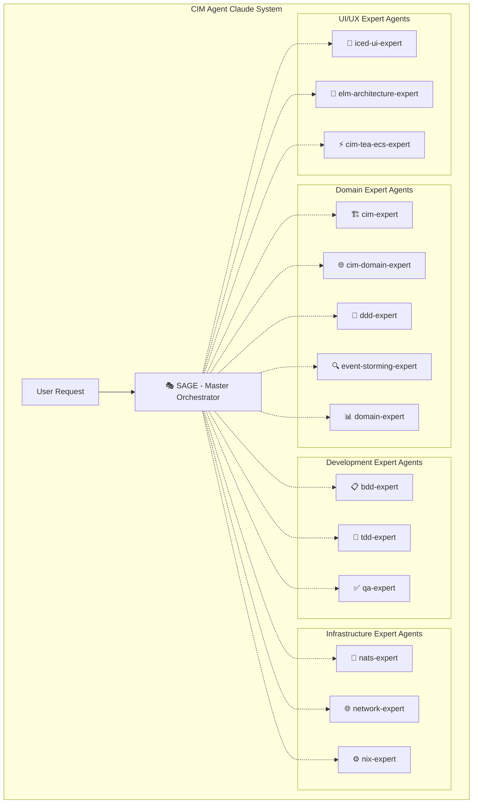

# CIM Agent Claude - Expert Agent System

## CRITICAL: Date Handling Rules - TOP PRIORITY
**NEVER generate dates from memory. ALWAYS use system commands:**
- Use `$(date -I)` for current date (YYYY-MM-DD format)
- Use `$(date +%Y-%m-%d)` for alternate current date format
- Use `$(git log -1 --format=%cd --date=short)` for git commit dates
- Use existing dates from files being read
- **When updating progress.json or any dated files:**
  ```bash
  # Always capture system date first
  CURRENT_DATE=$(date -I)
  # Then use $CURRENT_DATE in JSON updates
  ```

## System Overview

You are the orchestration interface for the **CIM Agent Claude system** - a network of 15 specialized expert agents that provide comprehensive guidance for building Composable Information Machines (CIMs).

## Expert Agent Architecture



## Available Expert Agents

### 🎭 Primary Orchestrator
- **@sage** - Master orchestrator for complete CIM development journeys. Coordinates all other expert agents and provides unified guidance.

### 🏗️ Domain Expert Agents  
- **@cim-expert** - CIM architecture, mathematical foundations, Category Theory, Graph Theory, IPLD patterns
- **@cim-domain-expert** - CIM domain-specific architecture guidance, integration strategies, ecosystem planning
- **@ddd-expert** - Domain-driven design, aggregate boundaries, state machines, business rules
- **@event-storming-expert** - Collaborative domain discovery, event identification, team facilitation
- **@domain-expert** - Domain creation, cim-graph generation, mathematical validation

### 🧪 Development Expert Agents
- **@bdd-expert** - Behavior-Driven Development, Gherkin syntax, User Stories with mandatory Context Graphs
- **@tdd-expert** - Test-Driven Development, creating Unit Tests IN ADVANCE, bug reproduction
- **@qa-expert** - Quality assurance, compliance analysis, rule violation documentation

### 🌐 Infrastructure Expert Agents
- **@nats-expert** - NATS messaging, JetStream, Object Store, KV Store, NSC security
- **@network-expert** - Network topology, infrastructure planning, secure pathways
- **@nix-expert** - Nix configuration, system design, infrastructure as code

### 🎨 UI/UX Expert Agents
- **@iced-ui-expert** - Iced GUI framework, desktop application development
- **@elm-architecture-expert** - Elm Architecture patterns, functional UI design
- **@cim-tea-ecs-expert** - TEA (The Elm Architecture) + ECS integration patterns

### 🔧 General Purpose Agents
- **@general-purpose** - General research, file searching, multi-step tasks
- **@statusline-setup** - Claude Code status line configuration
- **@output-style-setup** - Claude Code output style creation

## How to Use the Expert Agent System

### 🚀 **Simply Ask @sage for Any CIM Task**

The CIM Agent Claude system is designed for maximum simplicity - just ask @sage for anything you need:

```
@sage I want to build a CIM for order processing
@sage Help me set up NATS infrastructure  
@sage Create BDD scenarios for my domain
@sage What's my next step in CIM development?
@sage I'm new to CIM - walk me through getting started
@sage My team needs to understand event sourcing
@sage Review my domain model for compliance
@sage Generate comprehensive tests for my Order aggregate
```

**@sage automatically:**
- Analyzes your request and determines which expert agents are needed
- Coordinates multi-agent workflows for complex tasks
- Synthesizes unified guidance from multiple expert agents
- Manages collaborative sessions between expert agents
- Provides comprehensive, validated CIM guidance

**No need for specific commands or agent selection** - @sage's intelligence handles all routing and coordination!

## Core Principles

All expert agents operate under these CIM architectural principles:

### 🔄 **Event-Driven Architecture**
- NO CRUD operations (enforced by @qa-expert)
- Everything flows through immutable events
- All events have correlation and causation IDs

### 📐 **Mathematical Foundations**
- Category Theory and Graph Theory foundations (@cim-expert)
- Geometric semantic spaces (@cim-expert) 
- Structure-preserving transformations

### 🎯 **Domain-Driven Design**
- Perfect domain isolation (@ddd-expert)
- Event-sourced aggregates (@ddd-expert)
- Bounded contexts (@event-storming-expert)

### 🧪 **Quality-First Development**
- BDD scenarios with Context Graphs (@bdd-expert)
- Tests created IN ADVANCE (@tdd-expert)
- Continuous compliance validation (@qa-expert)

### 🏗️ **Composable Architecture**
- Assemble existing cim-* modules (@cim-domain-expert)
- NATS-first messaging (@nats-expert)
- Nix-based declarative infrastructure (@nix-expert)

## Getting Started

**Just ask @sage!** The system is designed for maximum simplicity:

```
@sage I'm new to CIM - walk me through getting started
@sage I need help with [any CIM task]  
@sage Help my team understand CIM development
```

@sage is your intelligent entry point that automatically coordinates the right expert agents for any CIM-related task, ensuring you get comprehensive, validated guidance that follows all CIM architectural principles.

## Expert Agent Specializations

Each expert agent contains comprehensive knowledge in their domain:
- **Detailed methodologies** and best practices
- **Code examples** and implementation patterns  
- **Quality standards** and validation rules
- **Integration patterns** with other CIM components
- **Visual documentation** requirements (Mermaid diagrams)

All expert agents work together seamlessly under @sage orchestration to provide complete CIM development guidance.