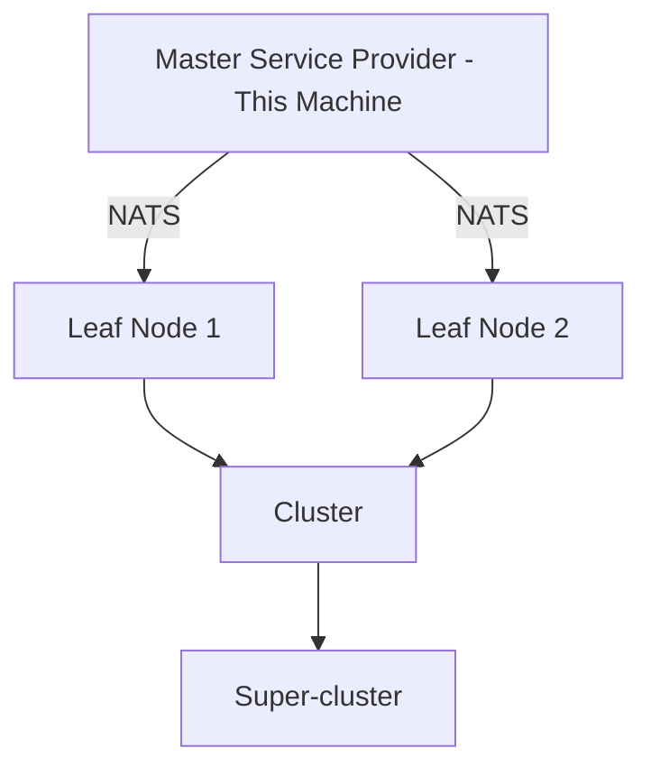

# CIM Development Client - Project Instructions

## CRITICAL: Read Complete Instructions
**This is a CIM Development Client. You MUST read these files in order:**
1. **`.claude/instructions.md`** - Complete CIM Agent Claude system instructions
2. **`.claude/agents/*.md`** - Individual expert agent specifications
3. **`/domain/readme.md`** - Domain modeling principles (if exists)
4. **`/domain/models/readme.md`** - Domain model definitions (if exists)

## Quick Start with SAGE
Simply ask **@sage** for any CIM-related task:
```
@sage I want to build a CIM for order processing
@sage Help me set up NATS infrastructure
@sage What's my next step in CIM development?
```

SAGE automatically coordinates the right expert agents for your needs.

## System Overview
- **Machine**: Dell Precision 7750 running NixOS
- **Role**: Master Service Provider in distributed CIM architecture
- **Purpose**: CIM (Composable Information Machine) development
- **Architecture**: Event-sourcing, NATS-first, NO CRUD operations

## Expert Agent System
The CIM Agent Claude system provides 21 specialized expert agents:

### Primary Orchestrator
- **@sage** - Master orchestrator, coordinates all other agents

### Domain Experts
- **@cim-expert** - CIM architecture and mathematical foundations
- **@cim-domain-expert** - Domain-specific CIM guidance
- **@domain-ontologist-researcher** - Ontological research and analysis
- **@ddd-expert** - Domain-driven design and aggregates
- **@event-storming-expert** - Collaborative domain discovery
- **@domain-expert** - Domain creation and cim-graph generation
- **@conceptual-spaces-expert** - Gärdenfors' geometric theory of meaning

### Development Experts
- **@bdd-expert** - Behavior-driven development with Gherkin
- **@tdd-expert** - Test-driven development, tests IN ADVANCE
- **@qa-expert** - Quality assurance and compliance

### Infrastructure Experts
- **@nats-expert** - NATS messaging and JetStream
- **@network-expert** - Network topology and planning
- **@nix-expert** - Nix configuration and infrastructure
- **@git-expert** - Git/GitHub operations and CI/CD
- **@subject-expert** - CIM subject algebra and routing

### UI/UX Experts
- **@iced-ui-expert** - Iced GUI framework
- **@elm-architecture-expert** - Elm Architecture patterns
- **@cim-tea-ecs-expert** - TEA + ECS integration
- **@ricing-expert** - NixOS desktop aesthetics and Tufte-inspired design

### Language & Documentation Experts
- **@language-expert** - Ubiquitous Language extraction and semantic analysis

## Key Directories
```
/git/steele/dell-62S6063/
├── .claude/              # ALL CIM instructions and agent specs
│   ├── instructions.md   # Master instructions
│   └── agents/          # Expert agent specifications
├── hosts/dell-62S6063/  # Host-specific configurations
├── modules/             # Reusable NixOS modules
├── users/steele/        # User configurations
└── domain/              # Domain models and logic
```

## Development Workflow

### 1. Context Awareness
Always know where you are:
```bash
# Check your context
.claude/scripts/detect-context.sh
```
- `cim` → Registry (source of truth)
- `cim-*` → Module (specific functionality)
- `cim-domain-*` → Domain (assembles modules)

### 2. CIM Assembly Approach
- Start with `cim-start` template
- Assemble existing `cim-*` modules
- Create domain-specific extensions
- ONE CIM per business domain

### 3. Core Commands
```bash
# Rebuild NixOS system
sudo nixos-rebuild switch --flake .

# Update flake inputs
nix flake update

# Check flake validity
nix flake check

# Query CIM modules
./scripts/query-modules.sh
```

## MANDATORY Development Rules

### Date Handling - TOP PRIORITY
**NEVER generate dates from memory:**
```bash
# ALWAYS use system commands
CURRENT_DATE=$(date -I)  # YYYY-MM-DD format
```

### Core Principles
1. **Event Sourcing Only** - NO CRUD operations
2. **NATS-First** - All communication via NATS
3. **Visualization Required** - Mermaid diagrams mandatory
4. **Test-First** - Tests created IN ADVANCE
5. **Single Responsibility** - Everything has ONE purpose

### File Conventions
- **Filenames**: lowercase_with_underscores.md
- **Git**: Always `git add` new files
- **State**: Maintained in NATS, query @sage

## CIM Architecture Overview


## Current Services
- **NATS** - Messaging backbone
- **Ollama** - AI/ML capabilities
- **RustDesk** - Remote access
- **Scanning/Printing** - Document support
- **YubiKey** - Authentication

## Development Environment
- **Platform**: NixOS (ALWAYS)
- **Shell**: Nix devshell environment
- **Model**: Claude Opus 4.1 (claude-opus-4-1-20250805)
- **All configurations**: Via Nix files

## Getting Help
- **General CIM help**: `@sage help`
- **Specific domain**: `@sage help with [domain]`
- **Expert list**: See `.claude/agents/`
- **Full instructions**: `.claude/instructions.md`

## REMEMBER
- This is a DEVELOPMENT client, not production
- Follow ALL instructions in `.claude/`
- Use @sage as your entry point
- Document CIM-specific configurations
- Test distributed behaviors before deployment
- Maintain clear dev/prod separation

---
*Updated: $(date -I)*
*CIM Agent Claude System v1.0*