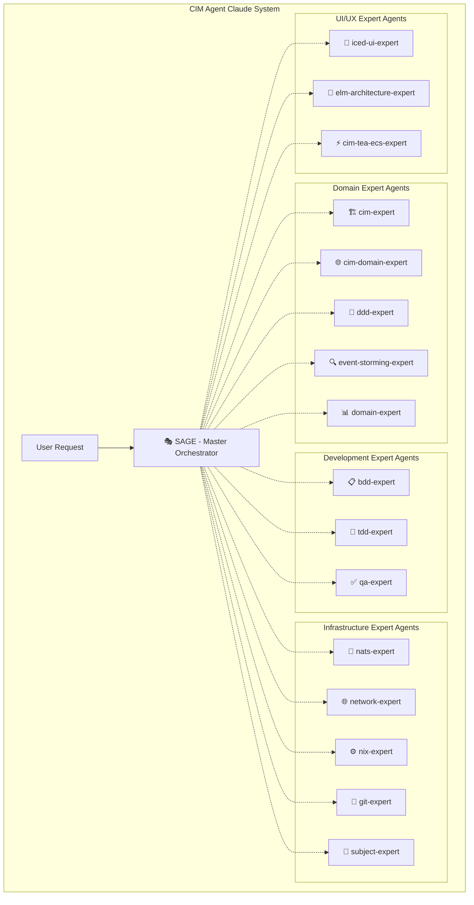

# CIM Agent Claude - Expert Agent Network

This file provides guidance to Claude Code (claude.ai/code) when working with the CIM Agent Claude repository.

## 🚨 CRITICAL: NIXOS SYSTEM - PACKAGE MANAGEMENT RULES 🚨

**THIS IS A NIXOS SYSTEM. NEVER USE ANY PACKAGE MANAGER OTHER THAN NIX!**

### FORBIDDEN COMMANDS (NEVER USE):
- ❌ `apt`, `apt-get`, `apt-cache`, `dpkg` (Debian/Ubuntu)
- ❌ `yum`, `dnf`, `rpm` (RedHat/Fedora)  
- ❌ `pacman`, `yay` (Arch)
- ❌ `brew` (Homebrew)
- ❌ `snap`, `flatpak` (Universal packages)
- ❌ `pip install` at system level (use Nix shells)
- ❌ `npm install -g` (use Nix shells)
- ❌ `cargo install` at system level (use Nix shells)
- ❌ Any system-wide package installation outside of Nix

### CORRECT NIX COMMANDS (ALWAYS USE):
- ✅ `nix develop` - Enter development shell with dependencies
- ✅ `nix-shell` - Legacy shell command
- ✅ `nix search` - Search for packages
- ✅ `nix build` - Build packages
- ✅ `nix run` - Run packages
- ✅ `nix flake update` - Update flake dependencies
- ✅ `nix-env` - User environment management (rarely needed)
- ✅ `nixos-rebuild` - System configuration (with proper config)

### WHY THIS MATTERS:
1. **System Integrity**: NixOS uses immutable system design - foreign package managers can corrupt it
2. **Reproducibility**: Nix ensures exact reproducibility - other package managers break this
3. **Rollback Safety**: NixOS can rollback changes - foreign packages can't be rolled back
4. **Dependency Hell**: Mixing package managers causes unresolvable conflicts
5. **System Breakage**: Using apt/yum/etc can make the system completely unbootable

### DEVELOPMENT WORKFLOW:
```bash
# ALWAYS use Nix for dependencies:
nix develop                    # Enter dev shell with all dependencies
nix develop --command cargo test   # Run commands in Nix environment
nix develop --command cargo build  # Build in Nix environment
```

### IF YOU NEED A PACKAGE:
1. First check if it's in the flake.nix
2. If not, ask the nix-expert agent: `@nix-expert how do I add package X?`
3. NEVER attempt to install it with apt-get, yum, brew, etc.

## Repository Overview

**cim-agent-claude** is an intelligent expert agent network for CIM (Composable Information Machine) development. This repository contains a comprehensive system of 17 specialized expert agents that provide world-class guidance for building production-ready CIMs.

**This is a Configuration Repository containing:**
- **17 Specialized Expert Agents** (in `.claude/agents/`)
- **Intelligent Agent Orchestration** via @sage master coordinator
- **Comprehensive CIM Development Guidance** from domain discovery to production deployment
- **Mathematical Foundations** based on Category Theory and Graph Theory
- **Event-Driven Architecture Patterns** with NO CRUD operations

## How to Use the Expert Agent Network

### 🚀 **Simply Ask @sage for Any CIM Task**

The CIM Agent Claude system is designed for maximum simplicity - just ask @sage for anything you need:

```
@sage I want to build a CIM for order processing
@sage Help me set up NATS infrastructure  
@sage Create BDD scenarios for my domain
@sage Design subject algebra for my payment domain
@sage Set up GitHub repository with proper CI/CD
@sage What's my next step in CIM development?
@sage I'm new to CIM - walk me through getting started
@sage My team needs to understand event sourcing
@sage Review my domain model for compliance
@sage Generate comprehensive tests for my Order aggregate
```

**@sage automatically:**
- Analyzes your request and determines which expert agents are needed
- Coordinates multi-agent workflows for complex tasks
- Synthesizes unified guidance from multiple expert agents
- Provides comprehensive, validated CIM guidance

### 🤖 **17 Specialized Expert Agents**

#### **🎭 Master Orchestrator**
- **@sage** - Intelligent coordination of all expert agents for unified CIM guidance

#### **🏗️ Domain Expert Agents (5)**
- **@cim-expert** - CIM architecture, mathematical foundations, Category Theory, Graph Theory
- **@cim-domain-expert** - CIM domain-specific architecture guidance, ecosystem planning
- **@ddd-expert** - Domain-driven design, aggregate boundaries, state machines
- **@event-storming-expert** - Collaborative domain discovery, event identification
- **@domain-expert** - Domain creation, cim-graph generation, mathematical validation

#### **🧪 Development Expert Agents (3)**
- **@bdd-expert** - Behavior-Driven Development, Gherkin syntax, User Stories with Context Graphs
- **@tdd-expert** - Test-Driven Development, creating Unit Tests IN ADVANCE, bug reproduction
- **@qa-expert** - Quality assurance, compliance analysis, rule violation documentation

#### **🌐 Infrastructure Expert Agents (5)**
- **@nats-expert** - NATS messaging, JetStream, Object Store, KV Store, NSC security
- **@network-expert** - Network topology, infrastructure planning, secure pathways
- **@nix-expert** - Nix configuration, system design, infrastructure as code
- **@git-expert** - Git and GitHub operations, repository management, CI/CD workflows
- **@subject-expert** - CIM subject algebra, routing patterns, mathematical subject hierarchies

#### **🎨 UI/UX Expert Agents (3)**
- **@iced-ui-expert** - Iced GUI framework, desktop application development
- **@elm-architecture-expert** - Elm Architecture patterns, functional UI design
- **@cim-tea-ecs-expert** - TEA (The Elm Architecture) + ECS integration patterns

## Expert Agent Network Architecture

### Intelligent Multi-Agent Coordination

```mermaid
graph TB
    subgraph "CIM Agent Claude System"
        USER[User Request]
        SAGE[🎭 SAGE - Master Orchestrator]
        
        subgraph "Domain Expert Agents"
            CIM[🏗️ cim-expert]
            CIM_DOMAIN[🌐 cim-domain-expert]
            DDD[📐 ddd-expert]
            ES[🔍 event-storming-expert]
            DOMAIN[📊 domain-expert]
        end
        
        subgraph "Development Expert Agents"
            BDD[📋 bdd-expert]
            TDD[🧪 tdd-expert]
            QA[✅ qa-expert]
        end
        
        subgraph "Infrastructure Expert Agents"
            NATS[📨 nats-expert]
            NETWORK[🌐 network-expert]
            NIX[⚙️ nix-expert]
            GIT[🔧 git-expert]
            SUBJECT[📐 subject-expert]
        end
        
        subgraph "UI/UX Expert Agents"
            ICED[🎨 iced-ui-expert]
            ELM[🔄 elm-architecture-expert]
            TEA[⚡ cim-tea-ecs-expert]
        end
        
        USER --> SAGE
        SAGE -.-> CIM
        SAGE -.-> CIM_DOMAIN
        SAGE -.-> DDD
        SAGE -.-> ES
        SAGE -.-> DOMAIN
        SAGE -.-> BDD
        SAGE -.-> TDD
        SAGE -.-> QA
        SAGE -.-> NATS
        SAGE -.-> NETWORK
        SAGE -.-> NIX
        SAGE -.-> GIT
        SAGE -.-> SUBJECT
        SAGE -.-> ICED
        SAGE -.-> ELM
        SAGE -.-> TEA
    end
```

### CIM Development Journey
1. **Domain Discovery**: @event-storming-expert → @ddd-expert → @domain-expert
2. **Architecture Design**: @cim-expert → @cim-domain-expert → @subject-expert
3. **Development Workflow**: @bdd-expert → @tdd-expert → @qa-expert
4. **Infrastructure Setup**: @nats-expert → @network-expert → @nix-expert → @git-expert
5. **UI/UX Implementation**: @elm-architecture-expert → @cim-tea-ecs-expert → @iced-ui-expert
6. **Quality Assurance**: @qa-expert validates all outputs across expert agents

## Core CIM Principles

All expert agents operate under these foundational CIM architectural principles:

### 🔄 **Event-Driven Architecture**
- NO CRUD operations (enforced by @qa-expert)
- Everything flows through immutable events
- All events have correlation and causation IDs

### 📐 **Mathematical Foundations**  
- Category Theory and Graph Theory foundations (@cim-expert)
- Geometric semantic spaces (@cim-expert)
- Structure-preserving transformations

### 🎯 **Domain-Driven Design**
- Perfect domain isolation (@ddd-expert)
- Event-sourced aggregates (@ddd-expert)
- Bounded contexts (@event-storming-expert)

### 🧪 **Quality-First Development**
- BDD scenarios with Context Graphs (@bdd-expert)
- Tests created IN ADVANCE (@tdd-expert)
- Continuous compliance validation (@qa-expert)

### 🏗️ **Composable Architecture**
- Assemble existing cim-* modules (@cim-domain-expert)
- NATS-first messaging (@nats-expert)
- Subject algebra optimization (@subject-expert)
- Nix-based declarative infrastructure (@nix-expert)

### Expert Agent Coordination Patterns
- **PROACTIVE Guidance**: Agents automatically guide through CIM development journey
- **Multi-Agent Workflows**: Complex tasks coordinated across multiple expert agents
- **Context-Aware Intelligence**: Agents understand current development stage and adapt
- **Validation-Driven Quality**: All outputs validated by @qa-expert against CIM principles

## Repository Structure

### Expert Agent Network Configuration
```
.claude/
├── 📋 System Interface (3 files)
│   ├── instructions.md              # Primary @sage interface
│   ├── unified-conversation-model.md # Conversation patterns & CIM philosophy
│   └── init.md                      # Template initialization logic
│
├── 🤖 Expert Agent Network (17 files)
│   └── agents/
│       ├── sage.md                  # 🎭 Master orchestrator
│       ├── cim-expert.md           # 🏗️ Architecture & foundations
│       ├── cim-domain-expert.md    # 🌐 Domain-specific architecture
│       ├── ddd-expert.md           # 📐 Domain-driven design
│       ├── event-storming-expert.md # 🔍 Collaborative discovery
│       ├── domain-expert.md        # 📊 Domain creation
│       ├── bdd-expert.md           # 📋 Behavior-driven development
│       ├── tdd-expert.md           # 🧪 Test-driven development
│       ├── qa-expert.md            # ✅ Quality assurance
│       ├── nats-expert.md          # 📨 NATS messaging
│       ├── network-expert.md       # 🌐 Network topology
│       ├── nix-expert.md           # ⚙️ Nix configuration
│       ├── git-expert.md           # 🔧 Git & GitHub operations
│       ├── subject-expert.md       # 📐 CIM subject algebra
│       ├── iced-ui-expert.md       # 🎨 Desktop GUI
│       ├── elm-architecture-expert.md # 🔄 Functional UI
│       └── cim-tea-ecs-expert.md   # ⚡ TEA+ECS integration
│
└── 🛠️ Operational Files (5 files)
    ├── scripts/detect-context.sh   # Context detection
    ├── security/settings.json      # Security config
    └── settings.local.json         # Claude Code permissions
```

## Getting Started

### For New Users
1. Start with `/sage` command to begin complete CIM development journey
2. SAGE will assess your needs and coordinate appropriate expert agents
3. Follow the guided workflow through domain discovery, infrastructure setup, and implementation

### For Experienced Users  
1. Use direct expert commands (`/cim`, `/ddd`, `/nats`, etc.) for specific needs
2. Invoke multiple agents via SAGE for complex multi-domain tasks
3. Reference existing instructions in `.claude/instructions/` for detailed guidance

### For Development Teams
1. Use `/eventstorming` to facilitate collaborative domain discovery sessions
2. SAGE coordinates multi-agent workflows for team-based CIM development  
3. Agents provide structured guidance for distributed team collaboration

## Special Considerations

### Date Handling
- **NEVER generate dates from memory**
- Always use system date: `$(date -I)`
- Use git commit dates: `$(git log -1 --format=%cd --date=short)`
- Capture current date in variables before JSON updates

### Context Detection
- Repository type determines development approach
- Use `.claude/scripts/detect-context.sh` if available
- `cim-agent-claude` = Agent configuration repository
- `cim-*` = Module repository  
- `cim-domain-*` = Domain implementation repository

### Security and Permissions
- Configured permissions in `.claude/settings.local.json`
- Specific bash commands allowed for CIM development workflows
- WebFetch limited to github.com domain for module research

This repository serves as the intelligent orchestration layer for CIM development, providing expert guidance through specialized agents that coordinate the complete journey from domain discovery to production deployment.