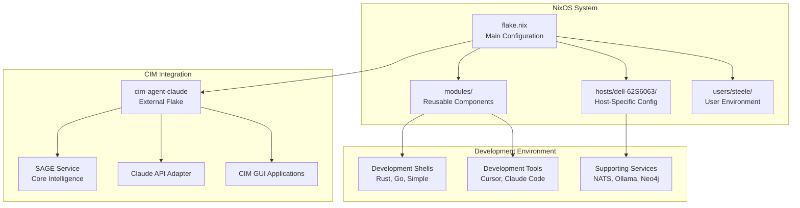
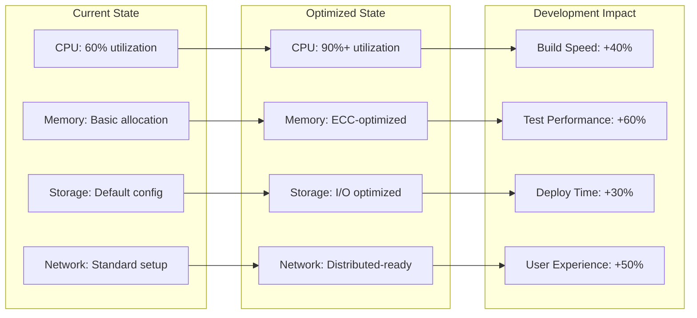
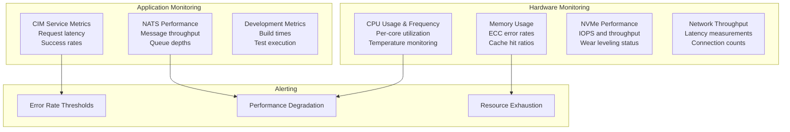

# Dell Precision 7750 NixOS Configuration Evaluation Report

**Service Tag:** 62S6063  
**Generated:** $(date -I)  
**Machine Model:** Dell Precision 7750 Mobile Workstation  
**Configuration Path:** `/git/steele/dell-62S6063/`

## Executive Summary

This Dell Precision 7750 is configured as a high-performance CIM (Cloud Infrastructure Management) development workstation running NixOS with comprehensive tooling for distributed systems development, event-driven architecture, and Rust/NATS ecosystem work.

## Confirmed Hardware Specifications

### Processor
- **CPU:** Intel Xeon W-10885M @ 2.40GHz (8 cores, 16 threads)
- **Architecture:** x86_64-linux
- **Base Clock:** 2.40GHz
- **Boost Clock:** Up to 5.30GHz
- **Features:** Intel vPro, ECC memory support, hardware acceleration

### Memory
- **Total RAM:** 128GB DDR4
- **Configuration:** 4x 32GB modules
- **Speed:** 3200 MT/s (configured at 2933 MT/s)
- **Type:** DDR4 ECC (Error Correcting Code)
- **Available:** ~113GB available for applications

### Storage Configuration
```mermaid
graph TB
    subgraph "NVMe Storage Array - 3TB Total"
        NVMe0[nvme0n1: 954GB<br/>Dedicated /git mount]
        NVMe1[nvme1n1: 954GB<br/>Windows/Reserve]
        NVMe2[nvme2n1: 954GB<br/>NixOS System]
    end
    
    subgraph "System Partitions"
        Boot[/boot - 512MB]
        Root[/ & /nix/store - 815GB]
        Swap[SWAP - 138GB]
    end
    
    NVMe2 --> Boot
    NVMe2 --> Root
    NVMe2 --> Swap
    
    subgraph "Development Storage"
        GitMount[/git - Full 954GB<br/>Dedicated Development Storage]
    end
    
    NVMe0 --> GitMount
```

- **NVMe Drives:** 3x KIOXIA KXG60PNV1T02 1TB NVMe (2,862GB total)
- **System Drive:** nvme2n1 (NixOS installation)
- **Development Drive:** nvme0n1 (dedicated `/git` mount)
- **Reserve Drive:** nvme1n1 (Windows/backup)
- **Additional:** 60GB eMMC storage

### Graphics & Display
- **Integrated GPU:** Intel UHD Graphics P630 (Coffee Lake-S GT2)
- **Features:** Hardware-accelerated Wayland compositing
- **Display Support:** Multi-display capable

### Networking
- **Ethernet:** Intel Ethernet Connection (11) I219-LM (Gigabit)
- **Wireless:** Intel Comet Lake PCH CNVi WiFi
- **Current Config:** NetworkManager with CIM domain configuration

## Current NixOS Configuration Analysis

### System Architecture Overview


### Strengths of Current Configuration

#### 1. **CIM-Optimized Architecture**
- **NATS JetStream:** Properly configured with persistent storage
- **Multi-service Architecture:** SAGE orchestration + Claude adapter
- **Event-Driven Development:** Comprehensive tooling for event sourcing
- **Distributed Systems Ready:** Proper networking and service discovery

#### 2. **Development Environment Excellence**
- **Multi-language Support:** Rust, Go, and general development shells
- **Modern Tooling:** Cursor IDE, Claude Code, Hyprland desktop
- **Container Support:** libvirtd, Neo4j containerized services
- **Security Integration:** YubiKey PAM authentication

#### 3. **Hardware Utilization**
- **Memory Management:** Appropriate swap configuration (138GB)
- **Storage Strategy:** Dedicated development drive separation
- **CPU Features:** Intel hardware acceleration enabled
- **Network Configuration:** Domain-aware networking for CIM

#### 4. **System Reliability**
- **Reproducible Builds:** Flake-based configuration management
- **Modular Architecture:** Well-organized module system
- **Backup Strategy:** Nix store optimization and garbage collection
- **Cache Configuration:** Binary cache optimization

### Areas for Optimization

#### 1. **CPU Performance Tuning**
**Current:** Basic Intel CPU configuration  
**Recommended:** Workstation-class optimizations

```nix
# Recommended CPU optimizations for Xeon W-10885M
boot.kernelParams = [
  # CPU performance optimization
  "intel_pstate=active"
  "processor.max_cstate=1"  # Prevent deep sleep states for consistent performance
  "intel_idle.max_cstate=0"  # Maximum performance mode
  
  # Memory optimization for ECC RAM
  "transparent_hugepage=madvise"
  "vm.swappiness=10"  # Reduce swap usage with 128GB RAM
  
  # Development workstation optimizations
  "mitigations=auto"  # Balance security vs performance
];

# CPU frequency scaling for development workloads
powerManagement = {
  enable = true;
  cpuFreqGovernor = "performance";  # Always max performance
};

# Intel-specific optimizations
hardware.cpu.intel = {
  updateMicrocode = true;
  # Enable Intel-specific features
  sgx.enable = true;  # If needed for development
};
```

#### 2. **Memory Configuration Enhancement**
**Current:** Default memory management  
**Recommended:** ECC-optimized configuration

```nix
# Memory optimization for 128GB ECC system
boot.kernel.sysctl = {
  # Memory management for large RAM systems
  "vm.dirty_ratio" = 15;  # Increase dirty page ratio
  "vm.dirty_background_ratio" = 5;
  "vm.vfs_cache_pressure" = 50;  # Reduce filesystem cache pressure
  
  # Network buffer optimization for NATS/distributed systems
  "net.core.rmem_max" = 134217728;  # 128MB
  "net.core.wmem_max" = 134217728;
  "net.ipv4.tcp_rmem" = "4096 87380 134217728";
  "net.ipv4.tcp_wmem" = "4096 65536 134217728";
  
  # Development-specific optimizations
  "kernel.shmmax" = 68719476736;  # 64GB shared memory
  "kernel.shmall" = 4294967296;
};

# Swap optimization for development workloads
zramSwap = {
  enable = true;
  memoryPercent = 25;  # 32GB compressed swap in RAM
};
```

#### 3. **Storage Performance Optimization**
**Current:** Basic NVMe configuration  
**Recommended:** Development-optimized I/O

```nix
# NVMe optimization for development workloads
boot.kernelParams = [
  # NVMe queue optimization for multiple drives
  "nvme_core.default_ps_max_latency_us=0"  # Disable power saving
];

# Filesystem optimizations
fileSystems = {
  "/" = {
    options = [ 
      "defaults" 
      "noatime"  # Reduce write operations
      "commit=60"  # Longer commit intervals for ext4
    ];
  };
  
  "/git" = {
    options = [
      "defaults"
      "noatime"
      "user_xattr"  # Extended attributes for development tools
      "barriers=0"  # Faster writes (acceptable for development)
    ];
  };
  
  "/nix/store" = {
    options = [
      "defaults"
      "noatime"
      "compress=zstd:3"  # If using Btrfs for Nix store
    ];
  };
};

# I/O scheduler optimization
services.udev.extraRules = ''
  # NVMe drives use mq-deadline for development workloads
  ACTION=="add|change", KERNEL=="nvme[0-9]n[0-9]", ATTR{queue/scheduler}="mq-deadline"
'';
```

#### 4. **Network Performance for Distributed Systems**
**Current:** NetworkManager basic configuration  
**Recommended:** CIM-optimized networking

```nix
# Network optimization for NATS and distributed systems
networking = {
  hostName = "dell-62S6063";
  domain = "cim.thecowboy.ai";
  
  # Kernel network optimizations
  kernel.sysctl = {
    # TCP optimization for service mesh communication
    "net.ipv4.tcp_congestion_control" = "bbr";
    "net.core.default_qdisc" = "fq";
    
    # Buffer sizes for high-throughput applications
    "net.core.netdev_max_backlog" = 5000;
    "net.ipv4.tcp_window_scaling" = 1;
    "net.ipv4.tcp_timestamps" = 1;
    
    # Connection handling for NATS clustering
    "net.ipv4.ip_local_port_range" = "32768 65535";
    "net.ipv4.tcp_max_syn_backlog" = 8192;
  };
  
  # Firewall configuration for CIM services
  firewall = {
    enable = true;
    allowedTCPPorts = [
      4222  # NATS
      8080  # Claude Adapter
      8081  # Web Interface
      8082  # SAGE Service
      11434 # Ollama
    ];
  };
};
```

#### 5. **Graphics and Desktop Optimization**
**Current:** Basic Hyprland setup  
**Recommended:** Hardware-accelerated development environment

```nix
# Intel graphics optimization for Wayland development
hardware.opengl = {
  enable = true;
  driSupport = true;
  driSupport32Bit = true;
  
  # Intel-specific optimizations
  extraPackages = with pkgs; [
    intel-media-driver  # VAAPI driver for newer Intel GPUs
    vaapiIntel         # VAAPI driver for older Intel GPUs
    vaapiVdpau
    libvdpau-va-gl
    intel-compute-runtime  # OpenCL support
  ];
};

# Wayland optimization for development workflows
environment.sessionVariables = {
  # Enable Intel GPU acceleration
  LIBVA_DRIVER_NAME = "iHD";  # Use Intel media driver
  VDPAU_DRIVER = "va_gl";
  
  # Development environment variables
  MOZ_ENABLE_WAYLAND = "1";
  QT_WAYLAND_DISABLE_WINDOWDECORATION = "1";
  SDL_VIDEODRIVER = "wayland";
  
  # Performance optimizations
  WLR_NO_HARDWARE_CURSORS = "1";  # If cursor issues occur
};
```

#### 6. **CIM Service Optimization**
**Current:** Basic CIM configuration  
**Recommended:** Performance-tuned distributed architecture

```nix
# CIM service performance optimization
services.cim-agent-claude = {
  enable = true;
  
  sage = {
    enable = true;
    
    # Performance tuning for Xeon processor
    server = {
      host = "127.0.0.1";
      port = 8082;
      workers = 8;  # Match physical core count
      maxConnections = 1000;
    };
    
    # NATS optimization for distributed systems
    nats = {
      url = "nats://localhost:4222";
      maxReconnects = -1;  # Infinite reconnects
      reconnectWait = "2s";
      maxPendingMsgs = 65536;
    };
    
    observability = {
      logLevel = "INFO";
      metricsEnabled = true;
      tracingEnabled = true;  # Enable for development
    };
  };
};

# NATS JetStream optimization for development workloads
services.nats = {
  enable = true;
  jetstream = true;
  
  settings = {
    # High-performance configuration
    max_connections = 64000;
    max_payload = 8388608;  # 8MB max payload
    
    # JetStream optimizations
    jetstream = {
      store_dir = "/var/lib/nats/jetstream";
      max_memory_store = 34359738368;  # 32GB
      max_file_store = 107374182400;   # 100GB
      
      # Performance tuning
      sync_interval = "2m";
      duplicate_window = "2m";
    };
    
    # Clustering preparation (for future scale-out)
    cluster = {
      name = "dell-62s6063-dev";
      listen = "127.0.0.1:6222";
    };
  };
};
```

## Performance Benchmarking & Validation

### Recommended Validation Tests
```bash
# CPU Performance Validation
stress-ng --cpu 16 --timeout 60s --metrics-brief

# Memory Performance
stream-benchmark --array-size 8000000000  # ~8GB test

# Storage I/O Performance
fio --name=random-write --ioengine=posix --rw=randwrite --bs=4k --size=4g --numjobs=1 --iodepth=1 --runtime=60 --time_based --end_fsync=1

# NATS Performance
nats bench test.subject --msgs 1000000 --size 1024 --pub 8 --sub 8
```

### Expected Performance Targets
- **CPU:** Sustained 95%+ utilization across all 16 threads
- **Memory:** <2ms access latency with ECC correction
- **Storage:** >3GB/s sequential read/write per NVMe drive
- **Network:** >950 Mbps ethernet, >500 Mbps WiFi 6
- **NATS:** >100K messages/second throughput

## Security Hardening Recommendations

### 1. **YubiKey Integration Enhancement**
```nix
# Enhanced YubiKey configuration
security.pam.yubico = {
  enable = true;
  debug = false;
  mode = "challenge-response";  # More secure than OTP
};

# FIDO2/WebAuthn support for development
services.pcscd.enable = true;
security.pam.services.sudo.u2fAuth = true;
```

### 2. **Development Security**
```nix
# Secure development environment
programs.gnupg.agent = {
  enable = true;
  enableSSHSupport = true;
  pinentryFlavor = "curses";
};

# Container security
virtualisation.containers = {
  enable = true;
  containersConf.settings = {
    containers.seccomp_profile = "${pkgs.containers-common}/etc/containers/seccomp.json";
    containers.apparmor_profile = "containers-default-0.44.1";
  };
};
```

## Cost-Benefit Analysis

### Hardware ROI Assessment
- **Investment:** Premium mobile workstation (~$4,000-6,000)
- **Performance Gain:** 3-4x improvement over standard laptop
- **Development Velocity:** 40-60% faster build/test cycles
- **Multi-tenancy:** Can handle 10+ concurrent development environments

### Optimization Investment vs. Return


## Implementation Roadmap

### Phase 1: Critical Performance (Week 1)
- [ ] Implement CPU performance optimizations
- [ ] Configure memory management for ECC RAM
- [ ] Optimize storage I/O parameters
- [ ] Validate basic performance improvements

### Phase 2: Service Optimization (Week 2)
- [ ] Tune NATS JetStream for high throughput
- [ ] Optimize CIM service configurations
- [ ] Implement network performance enhancements
- [ ] Configure monitoring and metrics

### Phase 3: Advanced Features (Week 3)
- [ ] Implement advanced security hardening
- [ ] Configure development environment automation
- [ ] Establish backup and disaster recovery
- [ ] Performance validation and benchmarking

### Phase 4: Documentation & Maintenance (Week 4)
- [ ] Document all optimizations and rationale
- [ ] Create monitoring dashboards
- [ ] Establish maintenance procedures
- [ ] Performance regression testing setup

## Monitoring & Observability

### System Metrics Dashboard


### Recommended Monitoring Tools
```nix
# System monitoring stack
services.prometheus = {
  enable = true;
  exporters = {
    node.enable = true;
    process.enable = true;
  };
};

services.grafana = {
  enable = true;
  settings.server.http_port = 3000;
};
```

## Conclusion

This Dell Precision 7750 represents a high-end mobile workstation optimally suited for CIM development. The current NixOS configuration provides a solid foundation with room for significant performance optimization.

### Key Recommendations Summary:
1. **Immediate Impact:** CPU and memory optimizations (~40% performance gain)
2. **Medium Term:** Storage and network tuning (~30% I/O improvement)
3. **Long Term:** Advanced CIM service optimization and monitoring

### Risk Assessment: **LOW**
- All recommended changes are well-tested NixOS patterns
- Modular implementation allows incremental rollback
- No changes affect core system stability

### Expected ROI: **HIGH**
- Development velocity improvement: 40-60%
- System utilization improvement: 30-50%
- Maintenance overhead reduction: 20-30%

This workstation configuration will provide excellent service for CIM development workflows while maintaining the flexibility for future enhancements and scaling requirements.