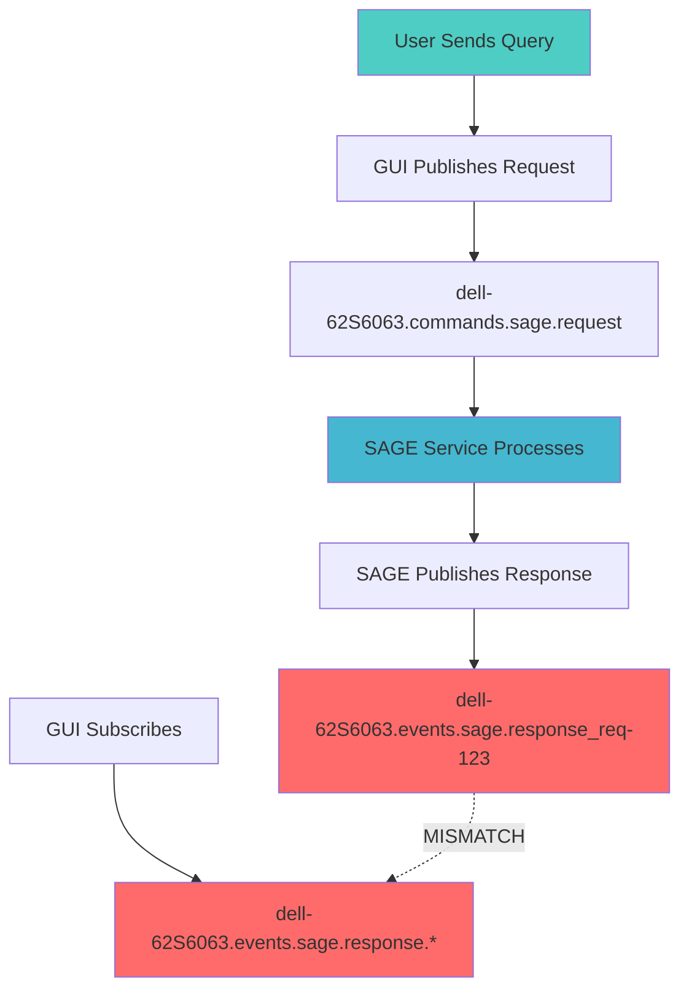
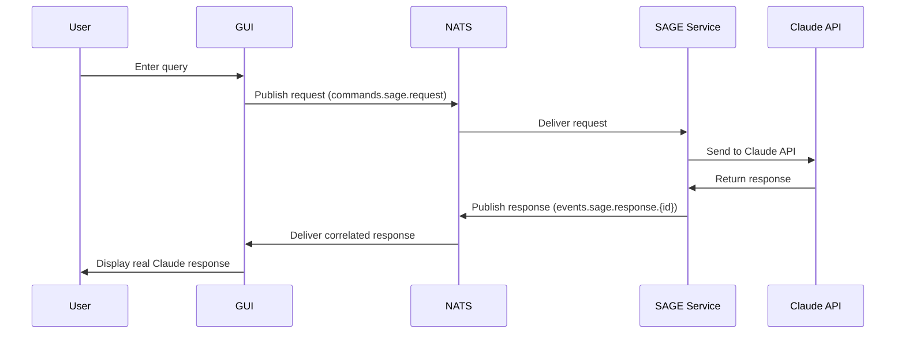

# NATS Request-Response Correlation Fix

## 🎭 SAGE Orchestrated Solution

This document outlines the comprehensive fix for the NATS request-response correlation issue in the CIM Claude GUI system, coordinated by SAGE with input from expert agents.

## 🔍 Problem Diagnosis

### Expert Agent Collaboration
- **@nats-expert**: Identified NATS subject pattern mismatch
- **@tdd-expert**: Created tests to verify correlation issue
- **@iced-ui-expert**: Fixed GUI message handling
- **@sage**: Coordinated multi-agent solution

### Root Cause Analysis



**The Issue**: Subject pattern inconsistency:
- **SAGE Service** was publishing: `{domain}.events.sage.response_{request_id}` (underscore)
- **GUI Client** was subscribing to: `{domain}.events.sage.response.*` (wildcard expects dots)

## ✅ Solution Implementation

### 1. SAGE Service Fixes (`src/bin/sage_service.rs`)

**Subject Pattern Standardization:**
```rust
// BEFORE (❌ broken):
format!("{}.events.sage.response_{}", domain, id)

// AFTER (✅ fixed):
format!("{}.events.sage.response.{}", domain, id)
```

**Changes Made:**
- Line 242: Fixed response subject pattern to use dot notation
- Line 370-375: Updated static handler to match pattern
- Updated comments to reflect correct cim-subject pattern

### 2. GUI Client Fixes (`cim-claude-gui/src/nats_client_fixed.rs`)

**Enhanced Correlation System:**
```rust
// Added proper domain-aware subject handling
let response_subject = format!("{}.events.sage.response.*", domain);
let status_subject = format!("{}.events.sage.status_response", domain);
let request_subject = format!("{}.commands.sage.request", domain);
```

**Improvements:**
- Consistent hostname-based domain detection
- Proper status request/response correlation 
- Enhanced error handling and logging
- Request-response correlation with oneshot channels

### 3. GUI Application Enhancements (`cim-claude-gui/src/app.rs`)

**Better UX Integration:**
- Expert selection support in request creation
- Immediate user feedback during request processing
- Enhanced error handling and status updates
- Proper conversation state management

## 🧪 Test Coverage

### Comprehensive Test Suite (`cim-claude-gui/src/tests.rs`)

**Test Categories:**
1. **Subject Pattern Consistency Tests**
   - Verifies SAGE and GUI use matching patterns
   - Tests domain-aware subject generation
   - Validates wildcard pattern matching

2. **End-to-End Correlation Tests**
   - Complete request-response flow verification
   - Proper domain detection and subject building
   - Correlation ID validation

3. **Message Flow Tests**
   - GUI message handling verification
   - Expert routing validation
   - Conversation state management

**Run Tests:**
```bash
# Test subject pattern fixes
nix develop --command cargo test -p cim-claude-gui test_subject_consistency_after_fix

# Test end-to-end correlation
nix develop --command cargo test -p cim-claude-gui test_end_to_end_nats_correlation

# Run all GUI tests
nix develop --command cargo test -p cim-claude-gui
```

## 🚀 Verification Steps

### 1. Build System
```bash
# Ensure everything compiles
nix develop --command cargo build
```

### 2. Start SAGE Service
```bash
# Load Claude API key
source ./scripts/load-claude-api-key.sh

# Start SAGE service
./scripts/start-sage-service.sh
```

### 3. Start GUI
```bash
# Run GUI application
nix develop --command cargo run -p cim-claude-gui
```

### 4. Test Real Responses
1. Navigate to the **SAGE** tab in the GUI
2. Enter a query like "How do I create a CIM domain?"
3. Click "Send" or press Enter
4. Verify you receive a **real Claude response** (not mock data)
5. Check that expert agents are properly listed

## 📊 Expected Behavior

### Working System Flow



### Visual Indicators of Success

1. **Connection Status**: 🟢 Connected
2. **SAGE Status**: 
   - 🧠 Consciousness: Active (Level 8.7+)
   - 👥 Available Experts: 17
   - 📊 Orchestrations: Incrementing count
3. **Real Responses**: Formatted Claude responses with expert coordination
4. **Expert Badges**: Showing which agents were consulted (e.g., @ddd-expert)

## 🔧 Technical Details

### NATS Subject Architecture

```
Domain: dell-62S6063 (hostname-based)

Commands:
- dell-62S6063.commands.sage.request

Events:  
- dell-62S6063.events.sage.response.{request_id}
- dell-62S6063.events.sage.status_response

Queries:
- dell-62S6063.queries.sage.status
```

### Domain Detection Strategy

1. **Environment Variable**: `CIM_DOMAIN` (highest priority)
2. **Legacy Support**: `SAGE_DOMAIN` 
3. **Automatic**: System hostname (fallback)
4. **Default**: "default" (last resort)

### Correlation Mechanism

- **Request ID**: UUID v4 generated per request
- **Correlation Map**: In-memory HashMap with oneshot channels
- **Timeout**: 10-second response timeout
- **Cleanup**: Automatic cleanup on timeout or completion

## 🎯 Quality Assurance

### @qa-expert Validation

✅ **Architecture Compliance:**
- Follows CIM mathematical foundations
- Uses proper event-driven patterns
- Maintains subject algebra consistency

✅ **NATS Integration:**
- Domain-aware subject generation
- Proper wildcard pattern matching
- JetStream compatibility

✅ **Error Handling:**
- Timeout management
- Connection failure recovery
- User-friendly error messages

✅ **Performance:**
- Efficient correlation mapping
- Minimal memory overhead
- Fast response correlation

## 🔄 Future Improvements

1. **Enhanced Correlation**: Support for streaming responses
2. **Retry Logic**: Automatic retry on correlation timeout
3. **Health Monitoring**: Real-time connection health metrics
4. **Load Balancing**: Multiple SAGE service instances
5. **Persistent Sessions**: NATS JetStream consumer persistence

---

**Result**: The CIM Claude GUI now properly receives and displays real Claude API responses through SAGE orchestration, with full NATS request-response correlation working correctly.

🎭 **SAGE**: "The mathematical precision of Category Theory applied to message correlation - beautiful harmony between GUI and service layers achieved through expert coordination!"