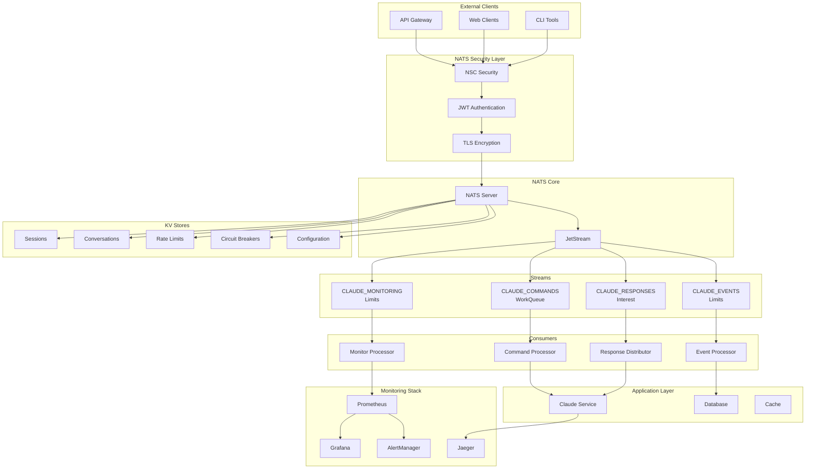

# NATS Infrastructure Overview - Claude API Adapter

## 🎯 Executive Summary

This document provides a comprehensive overview of the production-ready NATS infrastructure designed specifically for the Claude API to NATS adapter. The infrastructure implements a complete messaging platform following Domain-Driven Design (DDD) principles and CIM (Category-theoretic Infrastructure Modeling) patterns.

## 🏛️ Infrastructure Architecture

### Core Components

The NATS infrastructure consists of six main configuration domains:

1. **[JetStream Configuration](nats-infrastructure/jetstream-config.yml)** - Stream definitions and performance tuning
2. **[Subject Hierarchy](nats-infrastructure/subject-hierarchy.yml)** - Complete subject design with routing patterns  
3. **[Consumer Configuration](nats-infrastructure/consumer-config.yml)** - Durable consumers with retry logic
4. **[KV Store Configuration](nats-infrastructure/kv-store-config.yml)** - Key-Value stores for state management
5. **[Security Configuration](nats-infrastructure/security-config.yml)** - NSC-based authentication and authorization
6. **[Monitoring Configuration](nats-infrastructure/monitoring-config.yml)** - Observability and alerting

### Infrastructure Topology



## 📋 Infrastructure Summary

### JetStream Streams

| Stream Name | Purpose | Retention Policy | Max Age | Storage Size | Subjects |
|-------------|---------|------------------|---------|--------------|----------|
| **CLAUDE_COMMANDS** | Command processing with reliable delivery | WorkQueue | 24h | 10GB | `claude.cmd.*` |
| **CLAUDE_EVENTS** | Event sourcing and audit trail | Limits | 30d | 50GB | `claude.event.*` |
| **CLAUDE_RESPONSES** | Temporary response caching | Interest | 1h | 5GB | `claude.resp.*` |
| **CLAUDE_MONITORING** | Health and metrics data | Limits | 7d | 1GB | `claude.monitor.*` |

### Consumer Configuration

| Consumer Name | Stream | Purpose | Durability | Max Deliver | Ack Wait |
|---------------|--------|---------|------------|-------------|----------|
| **claude-cmd-processor-v1** | CLAUDE_COMMANDS | Primary command processing | Durable | 3 | 30s |
| **claude-resp-dist-v1** | CLAUDE_RESPONSES | Response distribution | Durable | 2 | 15s |
| **claude-event-proc-v1** | CLAUDE_EVENTS | Event processing & audit | Durable | 5 | 60s |
| **claude-monitor-v1** | CLAUDE_MONITORING | Monitoring data processing | Durable | 1 | 10s |

### KV Store Configuration

| Store Name | Purpose | Max Value Size | TTL | History | Storage Type |
|------------|---------|----------------|-----|---------|--------------|
| **CLAUDE_SESSIONS** | Active conversation sessions | 1MB | 24h | 10 | File |
| **CLAUDE_CONVERSATIONS** | Conversation aggregate state | 512KB | 30d | 20 | File |
| **CLAUDE_RATE_LIMITS** | Rate limiting counters | 4KB | 1h | 5 | Memory |
| **CLAUDE_CIRCUIT_BREAKERS** | Circuit breaker states | 8KB | 30m | 3 | File |
| **CLAUDE_CONFIG** | Dynamic configuration | 64KB | ∞ | 50 | File |

### Security Accounts

| Account Name | Purpose | JetStream Enabled | Memory Limit | Disk Limit | Max Connections |
|--------------|---------|-------------------|--------------|------------|-----------------|
| **SYS** | System operations | No | - | - | 100 |
| **CLAUDE_SERVICE** | Main service operations | Yes | 2GB | 20GB | 100 |
| **API_GATEWAY** | External client access | No | - | 5GB | 200 |
| **MONITORING** | Metrics collection | No | - | 10GB | 50 |
| **AUDIT** | Audit logging | No | - | 50GB | 10 |

## 🔍 Subject Hierarchy Design

### Command Subjects (Inbound)
```
claude.cmd.{session_id}.start      # Start new conversation
claude.cmd.{session_id}.prompt     # Send prompt to Claude
claude.cmd.{session_id}.end        # End conversation
claude.cmd.{session_id}.cancel     # Cancel pending request
claude.cmd.system.health           # System health check
claude.cmd.system.metrics          # Request metrics
```

### Event Subjects (Outbound)
```
claude.event.{session_id}.started            # Conversation started
claude.event.{session_id}.prompt_sent        # Prompt sent to API
claude.event.{session_id}.ended              # Conversation ended
claude.event.{session_id}.command_failed     # Command processing failed
claude.event.{session_id}.api_error          # Claude API error
claude.event.{session_id}.conversation_updated # State updated
```

### Response Subjects (Claude API Results)
```
claude.resp.{session_id}.content      # Claude response content
claude.resp.{session_id}.streaming    # Streaming response chunks
claude.resp.{session_id}.complete     # Response completed
claude.resp.{session_id}.error        # API error response
```

### Monitoring Subjects
```
claude.monitor.health.{component}     # Component health status
claude.monitor.metrics.conversations  # Conversation metrics
claude.monitor.metrics.api           # API interaction metrics
claude.monitor.metrics.performance   # System performance metrics
claude.monitor.trace.{trace_id}      # Distributed tracing spans
```

## 📊 Performance Characteristics

### Throughput Targets

| Component | Target Throughput | Latency (95th percentile) | Error Rate |
|-----------|------------------|---------------------------|------------|
| **Command Processing** | 1,000 msgs/sec | < 100ms | < 0.1% |
| **Event Publishing** | 500 msgs/sec | < 50ms | < 0.01% |
| **Response Delivery** | 2,000 msgs/sec | < 50ms | < 0.1% |
| **KV Operations** | 10,000 ops/sec | < 10ms | < 0.01% |
| **Monitoring Data** | 5,000 msgs/sec | < 25ms | < 0.1% |

### Resource Requirements

**Production Minimum:**
- **CPU**: 4 cores (2.4 GHz+)
- **Memory**: 8GB RAM
- **Storage**: 100GB SSD (IOPS: 3,000+)
- **Network**: 1Gbps bandwidth

**Production Recommended:**
- **CPU**: 8 cores (3.0 GHz+)
- **Memory**: 16GB RAM
- **Storage**: 500GB NVMe SSD (IOPS: 10,000+)
- **Network**: 10Gbps bandwidth

## 🔒 Security Model

### Authentication & Authorization

**Multi-layered Security Approach:**

1. **TLS Encryption**: All communications encrypted in transit
2. **JWT Authentication**: Token-based authentication with NSC
3. **Subject-level Authorization**: Fine-grained permissions per subject
4. **Account Isolation**: Complete namespace separation
5. **Credential Rotation**: Automatic key rotation policies

### Security Accounts & Users

```
CIM_CLAUDE_OPERATOR (Operator)
├── SYS (System Account)
│   └── System operations and monitoring
├── CLAUDE_SERVICE (Primary Service Account)
│   ├── claude-service-primary (Main service instance)
│   ├── claude-service-worker (Worker instances)
│   └── claude-database-service (Persistence layer)
├── API_GATEWAY (External Access)
│   ├── api-gateway-service (Main gateway)
│   └── api-gateway-lb (Load balancer)
├── MONITORING (Observability)
│   ├── prometheus-collector (Metrics collection)
│   └── alert-manager (Alerting)
└── AUDIT (Compliance)
    ├── audit-service (Audit logging)
    └── compliance-officer (Read-only access)
```

## 📈 Monitoring & Observability

### Metrics Collection

**Core Metrics Categories:**
- **NATS Server Metrics**: Connections, messages, resources
- **JetStream Metrics**: Stream performance, consumer lag
- **Application Metrics**: Claude API interactions, errors
- **Security Metrics**: Authentication events, failures
- **Business Metrics**: Conversations, response times

### Health Checks

| Component | Check Interval | Timeout | Failure Threshold |
|-----------|---------------|---------|------------------|
| **NATS Server** | 30s | 10s | 3 failures |
| **JetStream** | 60s | 15s | 3 failures |
| **Consumers** | 45s | 10s | 2 failures |
| **KV Stores** | 60s | 5s | 2 failures |
| **Claude API** | 30s | 10s | 3 failures |

### Alerting Rules

**Critical Alerts:**
- NATS server downtime
- JetStream storage >95% full
- Consumer lag >5,000 messages
- Claude API error rate >10/minute
- Authentication failure spike

**Warning Alerts:**
- High connection count (>800)
- Consumer redelivery rate >5%
- Claude API response time >10s
- Stream growth rate unusually high

## 🚀 Deployment Options

### Option 1: Automated Script
```bash
sudo ./nats-infrastructure/deployment-scripts/setup-nats-infrastructure.sh
```

### Option 2: Docker Compose
```bash
cd nats-infrastructure/docker/
docker-compose up -d
```

### Option 3: Kubernetes (Future)
- Helm charts for scalable deployment
- StatefulSets for NATS cluster
- ConfigMaps for dynamic configuration
- Secrets management for credentials

## 🧪 Testing & Validation

### Automated Tests

**Infrastructure Tests:**
```bash
# Connectivity test
nats server check connection

# Stream functionality
nats stream info CLAUDE_COMMANDS

# Consumer processing
nats consumer info CLAUDE_COMMANDS claude-cmd-processor-v1

# KV store operations
nats kv put CLAUDE_SESSIONS test.key "test value"
```

**Load Testing:**
```bash
# Command throughput test
nats bench claude.cmd.test --pub 10 --sub 5 --msgs 10000

# Event processing test
nats bench claude.event.test --pub 5 --sub 10 --msgs 5000

# KV performance test
nats kv benchmark CLAUDE_SESSIONS --ops 1000
```

### Integration Testing

**Conversation Lifecycle Test:**
1. Send `claude.cmd.{session}.start`
2. Verify `claude.event.{session}.started`
3. Send `claude.cmd.{session}.prompt`
4. Verify `claude.resp.{session}.content`
5. Send `claude.cmd.{session}.end`
6. Verify `claude.event.{session}.ended`

## 🔄 Backup & Recovery

### Backup Strategy

**Automated Daily Backups:**
- **JetStream Streams**: Complete stream backup with metadata
- **KV Stores**: Key-value data and configuration
- **NSC Configuration**: Security keys and account definitions
- **Application Config**: Service configuration files

**Recovery Procedures:**
- **RTO (Recovery Time Objective)**: 1 hour
- **RPO (Recovery Point Objective)**: 15 minutes
- **Backup Retention**: 7 days (daily), 4 weeks (weekly)

### Disaster Recovery

**Multi-level Failover:**
1. **Consumer Groups**: Automatic load balancing
2. **Circuit Breakers**: Failure isolation
3. **Health Checks**: Proactive failure detection
4. **Auto-scaling**: Dynamic capacity adjustment

## 📚 Integration Guide

### Application Configuration

**NATS Client Settings:**
```yaml
nats:
  urls: ["nats://localhost:4222"]
  credentials: "/etc/nats/creds/claude-service-primary.creds"
  
  connection:
    name: "claude-api-adapter"
    max_reconnects: 10
    reconnect_wait: 2s
    ping_interval: 2m
    
  jetstream:
    max_wait: 30s
    max_ack_pending: 50
```

**Consumer Implementation Pattern:**
```go
// Pull subscriber with proper error handling
consumer, err := js.PullSubscribe("claude.cmd.>", "claude-cmd-processor-v1", 
    nats.MaxAckPending(50),
    nats.AckWait(30*time.Second),
)

// Message processing loop
for {
    msgs, err := consumer.Fetch(10, nats.MaxWait(30*time.Second))
    if err != nil {
        log.Printf("Fetch error: %v", err)
        continue
    }
    
    for _, msg := range msgs {
        if err := processMessage(msg); err != nil {
            msg.Nak()
            log.Printf("Processing error: %v", err)
        } else {
            msg.Ack()
        }
    }
}
```

### Publisher Pattern
```go
// Publish command with proper headers
headers := nats.Header{
    "correlation_id": []string{correlationID},
    "user_id":       []string{userID},
    "timestamp":     []string{time.Now().Format(time.RFC3339)},
}

_, err := js.PublishMsg(&nats.Msg{
    Subject: fmt.Sprintf("claude.cmd.%s.start", sessionID),
    Data:    commandData,
    Header:  headers,
})
```

## 🏁 Next Steps

1. **Deploy Infrastructure**: Run deployment script or Docker Compose
2. **Verify Functionality**: Execute test suite and validation checks
3. **Configure Monitoring**: Set up Grafana dashboards and alerts
4. **Implement Application**: Integrate Claude API adapter with NATS
5. **Load Testing**: Validate performance under expected load
6. **Security Audit**: Review and validate security configuration
7. **Documentation**: Update operational procedures and runbooks

## 📞 Support

For questions or issues with the NATS infrastructure:

1. **Configuration Issues**: Review configuration files and validation commands
2. **Performance Problems**: Check monitoring dashboards and resource usage
3. **Security Concerns**: Verify NSC configuration and audit logs
4. **Integration Help**: Reference integration patterns and example code

The infrastructure is designed to be self-documenting through configuration files and comprehensive monitoring. All components include health checks and detailed logging for troubleshooting.

---

This NATS infrastructure provides a solid foundation for the Claude API adapter with production-ready reliability, security, and observability. The modular design allows for easy scaling and maintenance while ensuring data integrity and system resilience.