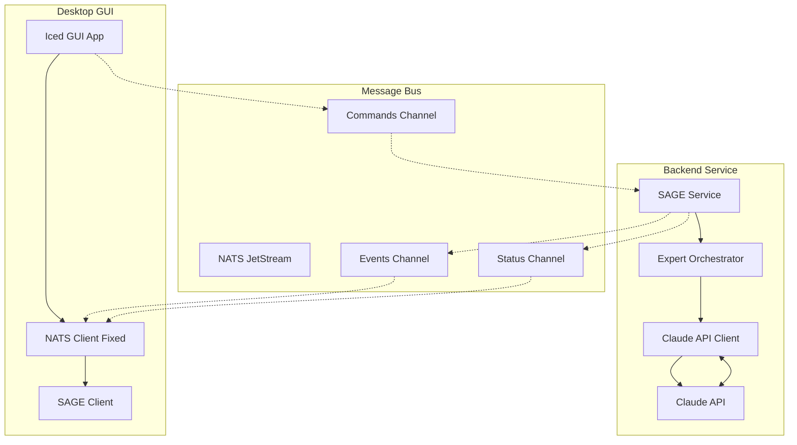

# 🎭 SAGE End-to-End Setup Guide

This guide shows how to set up and test the complete SAGE system with real Claude API integration.

## Architecture Overview



## 🚀 Quick Start

### 1. Prerequisites

```bash
# Install NATS Server
nix-shell -p nats-server

# Set Claude API Key
export ANTHROPIC_API_KEY="your-api-key-here"
export NATS_URL="nats://localhost:4222"
```

### 2. Start NATS Server

```bash
nats-server -js
```

### 3. Start SAGE Backend Service

```bash
cd /git/thecowboyai/cim-agent-claude
nix develop --command cargo run --bin sage-service
```

Expected output:
```
🎭 SAGE Systemd Service Starting...
🧠 SAGE Consciousness Initialized
📍 Domain: your-hostname
Expert Agents Available: 5
📨 Subscribing to: commands.sage.request
📊 Status endpoint: queries.sage.status
🧠 SAGE Request Handler Started (Static)
```

### 4. Start GUI Application

```bash
# In a new terminal
cd /git/thecowboyai/cim-agent-claude
nix develop --command cargo run -p cim-claude-gui
```

Expected output:
```
2025-08-23T... INFO  📡 SAGE response handler subscribed to sage.response.*
2025-08-23T... INFO  📡 SAGE status handler subscribed to sage.status.response
✅ NATS client initialized with response correlation
```

## 🧪 Testing the Integration

### Basic Functionality Test

1. **Open GUI**: The GUI should show the SAGE tab with connection status
2. **Send Test Query**: Enter "How do I create a CIM domain?" and click Send
3. **Verify Response**: You should see a real Claude API response coordinated through SAGE

### Advanced Testing Scenarios

#### Test 1: Domain Modeling Query
```
Query: "I need help designing aggregates for an e-commerce domain"
Expected: DDD expert coordination with specific aggregate recommendations
```

#### Test 2: Infrastructure Query
```
Query: "How do I set up NATS JetStream for event sourcing?"
Expected: NATS expert with JetStream configuration examples
```

#### Test 3: Multi-Expert Query
```
Query: "Create a complete CIM for order processing with tests and infrastructure"
Expected: Multiple expert coordination (DDD, TDD, NATS, CIM experts)
```

## 🔧 Troubleshooting

### NATS Connection Issues

```bash
# Check NATS server is running
nats-server --signal status

# Test NATS connectivity
nats pub test.subject "hello world"
nats sub test.subject
```

### Claude API Issues

```bash
# Verify API key is set
echo $ANTHROPIC_API_KEY

# Test API directly
curl -H "x-api-key: $ANTHROPIC_API_KEY" \
     -H "content-type: application/json" \
     -H "anthropic-version: 2023-06-01" \
     -d '{"model":"claude-3-5-sonnet-20241022","max_tokens":100,"messages":[{"role":"user","content":"Hello"}]}' \
     https://api.anthropic.com/v1/messages
```

### GUI Issues

```bash
# Check GUI compilation
cargo check -p cim-claude-gui

# Run with debug logging
RUST_LOG=debug cargo run -p cim-claude-gui
```

## 📊 Message Flow Verification

### NATS Subject Patterns Used

1. **Requests**: `commands.sage.request` (or `{domain}.commands.sage.request`)
2. **Responses**: `events.sage.response_{request_id}` (or `{domain}.events.sage.response_{request_id}`)
3. **Status**: `queries.sage.status` / `events.sage.status_response`

### Verify Message Flow

```bash
# Subscribe to all SAGE subjects
nats sub "*.sage.>"
nats sub "sage.>"

# In another terminal, send test via GUI
# You should see request and response messages
```

## 🎯 Success Criteria

- ✅ GUI connects to NATS without Tokio runtime errors
- ✅ Backend service receives and processes SAGE requests
- ✅ Real Claude API responses appear in GUI (not mock data)
- ✅ Expert orchestration works (multiple agents for complex queries)
- ✅ Request-response correlation maintains conversation state
- ✅ Status requests show SAGE consciousness and available agents

## 🔍 Advanced Configuration

### Custom Domain Setup

```bash
export CIM_DOMAIN="my-project"
# This will use subjects like: my-project.commands.sage.request
```

### Production Configuration

```bash
export NATS_URL="nats://production-nats:4222"
export ANTHROPIC_API_KEY="prod-api-key"
export RUST_LOG="info"
```

## 📈 Next Steps

Once end-to-end testing is successful:

1. **Streaming Responses**: Implement Claude API streaming for real-time responses
2. **Persistent Memory**: Add NATS KV Store for conversation persistence  
3. **Multi-User Support**: Implement session management and user contexts
4. **Expert Agent Expansion**: Add more specialized expert agents
5. **Production Deployment**: Containerize and deploy with systemd services

## 🐛 Known Issues

1. **Status Messages**: Status broadcast messages don't use correlation (by design)
2. **Mock Data**: Some test data still exists in GUI for fallback scenarios
3. **Error Recovery**: Limited retry logic for failed Claude API calls
4. **Memory Management**: Conversation history grows unbounded (needs cleanup)

## 💡 Tips

- Use the SAGE tab to see expert coordination in action
- Try queries that mention specific domains (testing, infrastructure, GUI)
- Watch NATS logs to see message routing and correlation
- Use different expert selections to see routing changes