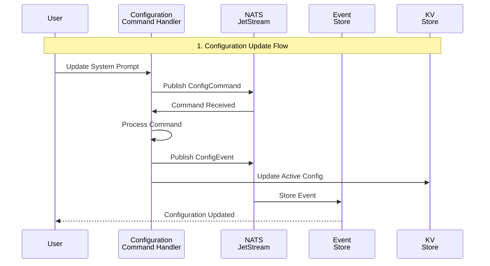
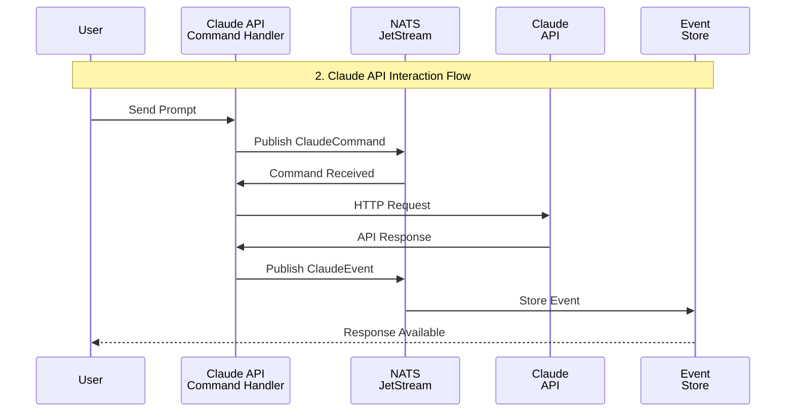
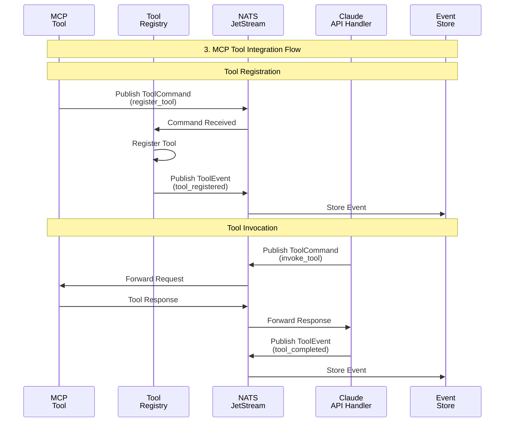
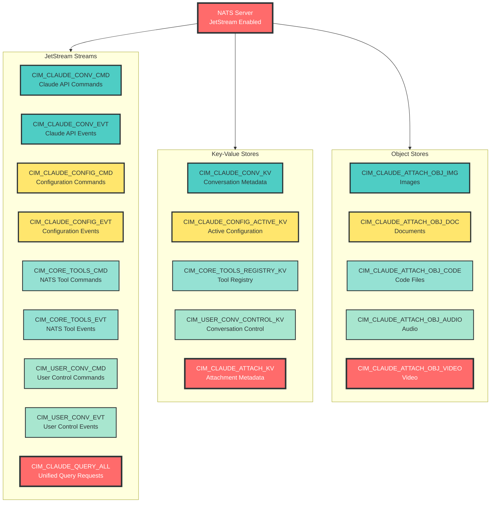
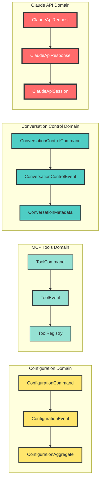

```mermaid
graph TB
    %% High contrast styling
    classDef primary fill:#FF6B6B,stroke:#2D3436,stroke-width:4px,color:#FFFFFF
    classDef secondary fill:#4ECDC4,stroke:#2D3436,stroke-width:3px,color:#2D3436
    classDef decision fill:#FFE66D,stroke:#2D3436,stroke-width:3px,color:#2D3436
    classDef result fill:#95E1D3,stroke:#2D3436,stroke-width:2px,color:#2D3436
    classDef start fill:#2D3436,stroke:#FFFFFF,stroke-width:2px,color:#FFFFFF

    %% Core Domains
    ClaudeAPI["1. Claude API Commands<br/>cim.claude.conv.cmd.*"]:::primary
    Config["2. Configuration Management<br/>cim.claude.config.cmd.*"]:::primary
    Tools["3. NATS-Connected Tools<br/>cim.core.event.cmd.*"]:::primary
    UserControl["4. Conversation Control<br/>cim.user.conv.cmd.*"]:::primary

    %% Claude API Subject Patterns
    ClaudeAPI --> StartConv["cim.claude.conv.cmd.start.{conv_id}"]:::secondary
    ClaudeAPI --> SendMsg["cim.claude.conv.cmd.send.{conv_id}"]:::secondary
    ClaudeAPI --> EndConv["cim.claude.conv.cmd.end.{conv_id}"]:::secondary

    %% Configuration Subject Patterns
    Config --> UpdatePrompt["cim.claude.config.cmd.update_system_prompt.{config_id}"]:::decision
    Config --> UpdateModel["cim.claude.config.cmd.update_model_params.{config_id}"]:::decision
    Config --> UpdateSettings["cim.claude.config.cmd.update_conversation_settings.{config_id}"]:::decision

    %% Tools Subject Patterns
    Tools --> RegisterTool["cim.core.event.cmd.register_tool.{tool_id}"]:::result
    Tools --> InvokeTool["cim.core.event.cmd.invoke_tool.{tool_id}"]:::result
    Tools --> HealthCheck["cim.core.event.cmd.health_check_tool.{tool_id}"]:::result

    %% User Control Subject Patterns
    UserControl --> PauseConv["cim.user.conv.cmd.pause.{conv_id}"]:::start
    UserControl --> ArchiveConv["cim.user.conv.cmd.archive.{conv_id}"]:::start
    UserControl --> ForkConv["cim.user.conv.cmd.fork.{conv_id}"]:::start
```

# CIM Claude Adapter - Event-Sourced Architecture

Copyright 2025 - Cowboy AI, LLC. All rights reserved.

## Overview

The CIM Claude Adapter follows **pure event sourcing** principles where **EVERYTHING is a Command, Event, or Query**. There are no exceptions - all interactions with Claude API, configuration changes, tool integrations, and conversation management are mapped through this pattern.

## Core Architecture Principle

> **"EVERYTHING on our side is an Event or a Command or a Query, no exceptions, we map these to the API of claude"**

## Subject Separation



## Subject Separation

### 1. Claude API Commands (Actual Claude Interaction)
**Subject Pattern**: `cim.claude.conv.cmd.{command}.{conversation_id}`
- `cim.claude.conv.cmd.start.{conv_id}` - Start new conversation
- `cim.claude.conv.cmd.send.{conv_id}` - Send prompt to Claude
- `cim.claude.conv.cmd.end.{conv_id}` - End conversation

**Events**: `cim.claude.conv.evt.{event}.{conversation_id}`
- `cim.claude.conv.evt.prompt_sent.{conv_id}` - Prompt sent to Claude API
- `cim.claude.conv.evt.response_received.{conv_id}` - Response received from Claude
- `cim.claude.conv.evt.rate_limited.{conv_id}` - Rate limit hit
- `cim.claude.conv.evt.api_error.{conv_id}` - API error occurred

### 2. Configuration Management (Separate from Claude API)
**Subject Pattern**: `cim.claude.config.cmd.{command}.{config_id}`
- `cim.claude.config.cmd.update_system_prompt.{config_id}` - Update system prompt
- `cim.claude.config.cmd.update_model_params.{config_id}` - Update temperature, max_tokens, etc.
- `cim.claude.config.cmd.update_conversation_settings.{config_id}` - Update conversation rules

**Events**: `cim.claude.config.evt.{event}.{config_id}`
- `cim.claude.config.evt.system_prompt_updated.{config_id}` - System prompt changed
- `cim.claude.config.evt.model_params_updated.{config_id}` - Model parameters changed
- `cim.claude.config.evt.config_reset.{config_id}` - Configuration reset to defaults

### 3. NATS-Connected Tools (MCP via NATS)
**Subject Pattern**: `cim.core.event.cmd.{command}.{tool_id}`
- `cim.core.event.cmd.register_tool.{tool_id}` - Tool registers on NATS
- `cim.core.event.cmd.invoke_tool.{tool_id}` - Invoke tool via NATS
- `cim.core.event.cmd.health_check_tool.{tool_id}` - Ping tool health

**Events**: `cim.core.event.evt.{event}.{tool_id}`
- `cim.core.event.evt.tool_registered.{tool_id}` - Tool available on NATS
- `cim.core.event.evt.tool_invocation_started.{tool_id}` - Tool execution started
- `cim.core.event.evt.tool_invocation_completed.{tool_id}` - Tool finished successfully

### 4. Conversation Control (User Actions)
**Subject Pattern**: `cim.user.conv.cmd.{command}.{conversation_id}`
- `cim.user.conv.cmd.pause.{conv_id}` - Pause conversation
- `cim.user.conv.cmd.archive.{conv_id}` - Archive conversation  
- `cim.user.conv.cmd.fork.{conv_id}` - Create conversation branch

**Events**: `cim.user.conv.evt.{event}.{conversation_id}`
- `cim.user.conv.evt.paused.{conv_id}` - Conversation paused
- `cim.user.conv.evt.archived.{conv_id}` - Conversation archived

## Message Flow Patterns







## Message Flow Patterns

### 1. Configuration Update Flow
```
User Request → ConfigCommand → NATS → CommandProcessor → ConfigEvent → NATS → EventStore
                                                       ↓
                                                  Update KV Store
```

### 2. Claude API Interaction Flow
```
User Prompt → ClaudeCommand → NATS → Claude API Adapter → Claude API
                                            ↓
                                      ClaudeEvent → NATS → EventStore
```

### 3. MCP Tool Integration Flow
```
Tool Registration:
MCP Tool → NATS ToolCommand → Tool Registry → ToolEvent → NATS

Tool Invocation:
Claude → ToolCommand → NATS → MCP Tool (via NATS) → ToolEvent → NATS → Claude
```

## Domain Models

### Configuration Domain
- **ConfigurationCommand**: Update system prompt, model params, conversation settings
- **ConfigurationEvent**: System prompt updated, model params changed, config reset
- **ConfigurationAggregate**: Current configuration state with event sourcing

### MCP Tools Domain  
- **ToolCommand**: Register, invoke, health check tools
- **ToolEvent**: Tool registered, invocation completed, tool unavailable
- **ToolRegistry**: Available tools and their NATS subjects

### Conversation Control Domain
- **ConversationControlCommand**: Pause, resume, archive, fork conversations
- **ConversationControlEvent**: Paused, archived, forked, merged
- **ConversationMetadata**: Tags, priority, status, branching info

## NATS Infrastructure





## NATS Infrastructure

### Streams
1. **CIM_CLAUDE_CONV_CMD** - Claude API commands
2. **CIM_CLAUDE_CONV_EVT** - Claude API events (audit trail)  
3. **CIM_CLAUDE_CONFIG_CMD** - Configuration commands
4. **CIM_CLAUDE_CONFIG_EVT** - Configuration change events
5. **CIM_CORE_TOOLS_CMD** - NATS tool commands
6. **CIM_CORE_TOOLS_EVT** - NATS tool events
7. **CIM_USER_CONV_CMD** - Conversation control commands
8. **CIM_USER_CONV_EVT** - Conversation control events
9. **CIM_CLAUDE_QUERY_ALL** - All query requests (unified)

### KV Stores  
1. **CIM_CLAUDE_CONV_KV** - Conversation metadata
2. **CIM_CLAUDE_CONFIG_ACTIVE_KV** - Active configuration state
3. **CIM_CORE_TOOLS_REGISTRY_KV** - NATS tool registry
4. **CIM_USER_CONV_CONTROL_KV** - Conversation control state
5. **CIM_CLAUDE_ATTACH_KV** - Attachment metadata

### Object Stores
1. **CIM_CLAUDE_ATTACH_OBJ_IMG** - Image attachments
2. **CIM_CLAUDE_ATTACH_OBJ_DOC** - Document attachments  
3. **CIM_CLAUDE_ATTACH_OBJ_CODE** - Code files
4. **CIM_CLAUDE_ATTACH_OBJ_AUDIO** - Audio attachments
5. **CIM_CLAUDE_ATTACH_OBJ_VIDEO** - Video attachments

## Key Benefits

### 1. Complete Event Sourcing
- Every action is traceable through events
- Full audit trail of all system changes  
- Replay capability for debugging and analysis
- Immutable event history

### 2. Subject Separation
- Configuration changes don't interfere with Claude API calls
- Tool management is separate from conversation flow
- User control actions are isolated from content processing
- Clear separation of concerns

### 3. NATS-First Tool Integration
- MCP tools become NATS services
- No special MCP handling needed - everything is NATS
- Tools can be written in any language that supports NATS
- Natural load balancing and failover through NATS

### 4. Scalable Architecture
- Each domain can scale independently
- Event-driven processing enables horizontal scaling
- NATS clustering supports high availability
- Stream partitioning supports high throughput

## Example Flows

### Update System Prompt
```bash
# 1. Command sent
nats pub cim.claude.config.cmd.update_system_prompt.main '{
  "new_prompt": "You are a helpful coding assistant...",
  "reason": "Specializing for code help",
  "correlation_id": "config-123"
}'

# 2. Event generated  
nats pub cim.claude.config.evt.system_prompt_updated.main '{
  "old_prompt": "...",
  "new_prompt": "You are a helpful coding assistant...",
  "updated_at": "2025-01-17T10:30:00Z"
}'
```

### MCP Tool Invocation via NATS
```bash
# 1. Tool registers itself
nats pub cim.core.event.cmd.register_tool.file-tool '{
  "name": "file_operations",
  "request_subject": "tools.file.req",
  "response_subject": "tools.file.resp"
}'

# 2. Claude invokes tool
nats req tools.file.req '{
  "operation": "read_file", 
  "path": "/path/to/file"
}' --timeout=30s

# 3. Tool responds
# (Automatic NATS request-reply pattern)
```

This architecture ensures that **every interaction** follows the Command/Event/Query pattern, providing complete traceability, scalability, and maintainability while integrating seamlessly with Claude's API through NATS message patterns.