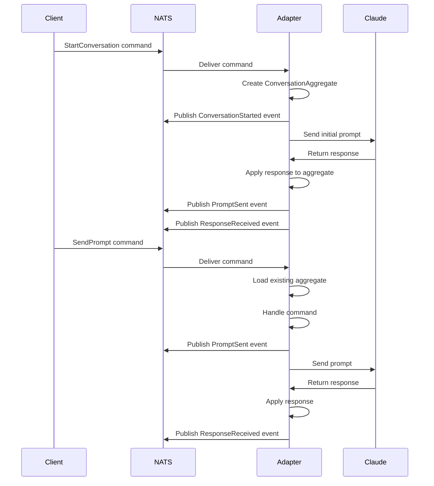

# CIM Claude Adapter

A production-ready hexagonal architecture port/adapter that translates between Claude API and NATS messaging, built following CIM (Composable Information Machine) standards.

## Architecture

This adapter implements a clean hexagonal architecture with proper domain boundaries:

### Domain Layer (Business Logic)
- **ConversationAggregate**: Manages conversation lifecycle with state machine
- **Domain Events**: Past-tense, business-focused events (ConversationStarted, PromptSent, ResponseReceived, etc.)
- **Commands**: Imperative, intent-focused commands (StartConversation, SendPrompt, EndConversation)
- **Value Objects**: Immutable objects with business validation (Prompt, ClaudeResponse, etc.)

### Ports (Interfaces)
- **ConversationPort**: Inbound port for NATS communication
- **ClaudeApiPort**: Outbound port for Claude API communication
- **ConversationStatePort**: Outbound port for state management

### Adapters (Implementations)
- **NatsAdapter**: NATS JetStream integration with proper subject patterns
- **ClaudeApiAdapter**: HTTP client with circuit breaker and rate limiting
- **MemoryStateAdapter**: In-memory state management (for development/testing)

### Application Service
- **ConversationService**: Orchestrates the complete workflow between ports and domain

## Features

### Event-Driven Architecture
- ✅ NO CRUD operations (everything through events)
- ✅ Proper correlation/causation ID tracking through entire flow
- ✅ Event sourcing ready with complete audit trail
- ✅ Domain events drive all state changes

### NATS Integration
- ✅ JetStream streams for commands, events, and responses
- ✅ Subject patterns: `claude.cmd.{session_id}.{operation}`, `claude.event.{conversation_id}.{event_type}`
- ✅ Durable consumers with retry logic
- ✅ Message correlation headers

### Claude API Integration
- ✅ Circuit breaker for resilience
- ✅ Rate limiting (50 requests/minute)
- ✅ Request/response correlation
- ✅ Timeout handling and retries

### Production Features
- ✅ Health checks and monitoring
- ✅ Structured logging with correlation IDs
- ✅ Graceful shutdown
- ✅ Configuration from environment variables
- ✅ Background cleanup of expired conversations

## Quick Start

### 1. Set Environment Variables

```bash
export CLAUDE_API_KEY="your-claude-api-key"
export NATS_URL="nats://localhost:4222"
export LOG_LEVEL="info"
```

### 2. Start NATS JetStream

```bash
# Using Docker
docker run -d --name nats -p 4222:4222 -p 8222:8222 nats:2.10-alpine -js -m 8222

# Or use the provided NATS infrastructure
cd ../nats-infrastructure
./deployment-scripts/setup-nats-infrastructure.sh
```

### 3. Run the Adapter

```bash
cargo run
```

The adapter will:
- Connect to NATS and ensure required streams exist
- Start listening for commands on `claude.cmd.*` subjects
- Publish events to `claude.event.*` subjects
- Start health check server on http://localhost:8080/health

## Usage

### Send Commands via NATS

```bash
# Start a conversation
nats pub claude.cmd.{session-id}.start '{
  "command_id": "cmd-123",
  "correlation_id": "corr-456",
  "command": {
    "StartConversation": {
      "session_id": "{session-id}",
      "initial_prompt": {
        "content": "Hello Claude!"
      },
      "context": {},
      "correlation_id": "corr-456"
    }
  },
  "timestamp": "2024-01-01T00:00:00Z"
}'

# Send a prompt to existing conversation
nats pub claude.cmd.{session-id}.prompt '{
  "command_id": "cmd-124",
  "correlation_id": "corr-457",
  "command": {
    "SendPrompt": {
      "conversation_id": "{conversation-id}",
      "prompt": {
        "content": "What is the weather like?"
      },
      "correlation_id": "corr-457"
    }
  },
  "timestamp": "2024-01-01T00:00:01Z"
}'
```

### Listen for Events

```bash
# Subscribe to all conversation events
nats sub "claude.event.*"

# Subscribe to specific conversation
nats sub "claude.event.{conversation-id}.*"

# Subscribe to specific event types
nats sub "claude.event.*.response_received"
```

## Configuration

All configuration can be set via environment variables:

### Required
- `CLAUDE_API_KEY`: Your Claude API key from Anthropic

### Optional
- `NATS_URL`: NATS server URL (default: `nats://localhost:4222`)
- `NATS_CREDENTIALS_FILE`: Path to NATS credentials file
- `CLAUDE_BASE_URL`: Claude API base URL (default: `https://api.anthropic.com`)
- `CLAUDE_TIMEOUT_SECONDS`: Request timeout (default: `30`)
- `SERVER_HOST`: Health server host (default: `127.0.0.1`)
- `SERVER_PORT`: Health server port (default: `8080`)
- `LOG_LEVEL`: Logging level (default: `info`)
- `METRICS_ENABLED`: Enable metrics (default: `true`)

## Event Flow



## Health Checks

The adapter exposes health check endpoints:

```bash
# Overall health
curl http://localhost:8080/health

# Response format
{
  "status": "healthy",
  "timestamp": "2024-01-01T00:00:00Z",
  "components": {
    "nats": {"status": "healthy"},
    "claude_api": {
      "status": "healthy",
      "response_time_ms": 150,
      "error_rate": 0.01
    }
  }
}
```

## Domain Events

The adapter publishes these domain events:

- **ConversationStarted**: New conversation initiated
- **PromptSent**: Prompt sent to Claude API
- **ResponseReceived**: Response received from Claude API
- **ConversationEnded**: Conversation terminated
- **RateLimitExceeded**: Rate limit hit
- **ClaudeApiErrorOccurred**: API error occurred

All events include proper correlation and causation IDs for complete audit trails.

## Business Rules

- Maximum 10 prompts per minute per conversation
- Maximum 100 exchanges per conversation
- Conversations expire after 24 hours of inactivity
- Maximum prompt length: 50,000 characters
- Circuit breaker opens after 5 consecutive failures

## Development

### Running Tests

```bash
cargo test
```

### Running with Debug Logging

```bash
RUST_LOG=debug cargo run
```

### Building for Production

```bash
cargo build --release
```

## Deployment

See the `../nats-infrastructure/` directory for complete deployment configurations including:

- Docker Compose setup
- Kubernetes manifests
- NATS security configuration
- Monitoring and observability

## Integration with CIM

This adapter follows CIM standards:

1. **Assembly-First**: Built using existing CIM patterns and libraries
2. **Event-Driven**: All operations through immutable events
3. **NATS-First**: All communication via NATS messaging
4. **Mathematical Foundations**: Based on category theory and proper domain boundaries
5. **Correlation Tracking**: Full event causation chains
6. **Self-Describing**: Domain events that business experts can understand

The adapter can be integrated into any CIM ecosystem as a domain service, providing Claude AI capabilities while maintaining proper event-driven boundaries.