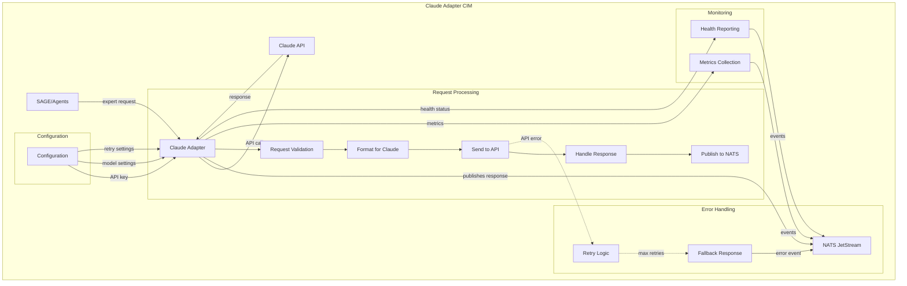
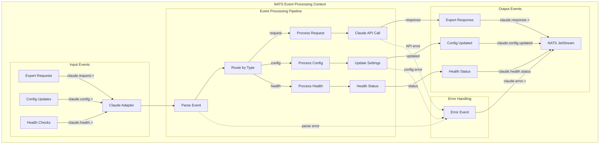

# CIM Claude Adapter - BDD Specification

## User Story 1: Claude API Integration

**Title**: Adapter provides reliable Claude API communication

**As a** CIM system component  
**I want** the Claude adapter to handle API communication reliably  
**So that** expert agent responses are delivered consistently through NATS  

### CIM Graph



### Acceptance Criteria

- [ ] Adapter validates all incoming expert agent requests
- [ ] Adapter formats requests according to Claude API specifications
- [ ] Adapter handles API rate limits and retry logic appropriately
- [ ] Adapter publishes successful responses to appropriate NATS subjects
- [ ] Adapter publishes error events when API calls fail
- [ ] Adapter maintains connection health monitoring
- [ ] Adapter supports configuration updates without restart

### Scenarios

```gherkin
Feature: Claude API Integration

  Background:
    Given Claude adapter is running and connected to NATS
    And Claude API credentials are configured
    And expert agent request streams are available

  Scenario: Successful expert agent request processing
    Given SAGE sends a request for nats-expert guidance
    When adapter receives the request from NATS
    Then adapter validates request format and content
    And adapter formats request for Claude API
    And adapter sends request to Claude API
    And Claude API returns expert guidance response
    And adapter publishes response to nats-expert response stream
    And adapter publishes RequestProcessed event with metrics

  Scenario: API error handling with retry
    Given SAGE sends a request for domain-expert guidance
    When adapter receives the request from NATS
    And adapter sends request to Claude API
    But Claude API returns a 429 rate limit error
    Then adapter waits for backoff period
    And adapter retries the request
    And Claude API returns successful response on retry
    And adapter publishes response to domain-expert response stream
    And adapter publishes RetrySucceeded event

  Scenario: Configuration update without restart
    Given adapter is processing requests normally
    When configuration update event is received
    And new Claude API model is specified
    Then adapter updates internal configuration
    And adapter continues processing with new model
    And adapter publishes ConfigurationUpdated event
    And no requests are lost during configuration change
```

---

## User Story 2: NATS Event Processing

**Title**: Adapter processes NATS events for Claude integration

**As a** CIM infrastructure component  
**I want** the adapter to handle NATS events efficiently  
**So that** Claude interactions are seamlessly integrated with event-driven architecture  

### CIM Graph



### Acceptance Criteria

- [ ] Adapter subscribes to all required NATS event streams
- [ ] Adapter parses incoming events correctly based on event type
- [ ] Adapter routes events to appropriate processing handlers
- [ ] Adapter publishes response events to correct NATS subjects
- [ ] Adapter handles malformed or invalid events gracefully
- [ ] Adapter maintains event processing metrics and monitoring
- [ ] Adapter ensures no events are lost during processing

### Scenarios

```gherkin
Feature: NATS Event Processing

  Background:
    Given Claude adapter is subscribed to required NATS streams
    And event processing handlers are initialized
    And output streams are configured

  Scenario: Expert request event processing
    Given adapter is listening for expert request events
    When a claude.request.nats-expert event is published
    And event contains valid expert request payload
    Then adapter parses the event successfully
    And adapter extracts request parameters
    And adapter routes to request processing handler
    And adapter calls Claude API with expert context
    And adapter publishes response to claude.response.nats-expert
    And adapter publishes RequestProcessingCompleted event

  Scenario: Configuration event processing
    Given adapter is processing requests with current configuration
    When a claude.config.update event is published
    And event contains new model and timeout settings
    Then adapter parses configuration update event
    And adapter validates new configuration values
    And adapter updates internal configuration
    And adapter publishes claude.config.updated event
    And subsequent requests use new configuration

  Scenario: Invalid event handling
    Given adapter is processing events normally
    When an invalid event with malformed JSON is received
    Then adapter attempts to parse the event
    And parsing fails due to malformed structure
    And adapter publishes claude.error.parse_failed event
    And adapter continues processing other valid events
    And adapter does not crash or stop processing
```