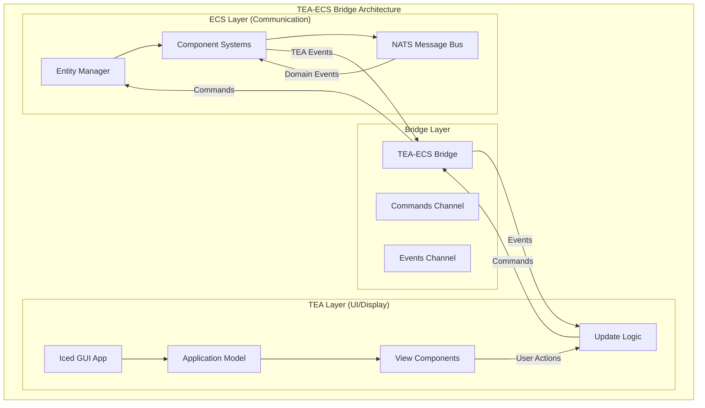
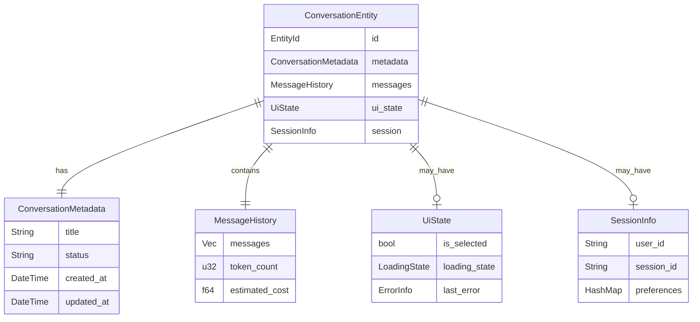
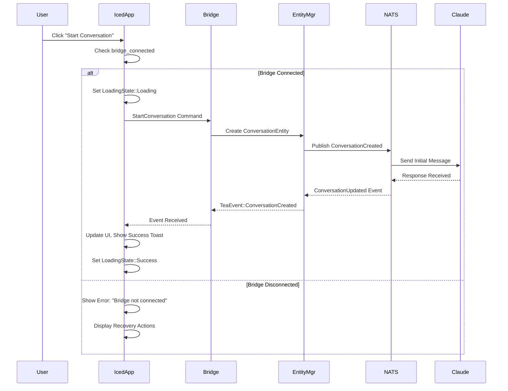
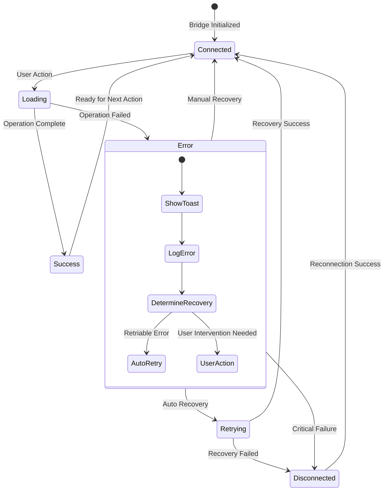
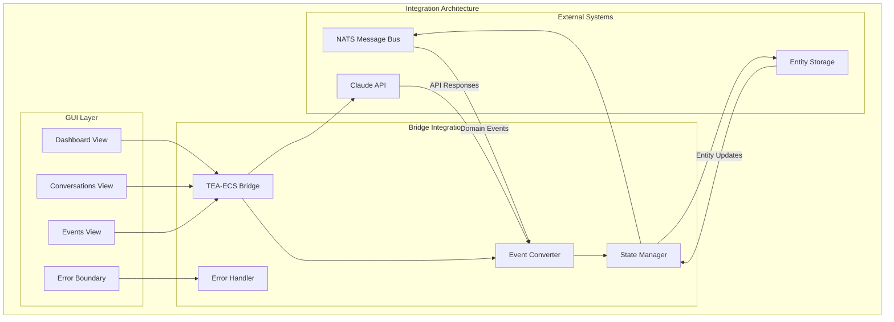

# TEA-ECS Bridge GUI Integration

## Overview

This document describes the comprehensive integration of the TEA-ECS bridge with the Iced GUI, creating a reactive user interface that demonstrates proper TEA (The Elm Architecture) patterns while integrating with our event-driven CIM architecture.

## Architecture

### TEA-ECS Bridge Pattern

The implementation follows the TEA-ECS bridge pattern where:

- **TEA Display Layer**: Synchronous Model-View-Update for UI rendering
- **ECS Communication Layer**: Asynchronous Entity-Component-System for message bus operations
- **Bridge**: Connects the two layers while maintaining clean separation



## Key Components

### 1. Enhanced Application State (`src/gui/app.rs`)

**Bridge Integration:**
- `TeaEcsBridge`: Core bridge instance for connecting layers
- `EntityManager`: Manages Entity[Components] shared state
- `ConversationEntity`: Represents conversations with metadata, messages, and UI state

**Reactive State Management:**
- `ComponentState`: Tracks loading states for UI components
- `LoadingState`: Enum for Idle/Loading/Success/Error states
- Real-time subscription system for bridge events

**Error Handling:**
- `ErrorBoundary`: Wraps UI sections with error boundaries
- `ToastNotification`: Non-blocking user feedback system
- Structured error information with recovery actions

### 2. Enhanced Messages (`src/gui/messages.rs`)

**Bridge Messages:**
- `BridgeMessage`: Bridge-specific communication events
- `TeaEventReceived`: Events from the ECS layer to TEA layer
- `BridgeStatusChanged`: Connection status updates

**Enhanced System Metrics:**
- Bridge latency tracking
- TEA event statistics
- Component state monitoring

### 3. Subscription System (`src/gui/subscriptions.rs`)

**Real-time Event Handling:**
- `BridgeSubscription`: Main bridge event subscription
- `HealthCheckSubscription`: Periodic system health monitoring
- `ConnectionStatusSubscription`: NATS connectivity monitoring
- `MetricsSubscription`: System performance metrics collection

**Error Recovery:**
- `ErrorRecoverySubscription`: Automatic bridge reconnection
- Exponential backoff for retries
- Graceful degradation on persistent failures

### 4. Error Boundary System (`src/gui/error_boundary.rs`)

**Comprehensive Error Handling:**
- `ErrorInfo`: Structured error information with severity levels
- `ErrorBoundary`: UI error boundary component
- `LoadingIndicator`: Loading state visualization
- `ToastNotification`: Non-blocking notification system

**Error Categories:**
- Bridge connection errors
- Claude API errors  
- Conversation management errors
- Message sending errors

**User Feedback:**
- Color-coded severity levels (Info/Warning/Error/Critical)
- Recovery action suggestions
- Automatic toast dismissal based on severity
- Detailed error information with timestamps

## Implementation Features

### 1. Reactive Components

**Dashboard:**
- Real-time system health indicators
- Bridge connection status with visual feedback
- Quick actions with loading states
- Recent events preview

**Conversations:**
- Live conversation list updates
- Per-conversation loading indicators
- Inline message sending with feedback
- Auto-selection of new conversations

**Events:**
- Prioritized event stream display
- Color-coded event types
- Conversation context linking
- Legacy/TEA event differentiation

### 2. State Management

**Entity-Component Pattern:**
```rust
ConversationEntity {
    id: EntityId,
    metadata: ConversationMetadata,    // Title, status, timestamps
    messages: MessageHistory,          // Message list, token count
    ui_state: Option<UiState>,        // Display preferences
    session: Option<SessionInfo>,     // User session data
}
```



**Component Dirty Tracking:**
- Automatic change detection
- Partial synchronization support  
- Efficient state updates

### 3. Event-Driven Updates

**TEA Event Processing:**
- `ConversationCreated`: Auto-select new conversations
- `MessageAdded`: Update activity timestamps, clear loading states
- `ClaudeResponseReceived`: Trigger UI notifications
- `ErrorOccurred`: Show structured error messages
- `ConnectionStatusChanged`: Update bridge status

**Loading State Management:**
- Per-operation loading indicators
- Automatic state clearing on completion/error
- Visual feedback for all async operations

### 4. User Experience Features

**Toast Notifications:**
- Success confirmations ("Message sent successfully")
- Warning alerts ("Bridge not connected")
- Error notifications with recovery actions
- Automatic dismissal based on severity

**Error Boundaries:**
- Graceful error handling around UI sections
- Fallback content for error states
- Detailed error information with expand/collapse
- Recovery action suggestions

**Loading Indicators:**
- Component-level loading states
- Visual feedback during async operations
- Retry mechanisms for failed operations

## Usage Examples

### Starting a Conversation



```rust
// User clicks "Start Conversation"
Message::StartConversation { session_id, initial_prompt } => {
    // Check bridge connection
    if self.bridge_connected {
        // Set loading state
        self.component_states.conversation_list = LoadingState::Loading;
        
        // Send command through bridge
        let create_cmd = EcsCommandBuilder::create_conversation(prompt).build();
        bridge.send_command(create_cmd);
        
        // Clear input
        self.prompt_input.clear();
    } else {
        // Show structured error
        let error_info = errors::bridge_disconnected();
        self.current_error = Some(error_info);
    }
}

// Bridge processes command asynchronously and returns event
TeaEvent::ConversationCreated { conversation_id, .. } => {
    // Update UI state
    self.component_states.conversation_list = LoadingState::Success;
    self.selected_conversation = Some(conversation_id);
    
    // Show success toast
    let toast = ToastNotification::new(ErrorSeverity::Info, "Conversation started");
    self.toast_notifications.insert(0, toast);
}
```

### Error Handling



```rust
// Bridge connection fails
TeaEvent::ErrorOccurred { error, .. } => {
    // Create structured error info
    let error_info = ErrorInfo::bridge_connection_error(error)
        .with_recovery_action("Check NATS server and retry");
    
    // Update UI state
    self.current_error = Some(error_info);
    self.component_states.bridge_connection = LoadingState::Error(error);
    
    // Show toast notification
    let toast = ToastNotification::new(ErrorSeverity::Error, "Connection lost");
    self.toast_notifications.insert(0, toast);
}
```

## Technical Benefits

### 1. Separation of Concerns
- UI logic separate from communication logic
- Clean async/sync boundary
- Independent testing of layers

### 2. Reactive Updates
- Real-time event propagation
- Efficient state synchronization
- Minimal UI redraws

### 3. Error Resilience
- Graceful error handling at multiple levels
- Automatic recovery mechanisms
- Clear user feedback

### 4. Scalability
- Component-based architecture
- Subscription-based event handling
- Entity-component state management

## Integration Points



### NATS Message Bus
- Automatic subscription to relevant event streams
- Bridge handles NATS connection management
- Events converted from domain events to TEA events

### Claude API
- Async API calls through bridge systems
- Rate limiting and error handling
- Token counting and cost estimation

### Entity Management
- Shared state between TEA and ECS layers
- Component dirty tracking for efficient sync
- Multi-scope entity management (global, feature, component, session)

## Conclusion

This implementation demonstrates a production-ready integration of TEA patterns with an ECS-based communication layer, providing:

- **Reactive UI**: Real-time updates with proper TEA patterns
- **Robust Error Handling**: Comprehensive error boundaries and user feedback
- **Event-Driven Architecture**: Clean separation with bridge pattern
- **Modern UX**: Loading states, toast notifications, and graceful degradation
- **Scalable Design**: Component-based architecture ready for expansion

The system showcases how to build complex reactive applications while maintaining clean architecture principles and providing excellent user experience through comprehensive error handling and real-time feedback.