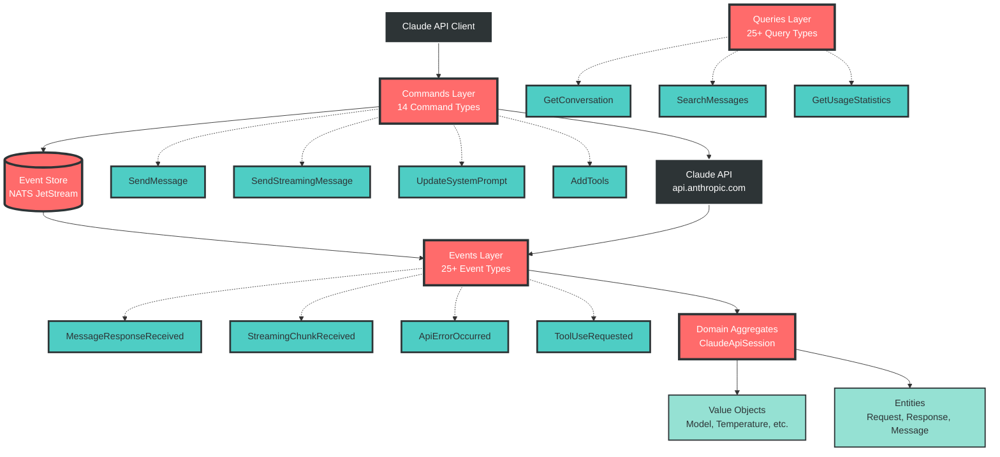
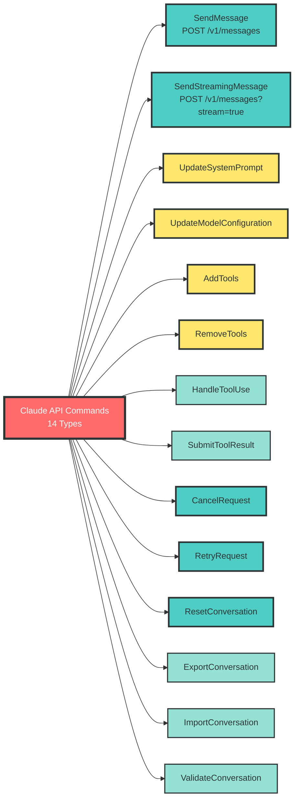
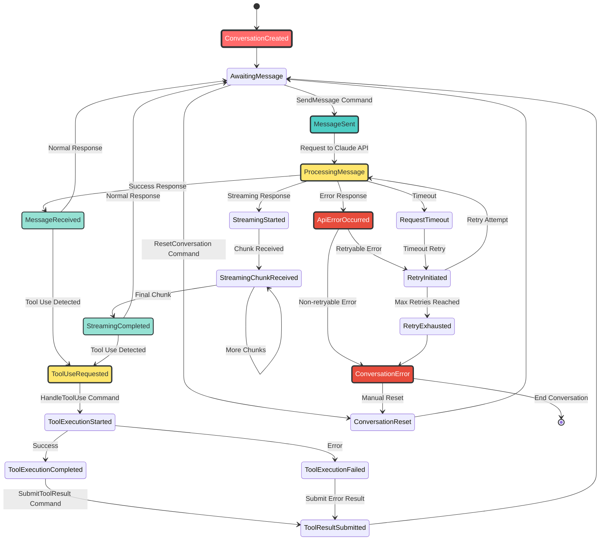
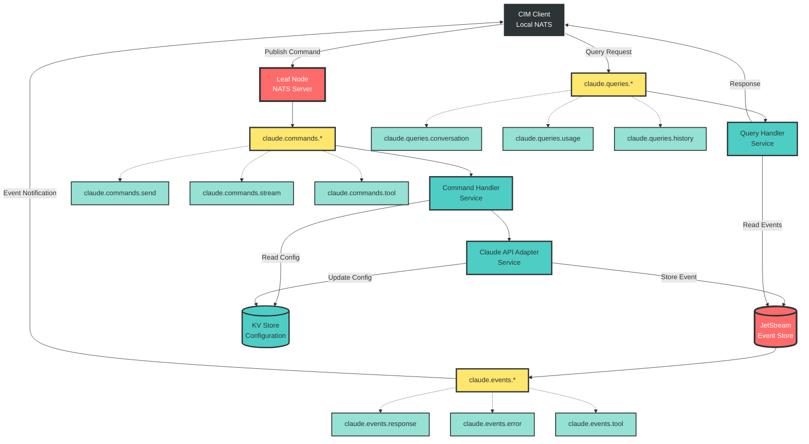
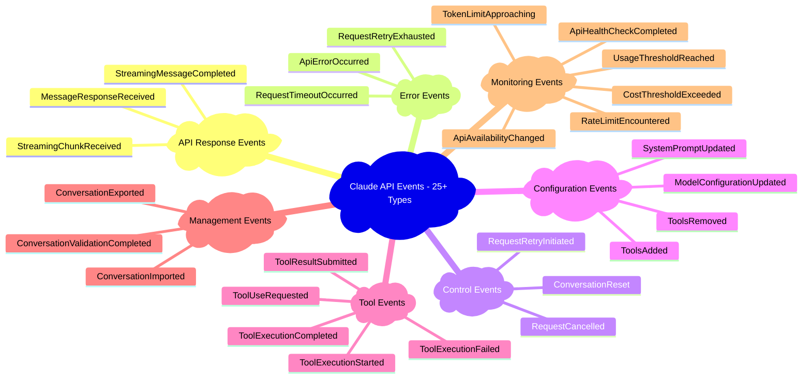
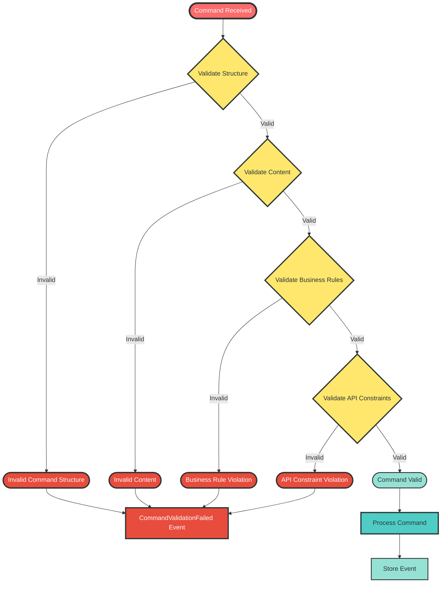

# CIM Claude Adapter - Architecture Overview

This document provides comprehensive architectural diagrams for the CIM Claude Adapter, which maps 100% of the Claude API to an event-sourced domain model using Commands, Events, Queries, Value Objects, Entities, and Aggregates.

## Event Sourcing Architecture Overview



## Complete API Command Mapping



## Event Sourcing State Machine



## NATS Message Flow Architecture



## Domain Model Visualization

```mermaid
classDiagram
    %% High contrast styling
    class ClaudeApiSession {
        <<Aggregate Root>>
        +conversation_id: ConversationId
        +model_config: ClaudeModel
        +system_prompt: ClaudeSystemPrompt
        +message_history: Vec~ClaudeMessage~
        +tool_definitions: Vec~ClaudeToolDefinition~
        +total_usage: ClaudeUsage
        +add_user_message(content)
        +add_assistant_message(response)
        +can_add_message(content) bool
        +estimated_cost_usd() f64
    }
    
    class ClaudeApiRequest {
        <<Entity>>
        +model: ClaudeModel
        +messages: Vec~ClaudeMessage~
        +max_tokens: MaxTokens
        +system: ClaudeSystemPrompt
        +temperature: Temperature
        +tools: Vec~ClaudeToolDefinition~
        +validate() Result
        +estimated_input_tokens() u32
    }
    
    class ClaudeApiResponse {
        <<Entity>>
        +id: ClaudeMessageId
        +model: ClaudeModel
        +content: Vec~ContentBlock~
        +stop_reason: StopReason
        +usage: ClaudeUsage
        +text_content() String
        +tool_uses() Vec~ContentBlock~
    }
    
    class ClaudeModel {
        <<Value Object>>
        Claude35Sonnet20241022
        Claude35Sonnet20240620
        Claude3Opus20240229
        Claude3Sonnet20240229
        Claude3Haiku20240307
        +as_str() &str
        +max_tokens() u32
        +context_window() u32
    }
    
    class Temperature {
        <<Value Object>>
        -value: f64
        +new(f64) Result~Self~
        +value() f64
    }
    
    class MaxTokens {
        <<Value Object>>
        -value: u32
        +new(u32) Result~Self~
        +value() u32
    }
    
    class ClaudeUsage {
        <<Value Object>>
        +input_tokens: u32
        +output_tokens: u32
        +total_tokens() u32
        +estimated_cost_usd(model) f64
    }
    
    class ClaudeMessage {
        <<Entity>>
        +role: MessageRole
        +content: MessageContent
        +user(content) Self
        +assistant(content) Self
    }
    
    class ContentBlock {
        <<Value Object>>
        Text
        Image
        ToolUse
        ToolResult
        +token_estimate() u32
    }
    
    class ClaudeApiError {
        <<Value Object>>
        +error_type: ClaudeErrorType
        +message: String
        +http_status: u16
        +retry_after: u32
        +is_retryable() bool
        +is_client_error() bool
    }
    
    %% Relationships
    ClaudeApiSession ||--o{ ClaudeMessage
    ClaudeApiSession ||--o{ ClaudeToolDefinition
    ClaudeApiSession ||--|| ClaudeModel
    ClaudeApiSession ||--|| ClaudeUsage
    
    ClaudeApiRequest ||--|| ClaudeModel
    ClaudeApiRequest ||--o{ ClaudeMessage
    ClaudeApiRequest ||--|| MaxTokens
    ClaudeApiRequest ||--o| Temperature
    
    ClaudeApiResponse ||--|| ClaudeModel
    ClaudeApiResponse ||--o{ ContentBlock
    ClaudeApiResponse ||--|| ClaudeUsage
    
    ClaudeMessage ||--|| MessageContent
    MessageContent ||--o{ ContentBlock
```

## Complete Event Types Mapping



## Query Pattern Architecture

```mermaid
graph TD
    %% High contrast styling
    classDef primary fill:#FF6B6B,stroke:#2D3436,stroke-width:4px,color:#FFFFFF
    classDef secondary fill:#4ECDC4,stroke:#2D3436,stroke-width:3px,color:#2D3436
    classDef decision fill:#FFE66D,stroke:#2D3436,stroke-width:3px,color:#2D3436
    classDef result fill:#95E1D3,stroke:#2D3436,stroke-width:2px,color:#2D3436

    %% Query Types
    QueryLayer["Query Layer<br/>25+ Query Types"]:::primary
    
    %% Conversation Queries
    ConvQueries["Conversation Queries"]:::secondary
    QueryLayer --> ConvQueries
    ConvQueries --> GetConv[GetConversation]:::decision
    ConvQueries --> GetHistory[GetConversationHistory]:::decision
    ConvQueries --> GetMsg[GetMessage]:::decision
    ConvQueries --> SearchMsg[SearchMessages]:::decision
    
    %% Analytics Queries  
    AnalyticsQueries["Analytics Queries"]:::secondary
    QueryLayer --> AnalyticsQueries
    AnalyticsQueries --> GetUsage[GetUsageStatistics]:::decision
    AnalyticsQueries --> GetCost[GetCostAnalysis]:::decision
    AnalyticsQueries --> GetPerf[GetPerformanceMetrics]:::decision
    AnalyticsQueries --> GetAnalytics[GetConversationAnalytics]:::decision
    
    %% Tool Queries
    ToolQueries["Tool Queries"]:::secondary
    QueryLayer --> ToolQueries
    ToolQueries --> GetTools[GetConversationTools]:::decision
    ToolQueries --> GetToolUsage[GetToolUsageHistory]:::decision
    ToolQueries --> GetToolExec[GetToolExecution]:::decision
    
    %% System Queries
    SystemQueries["System Queries"]:::secondary
    QueryLayer --> SystemQueries
    SystemQueries --> GetErrors[GetErrorHistory]:::decision
    SystemQueries --> GetRateLimit[GetRateLimitStatus]:::decision
    SystemQueries --> GetHealth[GetApiHealthStatus]:::decision
    SystemQueries --> GetQuota[GetQuotaUsage]:::decision
    
    %% Results
    GetConv --> ConvResult["ConversationDetails"]:::result
    GetUsage --> UsageResult["Usage Statistics"]:::result
    GetTools --> ToolResult["Tool Definitions"]:::result
    GetErrors --> ErrorResult["Error History"]:::result
```



## Command Validation Flow



This comprehensive architectural documentation provides complete visual coverage of our event-sourced Claude API adapter. All diagrams follow the high-contrast styling guide and show the complete 100% API mapping we've implemented across Commands, Events, Queries, Value Objects, Entities, and Aggregates.