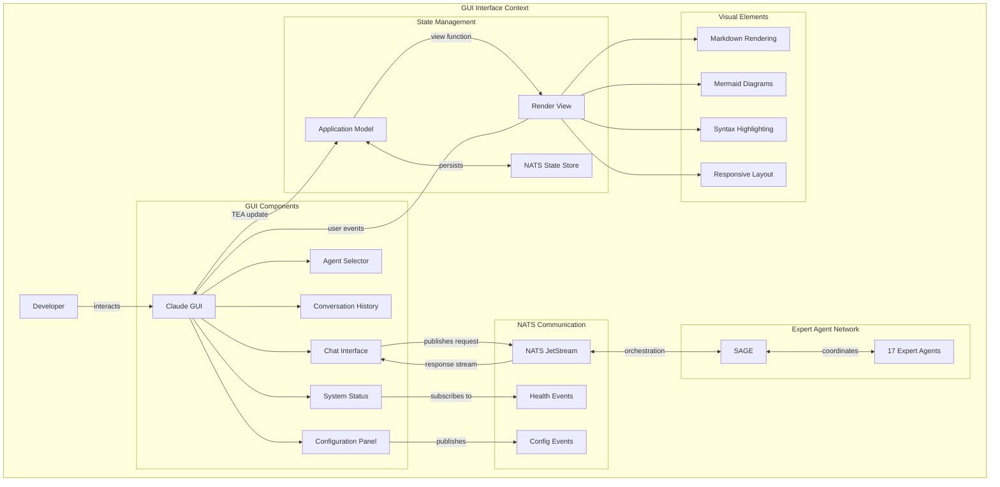
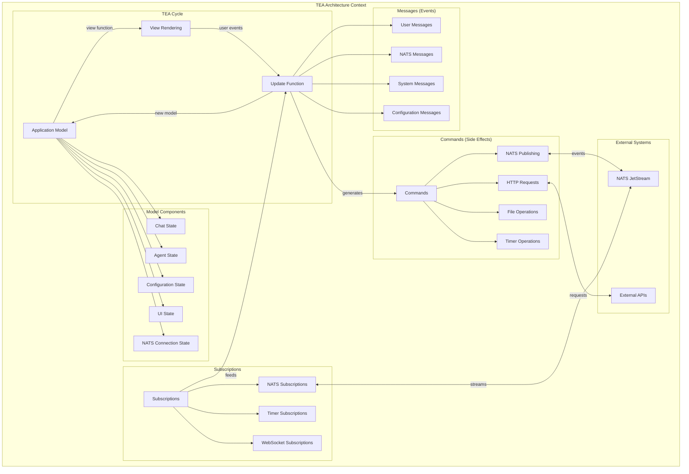

# CIM Claude GUI - BDD Specification

## User Story 1: Interactive Expert Agent Interface

**Title**: GUI provides interactive access to expert agent network

**As a** CIM developer  
**I want** a visual interface to interact with expert agents  
**So that** I can access CIM guidance through an intuitive desktop application  

### Context Graph



### Acceptance Criteria

- [ ] GUI provides chat interface for expert agent interactions
- [ ] GUI displays available expert agents with descriptions
- [ ] GUI shows real-time system status and health monitoring
- [ ] GUI renders markdown responses with syntax highlighting
- [ ] GUI displays Mermaid diagrams inline with responses
- [ ] GUI maintains conversation history across sessions
- [ ] GUI supports configuration management through interface
- [ ] GUI follows TEA (The Elm Architecture) patterns consistently

### Scenarios

```gherkin
Feature: Interactive Expert Agent Interface

  Background:
    Given GUI application is launched
    And NATS connection is established
    And expert agent network is available
    And TEA application model is initialized

  Scenario: Expert agent consultation through GUI
    Given user opens the expert agent selector
    When user selects "nats-expert" from the list
    And user types "How do I design NATS subjects for order processing?"
    And user clicks send button
    Then GUI publishes request to claude.request.nats-expert stream
    And GUI shows "Processing..." indicator
    And NATS response is received with expert guidance
    And GUI renders markdown response with syntax highlighting
    And GUI displays any Mermaid diagrams inline
    And GUI adds interaction to conversation history

  Scenario: SAGE orchestration through GUI
    Given user is in the main chat interface
    When user types "Build a complete CIM for inventory management"
    And user selects "Ask SAGE" option
    Then GUI publishes request to claude.request.sage stream
    And GUI shows orchestration progress indicators
    And SAGE coordinates multiple expert agents
    And GUI receives and displays coordinated responses
    And GUI shows which expert agents contributed
    And GUI renders comprehensive CIM creation guidance

  Scenario: System status monitoring
    Given GUI system status panel is visible
    When NATS health events are published
    And expert agent availability changes
    Then GUI updates system status indicators
    And GUI shows NATS connection status as healthy/unhealthy
    And GUI displays expert agent availability status
    And GUI shows recent system metrics and performance
    And GUI alerts user to any system issues
```

---

## User Story 2: TEA Architecture Implementation

**Title**: GUI implements TEA patterns for functional reactive interface

**As a** CIM GUI developer  
**I want** the interface to follow TEA (The Elm Architecture) patterns  
**So that** the application state management is predictable and maintainable  

### Context Graph



### Acceptance Criteria

- [ ] Application state is managed through single Model structure
- [ ] All UI updates flow through Update function with Messages
- [ ] View rendering is pure function of current Model state
- [ ] Side effects are handled through Commands, not direct calls
- [ ] External events flow through Subscriptions system
- [ ] State transitions are predictable and debuggable
- [ ] No direct mutation of application state occurs
- [ ] Message handling follows functional programming patterns

### Scenarios

```gherkin
Feature: TEA Architecture Implementation

  Background:
    Given GUI application follows TEA architecture patterns
    And Model contains all application state
    And Update function handles all state transitions
    And View function renders current Model state

  Scenario: User interaction state flow
    Given application is in initial state
    When user clicks "Send Message" button
    Then View generates SendMessage(content) message
    And Update function receives SendMessage message
    And Update function creates new Model with updated chat state
    And Update function generates PublishToNats command
    And View function renders new Model state
    And Command system executes NATS publishing
    And no direct state mutation occurs

  Scenario: External event handling
    Given application is subscribed to NATS response stream
    When NATS publishes expert agent response
    Then NATS subscription receives the event
    And subscription generates NatsResponseReceived message
    And Update function receives NatsResponseReceived message
    And Update function creates new Model with response content
    And Update function may generate additional commands
    And View function renders updated conversation
    And application state remains consistent

  Scenario: Configuration state management
    Given user opens configuration panel
    When user changes NATS server URL setting
    Then View generates ConfigurationChanged message
    And Update function receives configuration message
    And Update function validates new configuration
    And Update function creates new Model with updated config
    And Update function generates UpdateNatsConnection command
    And Command system reconnects to new NATS server
    And Update function receives connection status updates
    And View reflects new connection state
```