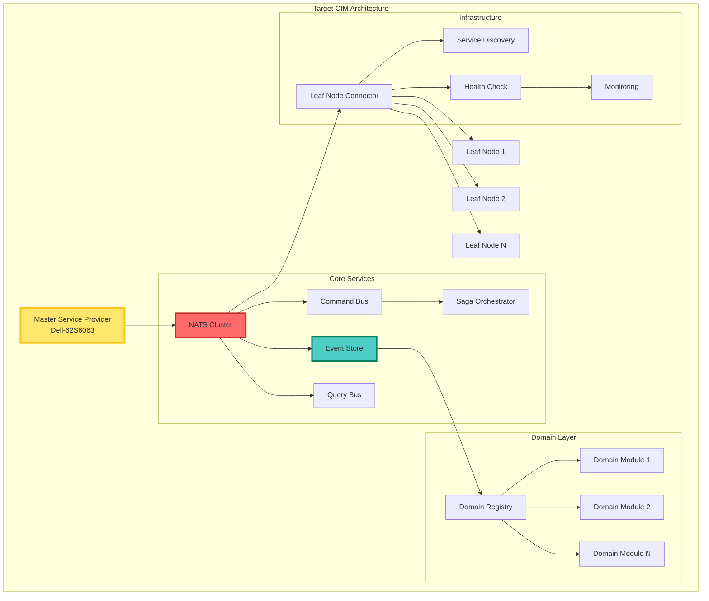

# CIM Ecosystem Flake Refactoring Guide

## Executive Summary

This document outlines comprehensive recommendations for refactoring the Dell-62S6063 NixOS configuration to better align with CIM (Composable Information Machine) ecosystem requirements. The refactoring transforms this system from a basic NixOS setup into a proper CIM Master Service Provider capable of coordinating distributed leaf nodes while maintaining event-sourcing and NATS-first principles.

## Current State Analysis

The existing configuration at `/git/steele/dell-62S6063` shows:
- Basic NixOS setup with some CIM-related components
- Simple NATS configuration without CIM-specific optimizations
- Limited event-sourcing infrastructure
- No formal domain module system
- Minimal distributed system support
- Lack of CIM-specific development tooling

## Architecture Vision



## Detailed Recommendations

### 1. Flake Input Structure

Add CIM-specific inputs to establish connections with the broader CIM ecosystem:

```nix
# flake.nix - inputs section
inputs = {
  # Core NixOS inputs (existing)
  nixpkgs.url = "github:NixOS/nixpkgs/nixos-unstable";
  home-manager = {
    url = "github:nix-community/home-manager";
    inputs.nixpkgs.follows = "nixpkgs";
  };
  
  # CIM Core Components
  cim-registry = {
    url = "github:thecowboyai/cim";
    inputs.nixpkgs.follows = "nixpkgs";
  };
  
  cim-start = {
    url = "github:thecowboyai/cim-start";
    inputs.nixpkgs.follows = "nixpkgs";
  };
  
  cim-domain = {
    url = "github:thecowboyai/cim-domain";
    inputs.nixpkgs.follows = "nixpkgs";
  };
  
  # Event Sourcing Framework
  eventstore = {
    url = "github:EventStore/EventStore";
    flake = false;
  };
  
  # Distributed Systems Tools
  vector = {
    url = "github:vectordotdev/vector";
    flake = false;
  };
  
  # Observability
  opentelemetry = {
    url = "github:open-telemetry/opentelemetry-rust";
    flake = false;
  };
  
  # Message Queue Tools
  nats-tools = {
    url = "github:nats-io/nats.nix";
    inputs.nixpkgs.follows = "nixpkgs";
  };
};
```

### 2. Module Organization Structure

Create a hierarchical module structure that reflects CIM's architectural patterns:

```
modules/
├── cim/
│   ├── core/                     # Core CIM infrastructure
│   │   ├── event-store.nix       # Event sourcing infrastructure
│   │   ├── nats-cluster.nix      # Enhanced NATS configuration
│   │   ├── command-bus.nix       # Command handling infrastructure
│   │   ├── query-bus.nix         # Query handling infrastructure
│   │   ├── saga-orchestrator.nix # Distributed transaction management
│   │   └── projection-engine.nix # Event projection processing
│   │
│   ├── domains/                   # Domain-driven design support
│   │   ├── base.nix              # Base domain configuration
│   │   ├── registry.nix          # Domain registry management
│   │   ├── aggregates.nix        # Aggregate root patterns
│   │   └── value-objects.nix     # Value object definitions
│   │
│   ├── leaf-nodes/               # Distributed architecture
│   │   ├── connector.nix         # Leaf node connection management
│   │   ├── discovery.nix         # Service discovery mechanism
│   │   ├── health-check.nix      # Health monitoring
│   │   ├── replication.nix       # Data replication strategies
│   │   └── failover.nix          # Failover management
│   │
│   ├── security/                 # Security and isolation
│   │   ├── boundaries.nix        # Environment boundaries
│   │   ├── encryption.nix        # TLS and encryption
│   │   ├── authentication.nix    # Auth mechanisms
│   │   └── authorization.nix     # RBAC configuration
│   │
│   ├── development/              # Development tools
│   │   ├── tools.nix             # CIM development tools
│   │   ├── testing.nix           # Testing infrastructure
│   │   ├── monitoring.nix        # Development monitoring
│   │   ├── debugging.nix         # Debug utilities
│   │   └── generators.nix        # Code generators
│   │
│   └── deployment/               # Deployment configurations
│       ├── environments.nix      # Environment definitions
│       ├── migrations.nix        # Migration tools
│       └── rollback.nix          # Rollback mechanisms
```

### 3. Enhanced NATS Configuration Module

Replace the basic NATS setup with a CIM-optimized configuration:

```nix
# modules/cim/core/nats-cluster.nix
{ config, lib, pkgs, ... }:

let
  cfg = config.services.cim-nats;
in {
  options.services.cim-nats = {
    enable = lib.mkEnableOption "CIM NATS Cluster";
    
    role = lib.mkOption {
      type = lib.types.enum ["master" "leaf" "cluster" "edge"];
      default = "master";
      description = "Node role in CIM architecture";
    };
    
    cluster = {
      name = lib.mkOption {
        type = lib.types.str;
        default = "cim-cluster";
        description = "Cluster name";
      };
      
      peers = lib.mkOption {
        type = lib.types.listOf lib.types.str;
        default = [];
        description = "Cluster peer URLs";
      };
    };
    
    eventSourcing = {
      enable = lib.mkEnableOption "Event sourcing streams";
      
      retentionDays = lib.mkOption {
        type = lib.types.int;
        default = 30;
        description = "Event retention period in days";
      };
      
      snapshotInterval = lib.mkOption {
        type = lib.types.int;
        default = 100;
        description = "Events between snapshots";
      };
    };
    
    leafNodes = lib.mkOption {
      type = lib.types.listOf (lib.types.submodule {
        options = {
          url = lib.mkOption {
            type = lib.types.str;
            description = "Leaf node URL";
          };
          
          credentials = lib.mkOption {
            type = lib.types.nullOr lib.types.path;
            default = null;
            description = "Path to credentials file";
          };
        };
      });
      default = [];
      description = "Leaf node connections";
    };
    
    subjects = {
      events = lib.mkOption {
        type = lib.types.str;
        default = "cim.events";
        description = "Event subject prefix";
      };
      
      commands = lib.mkOption {
        type = lib.types.str;
        default = "cim.commands";
        description = "Command subject prefix";
      };
      
      queries = lib.mkOption {
        type = lib.types.str;
        default = "cim.queries";
        description = "Query subject prefix";
      };
      
      sagas = lib.mkOption {
        type = lib.types.str;
        default = "cim.sagas";
        description = "Saga subject prefix";
      };
    };
  };
  
  config = lib.mkIf cfg.enable {
    services.nats = {
      enable = true;
      jetstream = true;
      
      settings = {
        server_name = "cim-${cfg.role}-${config.networking.hostName}";
        
        # JetStream configuration for event sourcing
        jetstream = {
          store_dir = "/var/lib/cim/nats/jetstream";
          max_memory_store = "4GB";
          max_file_store = "100GB";
          
          # Ensure durability for event sourcing
          sync_interval = "10s";
          sync_always = cfg.role == "master";
        };
        
        # Cluster configuration
        cluster = lib.mkIf (cfg.cluster.peers != []) {
          name = cfg.cluster.name;
          routes = cfg.cluster.peers;
          
          # Cluster authorization
          authorization = {
            user = "cluster";
            password = "$CIM_CLUSTER_PASSWORD";
            timeout = 2;
          };
        };
        
        # CIM-specific authorization
        authorization = {
          users = [
            {
              user = "cim-events";
              password = "$CIM_EVENTS_PASSWORD";
              permissions = {
                publish = ["${cfg.subjects.events}.>"];
                subscribe = ["${cfg.subjects.events}.>", "_INBOX.>"];
                allow_responses = true;
              };
            }
            {
              user = "cim-commands";
              password = "$CIM_COMMANDS_PASSWORD";
              permissions = {
                publish = ["${cfg.subjects.commands}.>"];
                subscribe = ["${cfg.subjects.commands}.>", "_INBOX.>"];
                allow_responses = true;
              };
            }
            {
              user = "cim-queries";
              password = "$CIM_QUERIES_PASSWORD";
              permissions = {
                publish = ["${cfg.subjects.queries}.>"];
                subscribe = ["${cfg.subjects.queries}.>", "_INBOX.>"];
                allow_responses = true;
              };
            }
            {
              user = "cim-sagas";
              password = "$CIM_SAGAS_PASSWORD";
              permissions = {
                publish = ["${cfg.subjects.sagas}.>"];
                subscribe = ["${cfg.subjects.sagas}.>", "_INBOX.>"];
                allow_responses = true;
              };
            }
          ];
        };
        
        # Leaf node configuration
        leafnodes = lib.mkIf (cfg.leafNodes != []) {
          listen = "0.0.0.0:7422";
          
          remotes = map (node: {
            url = node.url;
            credentials = lib.optionalString (node.credentials != null) 
              (builtins.readFile node.credentials);
          }) cfg.leafNodes;
        };
        
        # Monitoring and observability
        http_port = 8222;
        system_account = "SYS";
        
        # Limits and performance
        max_connections = 10000;
        max_subscriptions = 0;  # Unlimited
        max_payload = "8MB";
        write_deadline = "10s";
        
        # Logging
        debug = cfg.role == "master" && config.cim.security.environment == "development";
        trace = false;
        logtime = true;
        log_file = "/var/log/cim/nats.log";
      };
    };
    
    # Create CIM-specific JetStream streams
    systemd.services.cim-nats-streams = lib.mkIf cfg.eventSourcing.enable {
      description = "Configure CIM NATS Streams";
      after = ["nats.service"];
      requires = ["nats.service"];
      wantedBy = ["multi-user.target"];
      
      script = ''
        # Wait for NATS to be ready
        until ${pkgs.natscli}/bin/nats server ping; do
          sleep 1
        done
        
        # Event stream - the source of truth
        ${pkgs.natscli}/bin/nats stream add CIM_EVENTS \
          --subjects "${cfg.subjects.events}.>" \
          --storage file \
          --retention limits \
          --max-age ${toString cfg.eventSourcing.retentionDays}d \
          --replicas 3 \
          --discard old \
          --dupe-window 2m \
          --max-msg-size 1MB
        
        # Command stream - transient work queue
        ${pkgs.natscli}/bin/nats stream add CIM_COMMANDS \
          --subjects "${cfg.subjects.commands}.>" \
          --storage memory \
          --retention work \
          --max-age 1h \
          --replicas 1 \
          --discard new \
          --max-msgs-per-subject 100
        
        # Query results cache
        ${pkgs.natscli}/bin/nats stream add CIM_QUERY_CACHE \
          --subjects "${cfg.subjects.queries}.results.>" \
          --storage memory \
          --retention limits \
          --max-age 5m \
          --replicas 1 \
          --discard old
        
        # Saga coordination stream
        ${pkgs.natscli}/bin/nats stream add CIM_SAGAS \
          --subjects "${cfg.subjects.sagas}.>" \
          --storage file \
          --retention limits \
          --max-age 7d \
          --replicas 3 \
          --discard old
        
        # Snapshot stream for aggregate state
        ${pkgs.natscli}/bin/nats stream add CIM_SNAPSHOTS \
          --subjects "cim.snapshots.>" \
          --storage file \
          --retention limits \
          --max-age 30d \
          --replicas 3 \
          --discard old \
          --max-msgs-per-subject 10
      '';
      
      serviceConfig = {
        Type = "oneshot";
        RemainAfterExit = true;
        User = "root";
      };
    };
    
    # Log rotation
    services.logrotate.settings."/var/log/cim/nats.log" = {
      rotate = 7;
      daily = true;
      compress = true;
      delaycompress = true;
      notifempty = true;
      missingok = true;
    };
  };
}
```

### 4. Event Store Module

Implement a robust event store for proper event sourcing:

```nix
# modules/cim/core/event-store.nix
{ config, lib, pkgs, ... }:

let
  cfg = config.services.cim-event-store;
in {
  options.services.cim-event-store = {
    enable = lib.mkEnableOption "CIM Event Store";
    
    backend = lib.mkOption {
      type = lib.types.enum ["nats" "eventstore" "postgres" "cassandra"];
      default = "nats";
      description = "Event store backend";
    };
    
    aggregates = {
      snapshotInterval = lib.mkOption {
        type = lib.types.int;
        default = 100;
        description = "Events between aggregate snapshots";
      };
      
      cacheSize = lib.mkOption {
        type = lib.types.int;
        default = 1000;
        description = "Number of aggregates to cache in memory";
      };
    };
    
    projections = {
      enable = lib.mkEnableOption "Event projections";
      
      processors = lib.mkOption {
        type = lib.types.listOf (lib.types.submodule {
          options = {
            name = lib.mkOption {
              type = lib.types.str;
              description = "Projection processor name";
            };
            
            events = lib.mkOption {
              type = lib.types.listOf lib.types.str;
              description = "Event types to process";
            };
            
            target = lib.mkOption {
              type = lib.types.enum ["postgres" "redis" "elasticsearch"];
              description = "Projection target";
            };
          };
        });
        default = [];
        description = "Projection processors";
      };
      
      rebuildOnStart = lib.mkOption {
        type = lib.types.bool;
        default = false;
        description = "Rebuild projections on service start";
      };
    };
    
    validation = {
      enable = lib.mkEnableOption "Event validation";
      
      schemas = lib.mkOption {
        type = lib.types.path;
        default = /etc/cim/schemas;
        description = "Path to event schemas";
      };
    };
  };
  
  config = lib.mkIf cfg.enable {
    # Event processor service
    systemd.services.cim-event-processor = {
      description = "CIM Event Processor";
      after = ["network.target" "nats.service"];
      requires = ["nats.service"];
      wantedBy = ["multi-user.target"];
      
      serviceConfig = {
        ExecStart = "${pkgs.cim-event-processor}/bin/cim-event-processor";
        Restart = "always";
        RestartSec = "10";
        User = "cim";
        Group = "cim";
        
        # Resource limits
        LimitNOFILE = 65535;
        MemoryLimit = "2G";
        CPUQuota = "200%";
        
        # Security
        PrivateTmp = true;
        ProtectSystem = "strict";
        ProtectHome = true;
        NoNewPrivileges = true;
        ReadWritePaths = ["/var/lib/cim" "/var/log/cim"];
      };
      
      environment = {
        CIM_NATS_URL = "nats://localhost:4222";
        CIM_EVENT_BACKEND = cfg.backend;
        CIM_SNAPSHOT_INTERVAL = toString cfg.aggregates.snapshotInterval;
        CIM_CACHE_SIZE = toString cfg.aggregates.cacheSize;
        CIM_PROJECTIONS_ENABLED = lib.boolToString cfg.projections.enable;
        CIM_VALIDATION_ENABLED = lib.boolToString cfg.validation.enable;
        CIM_SCHEMA_PATH = toString cfg.validation.schemas;
        RUST_LOG = "info,cim_event_processor=debug";
      };
    };
    
    # Projection rebuilder service
    systemd.services.cim-projection-rebuilder = lib.mkIf cfg.projections.enable {
      description = "CIM Projection Rebuilder";
      after = ["cim-event-processor.service"];
      requires = ["cim-event-processor.service"];
      
      script = ''
        ${lib.concatMapStrings (proj: ''
          echo "Rebuilding projection: ${proj.name}"
          ${pkgs.cim-projection-rebuilder}/bin/cim-projection-rebuilder \
            --projection ${proj.name} \
            --events ${lib.concatStringsSep "," proj.events} \
            --target ${proj.target}
        '') cfg.projections.processors}
      '';
      
      serviceConfig = {
        Type = "oneshot";
        User = "cim";
        Group = "cim";
      };
    } // lib.optionalAttrs cfg.projections.rebuildOnStart {
      wantedBy = ["multi-user.target"];
    };
    
    # Create necessary directories
    systemd.tmpfiles.rules = [
      "d /var/lib/cim 0750 cim cim -"
      "d /var/lib/cim/events 0750 cim cim -"
      "d /var/lib/cim/snapshots 0750 cim cim -"
      "d /var/lib/cim/projections 0750 cim cim -"
      "d /var/log/cim 0750 cim cim -"
      "d /etc/cim 0750 cim cim -"
      "d /etc/cim/schemas 0750 cim cim -"
    ];
    
    # Create CIM user and group
    users.users.cim = {
      isSystemUser = true;
      group = "cim";
      home = "/var/lib/cim";
      description = "CIM Event Store service user";
    };
    
    users.groups.cim = {};
  };
}
```

### 5. Domain Module System

Implement domain-driven design support:

```nix
# modules/cim/domains/base.nix
{ config, lib, pkgs, ... }:

let
  cfg = config.cim.domains;
in {
  options.cim.domains = {
    enable = lib.mkEnableOption "CIM Domain System";
    
    active = lib.mkOption {
      type = lib.types.listOf lib.types.str;
      default = [];
      description = "Active domain modules";
      example = ["mortgage" "healthcare" "retail" "logistics"];
    };
    
    registry = lib.mkOption {
      type = lib.types.attrsOf (lib.types.submodule {
        options = {
          module = lib.mkOption {
            type = lib.types.str;
            description = "Domain module name";
          };
          
          version = lib.mkOption {
            type = lib.types.str;
            description = "Domain module version";
          };
          
          description = lib.mkOption {
            type = lib.types.str;
            default = "";
            description = "Domain description";
          };
          
          aggregates = lib.mkOption {
            type = lib.types.listOf lib.types.str;
            default = [];
            description = "Aggregate roots in this domain";
          };
          
          events = lib.mkOption {
            type = lib.types.listOf (lib.types.submodule {
              options = {
                name = lib.mkOption {
                  type = lib.types.str;
                  description = "Event name";
                };
                
                schema = lib.mkOption {
                  type = lib.types.str;
                  description = "Event schema (JSON Schema)";
                };
              };
            });
            default = [];
            description = "Event types this domain produces";
          };
          
          commands = lib.mkOption {
            type = lib.types.listOf (lib.types.submodule {
              options = {
                name = lib.mkOption {
                  type = lib.types.str;
                  description = "Command name";
                };
                
                handler = lib.mkOption {
                  type = lib.types.str;
                  description = "Command handler function";
                };
                
                validation = lib.mkOption {
                  type = lib.types.str;
                  default = "";
                  description = "Validation rules";
                };
              };
            });
            default = [];
            description = "Commands this domain accepts";
          };
          
          queries = lib.mkOption {
            type = lib.types.listOf (lib.types.submodule {
              options = {
                name = lib.mkOption {
                  type = lib.types.str;
                  description = "Query name";
                };
                
                projection = lib.mkOption {
                  type = lib.types.str;
                  description = "Projection to query";
                };
              };
            });
            default = [];
            description = "Queries this domain supports";
          };
          
          sagas = lib.mkOption {
            type = lib.types.listOf lib.types.str;
            default = [];
            description = "Sagas this domain participates in";
          };
          
          policies = lib.mkOption {
            type = lib.types.listOf (lib.types.submodule {
              options = {
                name = lib.mkOption {
                  type = lib.types.str;
                  description = "Policy name";
                };
                
                trigger = lib.mkOption {
                  type = lib.types.str;
                  description = "Event that triggers this policy";
                };
                
                action = lib.mkOption {
                  type = lib.types.str;
                  description = "Command to execute";
                };
              };
            });
            default = [];
            description = "Domain policies (event -> command mappings)";
          };
        };
      });
      default = {};
      description = "Domain registry configuration";
    };
    
    boundedContexts = lib.mkOption {
      type = lib.types.attrsOf (lib.types.listOf lib.types.str);
      default = {};
      description = "Bounded context definitions";
      example = {
        sales = ["customer" "order" "product"];
        fulfillment = ["inventory" "shipping" "warehouse"];
      };
    };
  };
  
  config = lib.mkIf cfg.enable {
    # Generate NATS subjects for each domain
    services.cim-nats.settings.authorization.users = lib.flatten (
      lib.mapAttrsToList (name: domain: [
        {
          user = "cim-domain-${name}";
          password = "$CIM_DOMAIN_${lib.toUpper name}_PASSWORD";
          permissions = {
            publish = 
              (map (e: "cim.events.${name}.${e.name}") domain.events) ++
              (map (c: "cim.commands.${name}.${c.name}") domain.commands) ++
              (map (s: "cim.sagas.${name}.${s}") domain.sagas);
            subscribe = [
              "cim.events.${name}.>"
              "cim.commands.${name}.>"
              "cim.queries.${name}.>"
              "cim.sagas.${name}.>"
              "_INBOX.>"
            ];
            allow_responses = true;
          };
        }
      ]) cfg.registry
    );
    
    # Domain service for each active domain
    systemd.services = lib.listToAttrs (map (domainName: {
      name = "cim-domain-${domainName}";
      value = {
        description = "CIM Domain Service: ${domainName}";
        after = ["cim-event-processor.service"];
        requires = ["cim-event-processor.service"];
        wantedBy = ["multi-user.target"];
        
        serviceConfig = {
          ExecStart = "${pkgs.cim-domain-runtime}/bin/cim-domain-runtime ${domainName}";
          Restart = "always";
          RestartSec = "10";
          User = "cim";
          Group = "cim";
          
          # Security
          PrivateTmp = true;
          ProtectSystem = "strict";
          ProtectHome = true;
          NoNewPrivileges = true;
        };
        
        environment = {
          CIM_DOMAIN_NAME = domainName;
          CIM_DOMAIN_CONFIG = builtins.toJSON (cfg.registry.${domainName} or {});
          CIM_NATS_URL = "nats://localhost:4222";
          RUST_LOG = "info,cim_domain=debug";
        };
      };
    }) cfg.active);
    
    # Generate domain documentation
    environment.etc."cim/domains.json".text = builtins.toJSON cfg.registry;
    
    # Domain management CLI tools
    environment.systemPackages = with pkgs; [
      (writeScriptBin "cim-domain-list" ''
        #!${stdenv.shell}
        echo "Active CIM Domains:"
        ${lib.concatMapStrings (d: "echo '  - ${d}'\n") cfg.active}
      '')
      
      (writeScriptBin "cim-domain-info" ''
        #!${stdenv.shell}
        DOMAIN=$1
        if [ -z "$DOMAIN" ]; then
          echo "Usage: cim-domain-info <domain-name>"
          exit 1
        fi
        ${pkgs.jq}/bin/jq ".\"$DOMAIN\"" /etc/cim/domains.json
      '')
      
      (writeScriptBin "cim-domain-events" ''
        #!${stdenv.shell}
        DOMAIN=$1
        if [ -z "$DOMAIN" ]; then
          echo "Usage: cim-domain-events <domain-name>"
          exit 1
        fi
        ${pkgs.natscli}/bin/nats sub "cim.events.$DOMAIN.>" --raw
      '')
    ];
  };
}
```

### 6. Leaf Node Connector Module

Implement distributed architecture support:

```nix
# modules/cim/leaf-nodes/connector.nix
{ config, lib, pkgs, ... }:

let
  cfg = config.cim.leafNodes;
in {
  options.cim.leafNodes = {
    enable = lib.mkEnableOption "CIM Leaf Node Connector";
    
    discovery = {
      method = lib.mkOption {
        type = lib.types.enum ["static" "dns" "consul" "kubernetes"];
        default = "static";
        description = "Service discovery method";
      };
      
      staticNodes = lib.mkOption {
        type = lib.types.listOf (lib.types.submodule {
          options = {
            name = lib.mkOption {
              type = lib.types.str;
              description = "Node name";
            };
            
            url = lib.mkOption {
              type = lib.types.str;
              description = "Node NATS URL";
            };
            
            region = lib.mkOption {
              type = lib.types.str;
              default = "default";
              description = "Node region";
            };
            
            capabilities = lib.mkOption {
              type = lib.types.listOf lib.types.str;
              default = [];
              description = "Node capabilities";
            };
          };
        });
        default = [];
        description = "Static leaf node definitions";
      };
      
      dnsQuery = lib.mkOption {
        type = lib.types.str;
        default = "_nats._tcp.cim.local";
        description = "DNS SRV query for discovery";
      };
    };
    
    routing = {
      strategy = lib.mkOption {
        type = lib.types.enum ["round-robin" "least-loaded" "location-aware" "capability-based"];
        default = "round-robin";
        description = "Routing strategy for leaf nodes";
      };
      
      healthCheck = {
        interval = lib.mkOption {
          type = lib.types.int;
          default = 30;
          description = "Health check interval in seconds";
        };
        
        timeout = lib.mkOption {
          type = lib.types.int;
          default = 5;
          description = "Health check timeout in seconds";
        };
        
        retries = lib.mkOption {
          type = lib.types.int;
          default = 3;
          description = "Health check retries before marking unhealthy";
        };
      };
    };
    
    synchronization = {
      enable = lib.mkEnableOption "Data synchronization between nodes";
      
      mode = lib.mkOption {
        type = lib.types.enum ["eventual" "strong" "causal"];
        default = "eventual";
        description = "Consistency model";
      };
      
      conflictResolution = lib.mkOption {
        type = lib.types.enum ["last-write-wins" "vector-clock" "crdt"];
        default = "last-write-wins";
        description = "Conflict resolution strategy";
      };
    };
  };
  
  config = lib.mkIf cfg.enable {
    # Leaf node manager service
    systemd.services.cim-leaf-manager = {
      description = "CIM Leaf Node Manager";
      after = ["network.target" "nats.service"];
      requires = ["nats.service"];
      wantedBy = ["multi-user.target"];
      
      serviceConfig = {
        ExecStart = "${pkgs.cim-leaf-manager}/bin/cim-leaf-manager";
        Restart = "always";
        RestartSec = "10";
        User = "cim";
        Group = "cim";
      };
      
      environment = {
        CIM_DISCOVERY_METHOD = cfg.discovery.method;
        CIM_STATIC_NODES = builtins.toJSON cfg.discovery.staticNodes;
        CIM_DNS_QUERY = cfg.discovery.dnsQuery;
        CIM_ROUTING_STRATEGY = cfg.routing.strategy;
        CIM_HEALTH_INTERVAL = toString cfg.routing.healthCheck.interval;
        CIM_HEALTH_TIMEOUT = toString cfg.routing.healthCheck.timeout;
        CIM_HEALTH_RETRIES = toString cfg.routing.healthCheck.retries;
        CIM_SYNC_ENABLED = lib.boolToString cfg.synchronization.enable;
        CIM_SYNC_MODE = cfg.synchronization.mode;
        CIM_CONFLICT_RESOLUTION = cfg.synchronization.conflictResolution;
      };
    };
    
    # Health monitoring dashboard
    services.grafana.provision.dashboards.settings.providers = lib.mkIf config.cim.monitoring.enable [{
      name = "CIM Leaf Nodes";
      folder = "CIM";
      type = "file";
      options.path = pkgs.writeTextDir "leaf-nodes.json" (builtins.toJSON {
        dashboard = {
          title = "CIM Leaf Node Health";
          panels = [
            {
              title = "Node Status";
              type = "stat";
              targets = [{
                expr = "up{job='cim-leaf-nodes'}";
              }];
            }
            {
              title = "Message Throughput";
              type = "graph";
              targets = [{
                expr = "rate(nats_msgs_sent_total[5m])";
              }];
            }
            {
              title = "Latency Distribution";
              type = "heatmap";
              targets = [{
                expr = "nats_rtt_seconds";
              }];
            }
          ];
        };
      });
    }];
    
    # Monitoring tools
    environment.systemPackages = with pkgs; [
      (writeScriptBin "cim-leaf-status" ''
        #!${stdenv.shell}
        echo "=== CIM Leaf Node Status ==="
        systemctl status cim-leaf-manager
        echo ""
        echo "Connected Nodes:"
        ${pkgs.natscli}/bin/nats server list
      '')
      
      (writeScriptBin "cim-leaf-test" ''
        #!${stdenv.shell}
        NODE=$1
        if [ -z "$NODE" ]; then
          echo "Usage: cim-leaf-test <node-name>"
          exit 1
        fi
        echo "Testing connection to $NODE..."
        ${pkgs.natscli}/bin/nats server ping --server=$NODE
      '')
    ];
  };
}
```

### 7. Development Tools Module

Enhanced development environment for CIM:

```nix
# modules/cim/development/tools.nix
{ config, lib, pkgs, ... }:

let
  cfg = config.cim.development;
in {
  options.cim.development = {
    enable = lib.mkEnableOption "CIM Development Tools";
    
    tools = {
      eventViewer = lib.mkEnableOption "Real-time event stream viewer";
      commandTester = lib.mkEnableOption "Command testing interface";
      queryBuilder = lib.mkEnableOption "Query builder and tester";
      domainGenerator = lib.mkEnableOption "Domain code generator";
      migrationTools = lib.mkEnableOption "Event migration tools";
      performanceProfiler = lib.mkEnableOption "Performance profiling tools";
    };
    
    debugging = {
      enable = lib.mkEnableOption "Debug mode";
      verbosity = lib.mkOption {
        type = lib.types.enum ["error" "warn" "info" "debug" "trace"];
        default = "info";
        description = "Log verbosity level";
      };
    };
  };
  
  config = lib.mkIf cfg.enable {
    environment.systemPackages = with pkgs; [
      # Core CIM tools
      (writeScriptBin "cim-events" ''
        #!${stdenv.shell}
        FILTER=''${1:-">"}
        echo "Monitoring events: cim.events.$FILTER"
        ${natscli}/bin/nats sub "cim.events.$FILTER" --raw | \
          while IFS= read -r line; do
            echo "[$(date -Iseconds)] $line" | \
              ${jq}/bin/jq -C '.' 2>/dev/null || echo "$line"
          done
      '')
      
      (writeScriptBin "cim-commands" ''
        #!${stdenv.shell}
        FILTER=''${1:-">"}
        echo "Monitoring commands: cim.commands.$FILTER"
        ${natscli}/bin/nats sub "cim.commands.$FILTER" --raw | \
          ${jq}/bin/jq -C '.'
      '')
      
      (writeScriptBin "cim-queries" ''
        #!${stdenv.shell}
        FILTER=''${1:-">"}
        echo "Monitoring queries: cim.queries.$FILTER"
        ${natscli}/bin/nats sub "cim.queries.$FILTER" --raw | \
          ${jq}/bin/jq -C '.'
      '')
      
      (writeScriptBin "cim-health" ''
        #!${stdenv.shell}
        echo "=== CIM System Health ==="
        echo ""
        echo "NATS Server:"
        ${natscli}/bin/nats server info
        echo ""
        echo "Active Streams:"
        ${natscli}/bin/nats stream list
        echo ""
        echo "Connected Nodes:"
        ${natscli}/bin/nats server list
        echo ""
        echo "Domain Services:"
        systemctl status 'cim-domain-*' --no-pager | grep -E "(●|Active:)"
        echo ""
        echo "Event Processor:"
        systemctl status cim-event-processor --no-pager | grep "Active:"
      '')
      
      (writeScriptBin "cim-replay" ''
        #!${stdenv.shell}
        STREAM=$1
        FROM=$2
        if [ -z "$STREAM" ] || [ -z "$FROM" ]; then
          echo "Usage: cim-replay <stream> <from-timestamp>"
          echo "Example: cim-replay CIM_EVENTS '2024-01-01T00:00:00Z'"
          exit 1
        fi
        ${natscli}/bin/nats stream view $STREAM --since="$FROM"
      '')
      
      (writeScriptBin "cim-send-command" ''
        #!${stdenv.shell}
        DOMAIN=$1
        COMMAND=$2
        DATA=$3
        if [ -z "$DOMAIN" ] || [ -z "$COMMAND" ] || [ -z "$DATA" ]; then
          echo "Usage: cim-send-command <domain> <command> <json-data>"
          echo "Example: cim-send-command user create '{\"name\":\"John\"}'"
          exit 1
        fi
        
        MESSAGE=$(${jq}/bin/jq -n \
          --arg cmd "$COMMAND" \
          --arg data "$DATA" \
          --arg id "$(${coreutils}/bin/uuidgen)" \
          --arg ts "$(date -Iseconds)" \
          '{
            id: $id,
            timestamp: $ts,
            command: $cmd,
            data: ($data | fromjson)
          }')
        
        echo "Sending command to cim.commands.$DOMAIN.$COMMAND:"
        echo "$MESSAGE" | ${jq}/bin/jq -C '.'
        echo "$MESSAGE" | ${natscli}/bin/nats pub "cim.commands.$DOMAIN.$COMMAND"
      '')
      
      (writeScriptBin "cim-query" ''
        #!${stdenv.shell}
        DOMAIN=$1
        QUERY=$2
        PARAMS=$3
        if [ -z "$DOMAIN" ] || [ -z "$QUERY" ]; then
          echo "Usage: cim-query <domain> <query> [params]"
          echo "Example: cim-query user findById '{\"id\":\"123\"}'"
          exit 1
        fi
        
        MESSAGE=$(${jq}/bin/jq -n \
          --arg query "$QUERY" \
          --arg params "''${PARAMS:-{}}" \
          --arg id "$(${coreutils}/bin/uuidgen)" \
          '{
            id: $id,
            query: $query,
            params: ($params | fromjson)
          }')
        
        echo "Executing query: cim.queries.$DOMAIN.$QUERY"
        echo "$MESSAGE" | ${natscli}/bin/nats req "cim.queries.$DOMAIN.$QUERY" --timeout=10s | \
          ${jq}/bin/jq -C '.'
      '')
    ]
    
    # Event viewer
    ++ lib.optional cfg.tools.eventViewer (writeScriptBin "cim-event-viewer" ''
      #!${stdenv.shell}
      ${pkgs.cim-event-viewer}/bin/cim-event-viewer
    '')
    
    # Command tester
    ++ lib.optional cfg.tools.commandTester (writeScriptBin "cim-command-test" ''
      #!${stdenv.shell}
      ${pkgs.cim-command-tester}/bin/cim-command-tester
    '')
    
    # Domain generator
    ++ lib.optional cfg.tools.domainGenerator (writeScriptBin "cim-generate-domain" ''
      #!${stdenv.shell}
      DOMAIN=$1
      if [ -z "$DOMAIN" ]; then
        echo "Usage: cim-generate-domain <domain-name>"
        exit 1
      fi
      ${pkgs.cim-domain-generator}/bin/cim-domain-generator "$DOMAIN"
    '');
    
    # Development environment variables
    environment.variables = {
      CIM_DEV_MODE = "true";
      CIM_LOG_LEVEL = cfg.debugging.verbosity;
      RUST_LOG = "${cfg.debugging.verbosity},cim=debug";
      RUST_BACKTRACE = if cfg.debugging.enable then "full" else "1";
    };
    
    # Shell aliases for development
    programs.bash.shellAliases = {
      cim-log = "journalctl -xef -u 'cim-*'";
      cim-restart = "systemctl restart 'cim-*'";
      cim-stop = "systemctl stop 'cim-*'";
      cim-start = "systemctl start 'cim-*'";
      cim-status = "systemctl status 'cim-*' --no-pager";
      nats-streams = "nats stream list";
      nats-consumers = "nats consumer list";
    };
  };
}
```

### 8. Monitoring and Observability Module

Comprehensive monitoring for CIM:

```nix
# modules/cim/development/monitoring.nix
{ config, lib, pkgs, ... }:

let
  cfg = config.cim.monitoring;
in {
  options.cim.monitoring = {
    enable = lib.mkEnableOption "CIM Monitoring and Observability";
    
    metrics = {
      enable = lib.mkEnableOption "Prometheus metrics collection";
      port = lib.mkOption {
        type = lib.types.port;
        default = 9090;
        description = "Prometheus port";
      };
      
      retention = lib.mkOption {
        type = lib.types.str;
        default = "30d";
        description = "Metrics retention period";
      };
    };
    
    tracing = {
      enable = lib.mkEnableOption "OpenTelemetry distributed tracing";
      
      endpoint = lib.mkOption {
        type = lib.types.str;
        default = "http://localhost:4317";
        description = "OTLP endpoint";
      };
      
      sampling = lib.mkOption {
        type = lib.types.float;
        default = 0.1;
        description = "Trace sampling rate (0.0-1.0)";
      };
    };
    
    logging = {
      aggregator = lib.mkOption {
        type = lib.types.enum ["vector" "fluentd" "logstash"];
        default = "vector";
        description = "Log aggregation tool";
      };
      
      output = lib.mkOption {
        type = lib.types.enum ["elasticsearch" "loki" "file"];
        default = "loki";
        description = "Log storage backend";
      };
    };
    
    alerts = {
      enable = lib.mkEnableOption "Alert rules";
      
      rules = lib.mkOption {
        type = lib.types.listOf (lib.types.submodule {
          options = {
            name = lib.mkOption {
              type = lib.types.str;
              description = "Alert name";
            };
            
            condition = lib.mkOption {
              type = lib.types.str;
              description = "PromQL expression";
            };
            
            threshold = lib.mkOption {
              type = lib.types.int;
              description = "Alert threshold";
            };
            
            duration = lib.mkOption {
              type = lib.types.str;
              default = "5m";
              description = "Duration before alert fires";
            };
          };
        });
        default = [];
        description = "Alert rule definitions";
      };
    };
  };
  
  config = lib.mkIf cfg.enable {
    # Prometheus configuration
    services.prometheus = lib.mkIf cfg.metrics.enable {
      enable = true;
      port = cfg.metrics.port;
      retentionTime = cfg.metrics.retention;
      
      globalConfig = {
        scrape_interval = "15s";
        evaluation_interval = "15s";
      };
      
      scrapeConfigs = [
        {
          job_name = "nats";
          static_configs = [{
            targets = ["localhost:8222"];
          }];
          metrics_path = "/metrics";
        }
        {
          job_name = "cim-events";
          static_configs = [{
            targets = ["localhost:9091"];
          }];
        }
        {
          job_name = "cim-domains";
          static_configs = [{
            targets = ["localhost:9092"];
          }];
        }
        {
          job_name = "node-exporter";
          static_configs = [{
            targets = ["localhost:9100"];
          }];
        }
      ];
      
      rules = lib.optional cfg.alerts.enable (
        map (rule: ''
          - alert: ${rule.name}
            expr: ${rule.condition} > ${toString rule.threshold}
            for: ${rule.duration}
            labels:
              severity: warning
            annotations:
              summary: "${rule.name} alert"
              description: "{{ $labels.instance }} triggered ${rule.name}"
        '') cfg.alerts.rules
      );
    };
    
    # Grafana configuration
    services.grafana = lib.mkIf cfg.metrics.enable {
      enable = true;
      
      settings = {
        server = {
          http_port = 3000;
          domain = "localhost";
          root_url = "http://localhost:3000";
        };
        
        analytics.reporting_enabled = false;
        
        "auth.anonymous" = {
          enabled = true;
          org_role = "Viewer";
        };
      };
      
      provision = {
        datasources.settings.datasources = [
          {
            name = "Prometheus";
            type = "prometheus";
            url = "http://localhost:${toString cfg.metrics.port}";
            isDefault = true;
          }
        ] ++ lib.optional (cfg.logging.output == "loki") {
          name = "Loki";
          type = "loki";
          url = "http://localhost:3100";
        };
        
        dashboards.settings.providers = [{
          name = "CIM Dashboards";
          folder = "CIM";
          type = "file";
          options.path = ./dashboards;
        }];
      };
    };
    
    # Loki for log aggregation
    services.loki = lib.mkIf (cfg.logging.output == "loki") {
      enable = true;
      
      configuration = {
        auth_enabled = false;
        
        server = {
          http_listen_port = 3100;
        };
        
        ingester = {
          lifecycler = {
            address = "127.0.0.1";
            ring = {
              kvstore.store = "inmemory";
              replication_factor = 1;
            };
            final_sleep = "0s";
          };
        };
        
        schema_config = {
          configs = [{
            from = "2024-01-01";
            store = "boltdb";
            object_store = "filesystem";
            schema = "v11";
            index = {
              prefix = "index_";
              period = "168h";
            };
          }];
        };
        
        storage_config = {
          boltdb.directory = "/var/lib/loki/index";
          filesystem.directory = "/var/lib/loki/chunks";
        };
      };
    };
    
    # Vector for log shipping
    services.vector = lib.mkIf (cfg.logging.aggregator == "vector") {
      enable = true;
      
      settings = {
        sources = {
          journald = {
            type = "journald";
            include_units = ["cim-*" "nats"];
          };
          
          nats_logs = {
            type = "file";
            include = ["/var/log/cim/*.log"];
          };
        };
        
        transforms = {
          parse = {
            type = "remap";
            inputs = ["journald" "nats_logs"];
            source = ''
              .timestamp = now()
              .hostname = get_hostname!()
              .service = .UNIT // "unknown"
            '';
          };
        };
        
        sinks = lib.mkMerge [
          (lib.mkIf (cfg.logging.output == "loki") {
            loki = {
              type = "loki";
              inputs = ["parse"];
              endpoint = "http://localhost:3100";
              labels = {
                job = "cim";
                host = "{{ hostname }}";
                service = "{{ service }}";
              };
            };
          })
          
          (lib.mkIf cfg.metrics.enable {
            prometheus = {
              type = "prometheus_exporter";
              inputs = ["parse"];
              address = "0.0.0.0:9091";
            };
          })
        ];
      };
    };
    
    # OpenTelemetry collector
    services.opentelemetry-collector = lib.mkIf cfg.tracing.enable {
      enable = true;
      
      settings = {
        receivers = {
          otlp = {
            protocols = {
              grpc.endpoint = "0.0.0.0:4317";
              http.endpoint = "0.0.0.0:4318";
            };
          };
        };
        
        processors = {
          batch = {};
          
          probabilistic_sampler = {
            sampling_percentage = cfg.tracing.sampling * 100;
          };
        };
        
        exporters = {
          jaeger = {
            endpoint = "localhost:14250";
            tls.insecure = true;
          };
          
          prometheus = lib.mkIf cfg.metrics.enable {
            endpoint = "0.0.0.0:9092";
          };
        };
        
        service = {
          pipelines = {
            traces = {
              receivers = ["otlp"];
              processors = ["batch" "probabilistic_sampler"];
              exporters = ["jaeger"];
            };
            
            metrics = lib.mkIf cfg.metrics.enable {
              receivers = ["otlp"];
              processors = ["batch"];
              exporters = ["prometheus"];
            };
          };
        };
      };
    };
    
    # Jaeger for trace visualization
    services.jaeger = lib.mkIf cfg.tracing.enable {
      enable = true;
    };
    
    # Node exporter for system metrics
    services.prometheus.exporters.node = lib.mkIf cfg.metrics.enable {
      enable = true;
      port = 9100;
    };
    
    # Create monitoring directories
    systemd.tmpfiles.rules = [
      "d /var/lib/loki 0750 loki loki -"
      "d /var/lib/grafana 0750 grafana grafana -"
      "d /var/lib/prometheus2 0750 prometheus prometheus -"
    ];
  };
}
```

### 9. Security Module

Security boundaries and encryption:

```nix
# modules/cim/security/boundaries.nix
{ config, lib, pkgs, ... }:

let
  cfg = config.cim.security;
in {
  options.cim.security = {
    environment = lib.mkOption {
      type = lib.types.enum ["development" "staging" "production"];
      default = "development";
      description = "CIM environment type";
    };
    
    isolation = {
      enable = lib.mkEnableOption "Network isolation";
      
      allowedNetworks = lib.mkOption {
        type = lib.types.listOf lib.types.str;
        default = ["10.0.0.0/8" "172.16.0.0/12" "192.168.0.0/16"];
        description = "Allowed network ranges";
      };
      
      blockedPorts = lib.mkOption {
        type = lib.types.listOf lib.types.port;
        default = [];
        description = "Blocked outbound ports";
      };
    };
    
    encryption = {
      enable = lib.mkEnableOption "TLS encryption";
      
      certFile = lib.mkOption {
        type = lib.types.path;
        description = "TLS certificate file";
      };
      
      keyFile = lib.mkOption {
        type = lib.types.path;
        description = "TLS key file";
      };
      
      caFile = lib.mkOption {
        type = lib.types.path;
        description = "CA certificate file";
      };
      
      clientAuth = lib.mkOption {
        type = lib.types.bool;
        default = true;
        description = "Require client certificates";
      };
    };
    
    authentication = {
      method = lib.mkOption {
        type = lib.types.enum ["password" "jwt" "oauth2" "mtls"];
        default = "password";
        description = "Authentication method";
      };
      
      passwordPolicy = {
        minLength = lib.mkOption {
          type = lib.types.int;
          default = 12;
          description = "Minimum password length";
        };
        
        requireComplexity = lib.mkOption {
          type = lib.types.bool;
          default = true;
          description = "Require complex passwords";
        };
      };
    };
    
    authorization = {
      enable = lib.mkEnableOption "Role-based access control";
      
      roles = lib.mkOption {
        type = lib.types.attrsOf (lib.types.submodule {
          options = {
            permissions = lib.mkOption {
              type = lib.types.listOf lib.types.str;
              description = "Role permissions";
            };
            
            domains = lib.mkOption {
              type = lib.types.listOf lib.types.str;
              default = ["*"];
              description = "Allowed domains";
            };
          };
        });
        default = {
          admin = {
            permissions = ["*"];
            domains = ["*"];
          };
          developer = {
            permissions = ["read" "write" "execute"];
            domains = ["*"];
          };
          viewer = {
            permissions = ["read"];
            domains = ["*"];
          };
        };
        description = "Role definitions";
      };
    };
    
    audit = {
      enable = lib.mkEnableOption "Security audit logging";
      
      events = lib.mkOption {
        type = lib.types.listOf lib.types.str;
        default = ["authentication" "authorization" "commands" "configuration"];
        description = "Events to audit";
      };
      
      retention = lib.mkOption {
        type = lib.types.int;
        default = 90;
        description = "Audit log retention in days";
      };
    };
  };
  
  config = {
    # Environment-specific NATS configuration
    services.nats.settings = lib.mkMerge [
      # Development settings
      (lib.mkIf (cfg.environment == "development") {
        debug = true;
        trace = true;
        
        authorization = {
          # Simple passwords for development
          default_permissions = {
            publish = ["_INBOX.>"];
            subscribe = ["_INBOX.>"];
          };
        };
      })
      
      # Production settings
      (lib.mkIf (cfg.environment == "production" && cfg.encryption.enable) {
        debug = false;
        trace = false;
        
        tls = {
          cert_file = cfg.encryption.certFile;
          key_file = cfg.encryption.keyFile;
          ca_file = cfg.encryption.caFile;
          verify = true;
          verify_and_map = cfg.encryption.clientAuth;
        };
        
        authorization = {
          # No default permissions in production
          default_permissions = {};
        };
      })
    ];
    
    # Network isolation
    networking.firewall = lib.mkIf cfg.isolation.enable {
      enable = true;
      
      allowedTCPPorts = [
        4222  # NATS client
        8222  # NATS monitoring
        7422  # NATS leaf nodes
      ] ++ lib.optionals config.cim.monitoring.enable [
        3000  # Grafana
        9090  # Prometheus
      ];
      
      trustedInterfaces = ["lo"];
      
      extraCommands = ''
        # Default deny all
        iptables -P INPUT DROP
        iptables -P FORWARD DROP
        iptables -P OUTPUT ACCEPT
        
        # Allow established connections
        iptables -A INPUT -m state --state ESTABLISHED,RELATED -j ACCEPT
        
        # Allow from trusted networks
        ${lib.concatMapStrings (net: ''
          iptables -A INPUT -s ${net} -j ACCEPT
        '') cfg.isolation.allowedNetworks}
        
        # Block specific outbound ports
        ${lib.concatMapStrings (port: ''
          iptables -A OUTPUT -p tcp --dport ${toString port} -j DROP
        '') cfg.isolation.blockedPorts}
        
        # Rate limiting for DoS protection
        iptables -A INPUT -p tcp --dport 4222 -m limit --limit 100/second --limit-burst 200 -j ACCEPT
        iptables -A INPUT -p tcp --dport 4222 -j DROP
      '';
    };
    
    # Audit logging
    systemd.services.cim-audit = lib.mkIf cfg.audit.enable {
      description = "CIM Security Audit Logger";
      after = ["nats.service"];
      requires = ["nats.service"];
      wantedBy = ["multi-user.target"];
      
      serviceConfig = {
        ExecStart = "${pkgs.cim-audit-logger}/bin/cim-audit-logger";
        Restart = "always";
        User = "cim-audit";
        Group = "cim-audit";
      };
      
      environment = {
        CIM_AUDIT_EVENTS = lib.concatStringsSep "," cfg.audit.events;
        CIM_AUDIT_RETENTION = toString cfg.audit.retention;
        CIM_NATS_URL = "nats://localhost:4222";
      };
    };
    
    # Create audit user
    users.users.cim-audit = lib.mkIf cfg.audit.enable {
      isSystemUser = true;
      group = "cim-audit";
      home = "/var/lib/cim-audit";
    };
    
    users.groups.cim-audit = lib.mkIf cfg.audit.enable {};
    
    # Security-related environment variables
    environment.variables = lib.mkIf (cfg.environment == "production") {
      CIM_PRODUCTION = "true";
      CIM_SECURITY_ENABLED = "true";
    };
  };
}
```

### 10. Testing Infrastructure Module

Comprehensive testing support:

```nix
# modules/cim/development/testing.nix
{ config, lib, pkgs, ... }:

let
  cfg = config.cim.testing;
in {
  options.cim.testing = {
    enable = lib.mkEnableOption "CIM Testing Framework";
    
    framework = lib.mkOption {
      type = lib.types.enum ["pytest" "cargo-test" "jest" "custom"];
      default = "cargo-test";
      description = "Testing framework";
    };
    
    scenarios = lib.mkOption {
      type = lib.types.listOf (lib.types.submodule {
        options = {
          name = lib.mkOption {
            type = lib.types.str;
            description = "Test scenario name";
          };
          
          type = lib.mkOption {
            type = lib.types.enum ["unit" "integration" "e2e" "performance" "chaos"];
            description = "Test type";
          };
          
          domains = lib.mkOption {
            type = lib.types.listOf lib.types.str;
            default = [];
            description = "Domains to test";
          };
          
          timeout = lib.mkOption {
            type = lib.types.int;
            default = 300;
            description = "Test timeout in seconds";
          };
        };
      });
      default = [];
      description = "Test scenarios";
    };
    
    continuous = {
      enable = lib.mkEnableOption "Continuous testing";
      
      interval = lib.mkOption {
        type = lib.types.str;
        default = "hourly";
        description = "Test execution interval";
      };
    };
    
    coverage = {
      enable = lib.mkEnableOption "Code coverage reporting";
      
      threshold = lib.mkOption {
        type = lib.types.int;
        default = 80;
        description = "Minimum coverage percentage";
      };
    };
    
    fixtures = {
      enable = lib.mkEnableOption "Test fixtures";
      
      dataPath = lib.mkOption {
        type = lib.types.path;
        default = /var/lib/cim/test-fixtures;
        description = "Path to test fixture data";
      };
    };
  };
  
  config = lib.mkIf cfg.enable {
    # Test runner service
    systemd.services.cim-test-runner = {
      description = "CIM Test Runner";
      
      script = ''
        set -e
        
        # Create test report directory
        REPORT_DIR="/var/lib/cim/test-reports/$(date +%Y%m%d-%H%M%S)"
        mkdir -p "$REPORT_DIR"
        
        # Run each test scenario
        ${lib.concatMapStrings (scenario: ''
          echo "Running test scenario: ${scenario.name}"
          
          case "${scenario.type}" in
            unit)
              ${pkgs.cim-test-harness}/bin/cim-test-unit \
                --scenario "${scenario.name}" \
                --timeout ${toString scenario.timeout} \
                --report "$REPORT_DIR/${scenario.name}-unit.xml"
              ;;
              
            integration)
              ${pkgs.cim-test-harness}/bin/cim-test-integration \
                --scenario "${scenario.name}" \
                --domains "${lib.concatStringsSep "," scenario.domains}" \
                --timeout ${toString scenario.timeout} \
                --report "$REPORT_DIR/${scenario.name}-integration.xml"
              ;;
              
            e2e)
              ${pkgs.cim-test-harness}/bin/cim-test-e2e \
                --scenario "${scenario.name}" \
                --timeout ${toString scenario.timeout} \
                --report "$REPORT_DIR/${scenario.name}-e2e.xml"
              ;;
              
            performance)
              ${pkgs.cim-test-harness}/bin/cim-test-performance \
                --scenario "${scenario.name}" \
                --duration ${toString scenario.timeout} \
                --report "$REPORT_DIR/${scenario.name}-performance.json"
              ;;
              
            chaos)
              ${pkgs.cim-test-harness}/bin/cim-test-chaos \
                --scenario "${scenario.name}" \
                --duration ${toString scenario.timeout} \
                --report "$REPORT_DIR/${scenario.name}-chaos.json"
              ;;
          esac
        '') cfg.scenarios}
        
        # Generate coverage report if enabled
        ${lib.optionalString cfg.coverage.enable ''
          ${pkgs.cim-coverage}/bin/cim-coverage \
            --input "$REPORT_DIR" \
            --threshold ${toString cfg.coverage.threshold} \
            --output "$REPORT_DIR/coverage.html"
        ''}
        
        echo "Test reports available at: $REPORT_DIR"
      '';
      
      serviceConfig = {
        Type = "oneshot";
        User = "cim";
        Group = "cim";
      };
    };
    
    # Continuous testing timer
    systemd.timers.cim-test-runner = lib.mkIf cfg.continuous.enable {
      description = "CIM Continuous Testing Timer";
      wantedBy = ["timers.target"];
      
      timerConfig = {
        OnCalendar = cfg.continuous.interval;
        Persistent = true;
      };
    };
    
    # Test data generators
    environment.systemPackages = with pkgs; [
      (writeScriptBin "cim-generate-test-events" ''
        #!${stdenv.shell}
        COUNT=''${1:-100}
        DOMAIN=''${2:-test}
        
        echo "Generating $COUNT test events for domain: $DOMAIN"
        
        for i in $(seq 1 $COUNT); do
          EVENT=$(${jq}/bin/jq -n \
            --arg id "$i" \
            --arg domain "$DOMAIN" \
            --arg type "TestEvent" \
            --arg ts "$(date -Iseconds)" \
            '{
              id: $id,
              domain: $domain,
              type: $type,
              timestamp: $ts,
              data: {
                value: ($id | tonumber),
                random: (now | tostring | split(".")[1] | tonumber)
              }
            }')
          
          echo "$EVENT" | ${natscli}/bin/nats pub "cim.events.$DOMAIN.TestEvent"
        done
        
        echo "Generated $COUNT test events"
      '')
      
      (writeScriptBin "cim-test-replay" ''
        #!${stdenv.shell}
        SCENARIO=$1
        if [ -z "$SCENARIO" ]; then
          echo "Usage: cim-test-replay <scenario-file>"
          exit 1
        fi
        
        echo "Replaying test scenario: $SCENARIO"
        ${pkgs.cim-test-replayer}/bin/cim-test-replayer --scenario "$SCENARIO"
      '')
      
      (writeScriptBin "cim-load-test" ''
        #!${stdenv.shell}
        DOMAIN=$1
        RPS=$2
        DURATION=$3
        
        if [ -z "$DOMAIN" ] || [ -z "$RPS" ] || [ -z "$DURATION" ]; then
          echo "Usage: cim-load-test <domain> <requests-per-second> <duration-seconds>"
          echo "Example: cim-load-test user 100 60"
          exit 1
        fi
        
        echo "Starting load test: $RPS req/s for $DURATION seconds on domain $DOMAIN"
        ${pkgs.cim-load-tester}/bin/cim-load-tester \
          --domain "$DOMAIN" \
          --rate "$RPS" \
          --duration "$DURATION" \
          --report "/tmp/cim-load-test-$(date +%s).json"
      '')
    ];
    
    # Test fixture management
    systemd.tmpfiles.rules = lib.mkIf cfg.fixtures.enable [
      "d ${cfg.fixtures.dataPath} 0750 cim cim -"
      "d /var/lib/cim/test-reports 0750 cim cim -"
    ];
  };
}
```

### 11. Main Flake Configuration

Updated flake.nix integrating all modules:

```nix
# flake.nix
{
  description = "CIM Development Client - Dell Precision 5570";

  inputs = {
    # Core inputs
    nixpkgs.url = "github:NixOS/nixpkgs/nixos-unstable";
    
    home-manager = {
      url = "github:nix-community/home-manager";
      inputs.nixpkgs.follows = "nixpkgs";
    };
    
    # CIM ecosystem inputs
    cim-registry = {
      url = "github:thecowboyai/cim";
      inputs.nixpkgs.follows = "nixpkgs";
    };
    
    cim-start = {
      url = "github:thecowboyai/cim-start";
      inputs.nixpkgs.follows = "nixpkgs";
    };
    
    cim-domain = {
      url = "github:thecowboyai/cim-domain";
      inputs.nixpkgs.follows = "nixpkgs";
    };
  };

  outputs = { self, nixpkgs, home-manager, ... } @ inputs:
  let
    system = "x86_64-linux";
    
    # Import all CIM modules
    cimModules = [
      # Core infrastructure
      ./modules/cim/core/event-store.nix
      ./modules/cim/core/nats-cluster.nix
      ./modules/cim/core/command-bus.nix
      ./modules/cim/core/query-bus.nix
      ./modules/cim/core/saga-orchestrator.nix
      ./modules/cim/core/projection-engine.nix
      
      # Domain support
      ./modules/cim/domains/base.nix
      ./modules/cim/domains/registry.nix
      ./modules/cim/domains/aggregates.nix
      ./modules/cim/domains/value-objects.nix
      
      # Distributed architecture
      ./modules/cim/leaf-nodes/connector.nix
      ./modules/cim/leaf-nodes/discovery.nix
      ./modules/cim/leaf-nodes/health-check.nix
      ./modules/cim/leaf-nodes/replication.nix
      ./modules/cim/leaf-nodes/failover.nix
      
      # Security
      ./modules/cim/security/boundaries.nix
      ./modules/cim/security/encryption.nix
      ./modules/cim/security/authentication.nix
      ./modules/cim/security/authorization.nix
      
      # Development tools
      ./modules/cim/development/tools.nix
      ./modules/cim/development/testing.nix
      ./modules/cim/development/monitoring.nix
      ./modules/cim/development/debugging.nix
      ./modules/cim/development/generators.nix
      
      # Deployment
      ./modules/cim/deployment/environments.nix
      ./modules/cim/deployment/migrations.nix
      ./modules/cim/deployment/rollback.nix
    ];
    
  in {
    # NixOS configuration for Dell-62S6063
    nixosConfigurations."dell-62S6063" = nixpkgs.lib.nixosSystem {
      inherit system;
      specialArgs = { inherit inputs; };
      
      modules = [
        # Hardware configuration
        ./hosts/dell-62S6063/hardware-configuration.nix
        
        # Base system configuration
        ./hosts/dell-62S6063/configuration.nix
        
        # Home Manager
        home-manager.nixosModules.home-manager
        {
          home-manager.useGlobalPkgs = true;
          home-manager.useUserPackages = true;
          home-manager.users.steele = import ./users/steele/home.nix;
        }
        
        # Import all CIM modules
      ] ++ cimModules ++ [
        
        # CIM configuration
        {
          # Core CIM services
          services.cim-nats = {
            enable = true;
            role = "master";
            
            cluster = {
              name = "cim-dev-cluster";
              peers = [];  # Add peer URLs for clustering
            };
            
            eventSourcing = {
              enable = true;
              retentionDays = 30;
              snapshotInterval = 100;
            };
            
            leafNodes = [
              # Add leaf node configurations here
            ];
          };
          
          services.cim-event-store = {
            enable = true;
            backend = "nats";
            
            aggregates = {
              snapshotInterval = 100;
              cacheSize = 1000;
            };
            
            projections = {
              enable = true;
              rebuildOnStart = false;
              
              processors = [
                {
                  name = "user-view";
                  events = ["UserCreated" "UserUpdated" "UserDeleted"];
                  target = "postgres";
                }
              ];
            };
            
            validation = {
              enable = true;
              schemas = ./schemas;
            };
          };
          
          # Domain configuration
          cim.domains = {
            enable = true;
            active = ["development" "user" "system"];
            
            registry = {
              development = {
                module = "cim-domain-dev";
                version = "0.1.0";
                description = "Development domain for testing";
                aggregates = ["TestAggregate"];
                events = [
                  {
                    name = "TestCreated";
                    schema = builtins.readFile ./schemas/test-created.json;
                  }
                ];
                commands = [
                  {
                    name = "CreateTest";
                    handler = "handle_create_test";
                    validation = "validate_create_test";
                  }
                ];
              };
              
              user = {
                module = "cim-domain-user";
                version = "1.0.0";
                description = "User management domain";
                aggregates = ["User" "UserProfile"];
                events = [
                  {
                    name = "UserCreated";
                    schema = builtins.readFile ./schemas/user-created.json;
                  }
                  {
                    name = "UserUpdated";
                    schema = builtins.readFile ./schemas/user-updated.json;
                  }
                ];
                commands = [
                  {
                    name = "CreateUser";
                    handler = "handle_create_user";
                  }
                  {
                    name = "UpdateUser";
                    handler = "handle_update_user";
                  }
                ];
              };
            };
            
            boundedContexts = {
              identity = ["user" "authentication" "authorization"];
              operations = ["system" "monitoring" "audit"];
            };
          };
          
          # Leaf nodes configuration
          cim.leafNodes = {
            enable = true;
            
            discovery = {
              method = "static";
              staticNodes = [
                # Add leaf nodes as they come online
              ];
            };
            
            routing = {
              strategy = "round-robin";
              healthCheck = {
                interval = 30;
                timeout = 5;
                retries = 3;
              };
            };
            
            synchronization = {
              enable = true;
              mode = "eventual";
              conflictResolution = "last-write-wins";
            };
          };
          
          # Development tools
          cim.development = {
            enable = true;
            
            tools = {
              eventViewer = true;
              commandTester = true;
              queryBuilder = true;
              domainGenerator = true;
              migrationTools = true;
              performanceProfiler = true;
            };
            
            debugging = {
              enable = true;
              verbosity = "debug";
            };
          };
          
          # Testing configuration
          cim.testing = {
            enable = true;
            framework = "cargo-test";
            
            scenarios = [
              {
                name = "domain-unit-tests";
                type = "unit";
                domains = ["user" "system"];
                timeout = 300;
              }
              {
                name = "integration-tests";
                type = "integration";
                domains = ["user"];
                timeout = 600;
              }
              {
                name = "performance-baseline";
                type = "performance";
                timeout = 1800;
              }
            ];
            
            continuous = {
              enable = false;  # Enable for CI/CD
              interval = "daily";
            };
            
            coverage = {
              enable = true;
              threshold = 80;
            };
            
            fixtures = {
              enable = true;
              dataPath = ./test-fixtures;
            };
          };
          
          # Monitoring and observability
          cim.monitoring = {
            enable = true;
            
            metrics = {
              enable = true;
              port = 9090;
              retention = "30d";
            };
            
            tracing = {
              enable = true;
              endpoint = "http://localhost:4317";
              sampling = 0.1;
            };
            
            logging = {
              aggregator = "vector";
              output = "loki";
            };
            
            alerts = {
              enable = true;
              rules = [
                {
                  name = "HighEventLatency";
                  condition = "histogram_quantile(0.99, rate(cim_event_processing_duration_seconds_bucket[5m]))";
                  threshold = 1;
                  duration = "5m";
                }
                {
                  name = "LowEventThroughput";
                  condition = "rate(cim_events_processed_total[5m])";
                  threshold = 10;
                  duration = "10m";
                }
              ];
            };
          };
          
          # Security configuration
          cim.security = {
            environment = "development";
            
            isolation = {
              enable = false;  # Disabled for development
              allowedNetworks = ["10.0.0.0/8" "192.168.0.0/16"];
            };
            
            encryption = {
              enable = false;  # Enable for production
            };
            
            authentication = {
              method = "password";
              passwordPolicy = {
                minLength = 12;
                requireComplexity = true;
              };
            };
            
            authorization = {
              enable = true;
              roles = {
                admin = {
                  permissions = ["*"];
                  domains = ["*"];
                };
                developer = {
                  permissions = ["read" "write" "execute"];
                  domains = ["*"];
                };
                viewer = {
                  permissions = ["read"];
                  domains = ["*"];
                };
              };
            };
            
            audit = {
              enable = true;
              events = ["authentication" "commands" "configuration"];
              retention = 90;
            };
          };
        }
      ];
    };
    
    # Development shells
    devShells.${system} = {
      default = self.devShells.${system}.cim;
      
      cim = pkgs.mkShell {
        buildInputs = with pkgs; [
          # Rust development
          rustc
          cargo
          rust-analyzer
          rustfmt
          clippy
          
          # NATS tools
          natscli
          nats-server
          nats-top
          
          # Development tools
          jq
          yq
          httpie
          grpcurl
          protobuf
          
          # Monitoring tools
          prometheus
          grafana
          loki
          vector
          
          # Testing tools
          k6
          vegeta
          drill
        ];
        
        shellHook = ''
          echo "╔════════════════════════════════════════╗"
          echo "║     CIM Development Environment        ║"
          echo "╠════════════════════════════════════════╣"
          echo "║ Commands:                              ║"
          echo "║   cim-health    - Check system health  ║"
          echo "║   cim-events    - Monitor events       ║"
          echo "║   cim-commands  - Monitor commands     ║"
          echo "║   cim-domains   - List domains         ║"
          echo "║   cim-test      - Run tests            ║"
          echo "╚════════════════════════════════════════╝"
          
          export RUST_LOG="info,cim=debug"
          export CIM_DEV_MODE="true"
        '';
      };
    };
    
    # CIM-specific packages
    packages.${system} = {
      cim-cli = pkgs.callPackage ./pkgs/cim-cli {};
      cim-event-processor = pkgs.callPackage ./pkgs/cim-event-processor {};
      cim-domain-runtime = pkgs.callPackage ./pkgs/cim-domain-runtime {};
      cim-leaf-manager = pkgs.callPackage ./pkgs/cim-leaf-manager {};
      cim-test-harness = pkgs.callPackage ./pkgs/cim-test-harness {};
      cim-audit-logger = pkgs.callPackage ./pkgs/cim-audit-logger {};
    };
  };
}
```

## Implementation Roadmap

### Phase 1: Foundation (Week 1-2)
1. Set up enhanced NATS configuration
2. Implement event store module
3. Create basic domain structure
4. Establish development tools

### Phase 2: Core Services (Week 3-4)
1. Deploy command and query buses
2. Implement saga orchestrator
3. Set up projection engine
4. Create domain registry

### Phase 3: Distribution (Week 5-6)
1. Configure leaf node connectors
2. Implement service discovery
3. Set up health monitoring
4. Test failover mechanisms

### Phase 4: Observability (Week 7-8)
1. Deploy Prometheus and Grafana
2. Configure distributed tracing
3. Set up log aggregation
4. Create monitoring dashboards

### Phase 5: Security & Testing (Week 9-10)
1. Implement authentication/authorization
2. Set up audit logging
3. Create test scenarios
4. Perform security hardening

### Phase 6: Integration (Week 11-12)
1. Connect to CIM registry
2. Test with actual leaf nodes
3. Validate event flows
4. Performance optimization

## Success Metrics

1. **Event Processing**: < 100ms p99 latency
2. **Throughput**: > 10,000 events/second
3. **Availability**: 99.9% uptime
4. **Test Coverage**: > 80%
5. **Mean Time to Recovery**: < 5 minutes
6. **Leaf Node Connectivity**: < 1 second discovery

## Conclusion

This refactoring transforms the Dell-62S6063 system into a fully-featured CIM Master Service Provider, ready to coordinate distributed domains while maintaining event-sourcing principles and NATS-first architecture. The modular approach ensures maintainability, scalability, and alignment with CIM ecosystem standards.