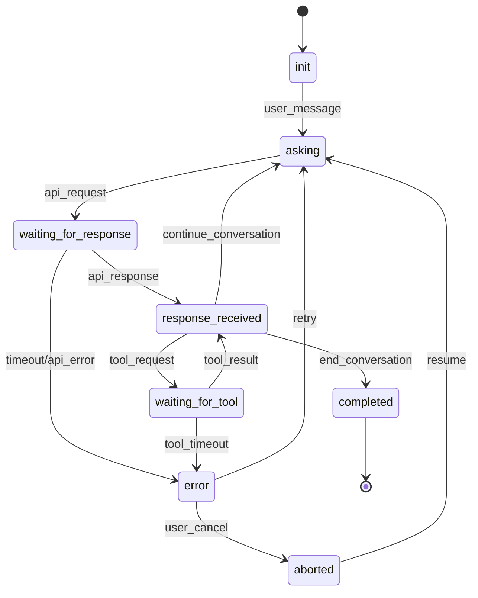

# Claude API Comprehensive Design
**CIM Agent Claude - Complete Architecture Documentation**

*Copyright 2025 - Cowboy AI, LLC. All rights reserved.*

## Overview

This document provides comprehensive architectural documentation for the CIM Agent Claude system, covering the complete Claude API integration with state machine-driven conversation management, tool use capabilities, vision processing, and enterprise features.

## System Architecture

### High-Level Architecture

```
┌─────────────────────────────────────────────────────────────────┐
│                    CIM Agent Claude (Root CIM)                  │
├─────────────────┬──────────────┬─────────────────┬──────────────┤
│   Orchestration │  Composition │  Infrastructure │   Monitoring │
├─────────────────┼──────────────┼─────────────────┼──────────────┤
│ Service Manager │ CIM Composer │ NATS JetStream  │ Observability│
│ State Machine   │ Module Reg.  │ KV Stores       │ Metrics      │
│ Event Flows     │ Dependencies │ WebSocket Proxy │ Health Check │
└─────────────────┴──────────────┴─────────────────┴──────────────┘
                              │
    ┌─────────────────────────┼─────────────────────────┐
    │                         │                         │
┌───▼───────────────┐  ┌──────▼──────────┐  ┌──────────▼─────────┐
│ cim-claude-adapter│  │ cim-claude-gui  │  │ External Tools     │
├───────────────────┤  ├─────────────────┤  ├────────────────────┤
│ Pure Claude API   │  │ Desktop (Iced)  │  │ Custom MCP Tools   │
│ Client Library    │  │ Web (WASM)      │  │ Server Tools       │
│ Domain Types      │  │ WebSocket       │  │ Function Calling   │
│ Error Handling    │  │ Real-time UI    │  │ Parallel Execution │
└───────────────────┘  └─────────────────┘  └────────────────────┘
```

### Module Composition Pattern

```rust
#[async_trait]
pub trait CimModule: Send + Sync {
    fn id(&self) -> &str;
    fn module_type(&self) -> ModuleType;
    async fn initialize(&mut self, infrastructure: Arc<NatsInfrastructure>) -> Result<(), Error>;
    async fn start(&self) -> Result<(), Error>;
    fn input_subjects(&self) -> Vec<String>;
    fn output_subjects(&self) -> Vec<String>;
}

// Category Theory Patterns
pub struct CimComposer {
    modules: HashMap<String, Box<dyn CimModule>>,
    dependencies: DependencyGraph,
    event_flows: EventFlowValidator,
}
```

## Conversation State Machine

### Core State Lifecycle



### State Implementation

```rust
#[derive(Debug, Clone, PartialEq, Serialize, Deserialize)]
pub enum ConversationState {
    Init,
    Asking,
    WaitingForResponse,
    ResponseReceived,
    WaitingForTool { tool_id: String, started_at: DateTime<Utc> },
    Completed { reason: CompletionReason },
    Error { reason: String, retry_count: u32 },
    Aborted { previous_state: Box<ConversationState> },
}

#[derive(Debug, Clone)]
pub struct StateTransition {
    pub from: ConversationState,
    pub to: ConversationState,
    pub trigger: TransitionTrigger,
    pub timestamp: DateTime<Utc>,
    pub metadata: Option<Value>,
}

#[derive(Debug, Clone)]
pub enum TransitionTrigger {
    UserMessage,
    ApiRequest,
    ApiResponse,
    ToolRequest,
    ToolResponse,
    Timeout,
    UserAbort,
    SystemError,
    Completion,
    Retry,
}
```

### State Machine Engine

```rust
pub struct ConversationStateMachine {
    conversation_id: String,
    current_state: ConversationState,
    state_history: Vec<StateTransition>,
    timeouts: StateTimeouts,
    error_recovery: ErrorRecovery,
    metrics: StateMachineMetrics,
}

impl ConversationStateMachine {
    pub async fn transition(&mut self, trigger: TransitionTrigger) -> Result<(), StateError> {
        let new_state = self.validate_transition(&self.current_state, &trigger)?;
        let transition = StateTransition {
            from: self.current_state.clone(),
            to: new_state.clone(),
            trigger,
            timestamp: Utc::now(),
            metadata: None,
        };
        
        self.state_history.push(transition.clone());
        self.current_state = new_state;
        self.publish_state_change(transition).await?;
        Ok(())
    }
}
```

## Domain Coverage

### 1. Core Claude API Integration (Stories 1.1-1.3)
- **Basic Messaging**: Send/receive with full parameter support
- **Streaming Responses**: Real-time response generation
- **Error Handling**: Comprehensive retry logic with exponential backoff

### 2. Configuration Management (Stories 2.1-2.3)  
- **System Prompts**: Dynamic prompt management
- **Model Parameters**: Temperature, max_tokens, stop sequences
- **Import/Export**: Configuration backup and restore

### 3. Tool Use and Function Calling (Stories 8.1-8.5)
- **Custom Tools**: Developer-defined tool registration
- **Parallel Execution**: Concurrent tool invocation
- **Server Tools**: Built-in web search, code execution, computer use
- **Force Usage**: Required tool execution patterns

```rust
#[derive(Debug, Clone, Serialize, Deserialize)]
pub struct ToolDefinition {
    pub name: String,
    pub description: String,
    pub input_schema: Value,
    pub function: ToolFunction,
    pub metadata: ToolMetadata,
}

pub struct ToolExecutionContext {
    pub tool_id: String,
    pub execution_id: String,
    pub parameters: Value,
    pub timeout: Duration,
    pub retry_config: RetryConfig,
}
```

### 4. Vision and Multi-modal (Stories 9.1-9.3)
- **Image Processing**: Upload, analysis, description
- **Document Analysis**: Charts, graphs, OCR
- **Image Comparison**: Difference detection, pattern analysis

```rust
#[derive(Debug, Clone)]
pub struct MultimodalMessage {
    pub text: Option<String>,
    pub images: Vec<ImageContent>,
    pub metadata: MessageMetadata,
}

#[derive(Debug, Clone)]
pub struct ImageContent {
    pub data: ImageData,
    pub format: ImageFormat,
    pub size_bytes: u64,
    pub dimensions: (u32, u32),
    pub analysis_hints: Vec<String>,
}
```

### 5. Advanced Streaming (Stories 10.1-10.3)
- **Real-time Streaming**: Incremental response assembly
- **Streaming Tools**: Tool execution during response generation
- **Server-Sent Events**: Browser-compatible streaming

### 6. Model Management (Stories 11.1-11.3)
- **Dynamic Selection**: Runtime model switching
- **Capability Detection**: Feature availability per model
- **Context Optimization**: Automatic message compression

### 7. Enterprise Features (Stories 13.1-13.3)
- **Organization Management**: Multi-tenant access control
- **Usage Analytics**: Cost tracking, pattern analysis
- **API Key Lifecycle**: Creation, rotation, revocation

## NATS Event Architecture

### Subject Hierarchy

```
cim.claude.
├── conv.                    # Conversations
│   ├── cmd.send.{conv_id}
│   ├── evt.response_received.{conv_id}
│   └── evt.state_changed.{conv_id}.{state}
├── tools.                   # Tool Use
│   ├── cmd.register.{tool_id}
│   ├── cmd.invoke.{tool_id}.{exec_id}
│   └── evt.executed.{tool_id}.{exec_id}
├── multimodal.             # Vision/Images
│   ├── cmd.send.{conv_id}
│   └── evt.processed.{conv_id}
├── stream.                 # Streaming
│   ├── cmd.start.{stream_id}
│   └── evt.chunk.{stream_id}
├── models.                 # Model Management
│   ├── cmd.switch.{model_name}
│   └── evt.switched.{model_name}
├── state.                  # State Machine
│   ├── cmd.transition.{conv_id}
│   └── evt.transitioned.{conv_id}.{from}.{to}
└── admin.                  # Enterprise
    ├── cmd.manage_org.{org_id}
    └── evt.org_updated.{org_id}
```

### Event Sourcing Pattern

```rust
#[derive(Debug, Clone, Serialize, Deserialize)]
pub struct ClaudeEvent {
    pub id: String,
    pub event_type: String,
    pub conversation_id: Option<String>,
    pub payload: Value,
    pub timestamp: DateTime<Utc>,
    pub correlation_id: String,
    pub causation_id: Option<String>,
}

pub struct EventStore {
    streams: HashMap<String, Vec<ClaudeEvent>>,
    snapshots: HashMap<String, ConversationSnapshot>,
    projections: Vec<Box<dyn EventProjection>>,
}
```

## Error Handling Strategy

### Error Classification

```rust
#[derive(Error, Debug, Clone)]
pub enum ClaudeError {
    #[error("Configuration error: {0}")]
    Configuration(String),
    
    #[error("Authentication error: {0}")]
    Authentication(String),
    
    #[error("Network error: {0}")]
    Network(String),
    
    #[error("API error {status_code}: {message}")]
    Api { status_code: u16, message: String },
    
    #[error("Rate limited: {0}")]
    RateLimit(String),
    
    #[error("Timeout: {0}")]
    Timeout(String),
}

impl ClaudeError {
    pub fn is_retryable(&self) -> bool {
        matches!(self, 
            ClaudeError::Network(_) |
            ClaudeError::RateLimit(_) |
            ClaudeError::Timeout(_) |
            ClaudeError::Api { status_code: 429 | 500..=599, .. }
        )
    }
    
    pub fn retry_delay(&self) -> Duration {
        match self {
            ClaudeError::RateLimit(_) => Duration::from_secs(60),
            ClaudeError::Api { status_code: 429, .. } => Duration::from_secs(30),
            _ => Duration::from_millis(1000),
        }
    }
}
```

### Retry Logic

```rust
pub struct RetryConfig {
    pub max_attempts: u32,
    pub base_delay: Duration,
    pub max_delay: Duration,
    pub backoff_multiplier: f64,
    pub jitter: bool,
}

pub async fn with_retry<F, T>(
    operation: F,
    config: RetryConfig,
) -> Result<T, ClaudeError>
where
    F: Fn() -> BoxFuture<'_, Result<T, ClaudeError>>,
{
    let mut attempts = 0;
    let mut delay = config.base_delay;
    
    loop {
        attempts += 1;
        
        match operation().await {
            Ok(result) => return Ok(result),
            Err(error) if !error.is_retryable() => return Err(error),
            Err(error) if attempts >= config.max_attempts => return Err(error),
            Err(error) => {
                let actual_delay = if config.jitter {
                    add_jitter(delay)
                } else {
                    delay
                };
                
                tokio::time::sleep(actual_delay).await;
                delay = (delay.as_millis() as f64 * config.backoff_multiplier) as u64;
                delay = Duration::from_millis(delay.min(config.max_delay.as_millis() as u64));
            }
        }
    }
}
```

## Monitoring and Observability

### Metrics Collection

```rust
#[derive(Debug, Serialize)]
pub struct SystemMetrics {
    // Conversation Metrics
    pub active_conversations: u64,
    pub conversations_per_second: f64,
    pub average_response_time: Duration,
    pub state_distribution: HashMap<ConversationState, u64>,
    
    // API Metrics  
    pub api_requests_per_second: f64,
    pub api_error_rate: f64,
    pub token_usage_rate: f64,
    pub cost_per_hour: f64,
    
    // Tool Metrics
    pub tool_executions_per_second: f64,
    pub tool_success_rate: f64,
    pub average_tool_duration: Duration,
    
    // System Health
    pub memory_usage: u64,
    pub cpu_usage: f64,
    pub nats_connection_status: ConnectionStatus,
    pub error_rates_by_type: HashMap<String, f64>,
}

pub struct MetricsCollector {
    prometheus_registry: Registry,
    conversation_metrics: ConversationMetrics,
    api_metrics: ApiMetrics,
    system_metrics: SystemMetrics,
}
```

### Health Checks

```rust
pub struct HealthCheck {
    pub name: String,
    pub status: HealthStatus,
    pub last_check: DateTime<Utc>,
    pub details: Option<Value>,
}

#[derive(Debug, Clone)]
pub enum HealthStatus {
    Healthy,
    Degraded { reason: String },
    Unhealthy { reason: String },
}

pub struct HealthMonitor {
    checks: HashMap<String, Box<dyn HealthChecker>>,
    status_cache: Arc<RwLock<HashMap<String, HealthCheck>>>,
}

#[async_trait]
pub trait HealthChecker: Send + Sync {
    async fn check(&self) -> HealthCheck;
}
```

## Security Architecture

### Authentication and Authorization

```rust
pub struct AuthContext {
    pub user_id: String,
    pub organization_id: String,
    pub permissions: HashSet<Permission>,
    pub api_key_id: String,
    pub scopes: Vec<String>,
}

#[derive(Debug, Clone, Hash, PartialEq, Eq)]
pub enum Permission {
    SendMessage,
    ManageTools,
    ViewAnalytics,
    ManageOrganization,
    AdminAccess,
}

pub struct SecurityManager {
    auth_provider: Box<dyn AuthProvider>,
    permission_engine: PermissionEngine,
    audit_logger: AuditLogger,
}
```

### Rate Limiting

```rust
pub struct RateLimiter {
    limits: HashMap<String, RateLimit>,
    state: Arc<RwLock<HashMap<String, RateLimitState>>>,
}

#[derive(Debug, Clone)]
pub struct RateLimit {
    pub requests_per_minute: u32,
    pub requests_per_hour: u32,
    pub tokens_per_minute: u32,
    pub concurrent_conversations: u32,
}
```

## Deployment Architecture

### Development Environment
```yaml
services:
  nats:
    image: nats:2.10-alpine
    ports: ["4222:4222", "8222:8222"]
    
  cim-agent-claude:
    build: .
    environment:
      - CLAUDE_API_KEY=${CLAUDE_API_KEY}
      - NATS_URL=nats://nats:4222
    depends_on: [nats]
```

### Production Environment
```nix
{ config, lib, pkgs, ... }: {
  services.cim-agent-claude = {
    enable = true;
    claude = {
      apiKey = config.age.secrets.claude-api-key.path;
      model = "claude-3-5-sonnet-20241022";
    };
    nats = {
      url = "nats://localhost:4222";
      websocket.enable = true;
    };
    monitoring = {
      prometheus.enable = true;
      grafana.enable = true;
    };
  };
}
```

## Performance Characteristics

### Scalability Targets
- **Concurrent Conversations**: 10,000+
- **Messages per Second**: 1,000+
- **Response Latency**: <500ms P95
- **State Transitions**: <10ms
- **Tool Execution**: <5s timeout
- **Memory Usage**: <1GB per 1000 conversations

### Optimization Strategies
- **Connection Pooling**: HTTP/2 connection reuse
- **Response Caching**: Identical request deduplication  
- **State Machine Optimization**: Lock-free state transitions
- **Message Batching**: Group NATS publishes
- **Memory Management**: Conversation cleanup policies

## Testing Strategy

### Unit Tests (69 tests implemented)
- **Claude Client**: All API interactions
- **Domain Types**: Serialization, validation
- **Error Handling**: All error scenarios
- **State Machine**: State transitions, timeouts

### Integration Tests
- **End-to-End Flows**: Complete conversation lifecycles  
- **Tool Integration**: Custom and server tools
- **Vision Processing**: Image upload and analysis
- **Streaming**: Real-time response handling

### Performance Tests
- **Load Testing**: High conversation volume
- **Stress Testing**: Resource exhaustion scenarios
- **Latency Testing**: Response time distribution
- **Memory Testing**: Long-running conversation leaks

## Future Roadmap

### Planned Features
- **Advanced Analytics**: ML-powered usage insights
- **Custom Models**: Support for fine-tuned models
- **Batch Processing**: Bulk conversation processing
- **Advanced Security**: Zero-trust architecture
- **Global Distribution**: Multi-region deployment

### Technical Debt
- **Streaming Implementation**: Complete real-time streaming
- **Vision Processing**: Advanced image analysis
- **Tool Discovery**: Automatic MCP tool detection
- **Performance Tuning**: Sub-100ms response times

---

## Conclusion

This comprehensive design provides a production-ready architecture for Claude API integration with enterprise-grade conversation state management, complete tool use capabilities, vision processing, and robust error handling. The system is designed to scale to thousands of concurrent conversations while maintaining sub-second response times and complete observability.

The modular CIM architecture enables easy extension with additional Claude API features as they become available, while the event-sourced design provides complete auditability and replay capabilities for debugging and analysis.

*For implementation details, see individual user stories in `/docs/user-stories.md` and module-specific documentation in respective directories.*