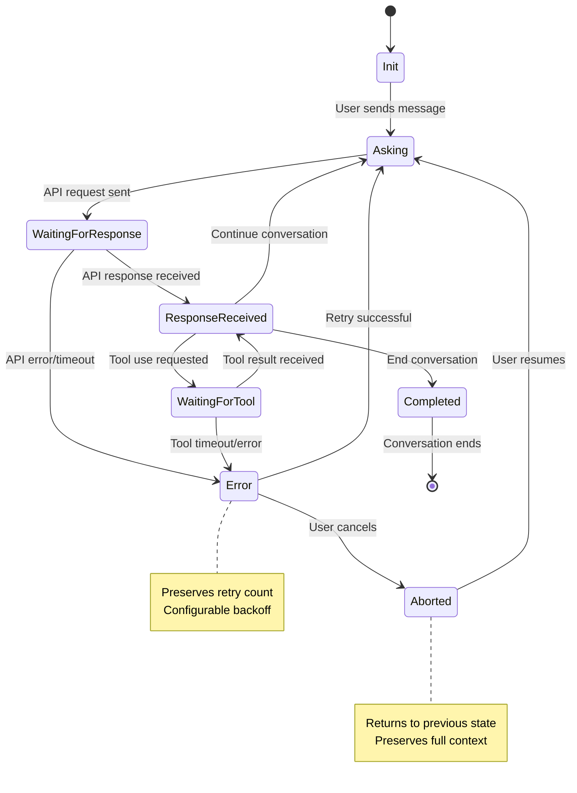

# Conversation State Machine Architecture
**CIM Agent Claude - State Machine Design Documentation**

*Copyright 2025 - Cowboy AI, LLC. All rights reserved.*

## Overview

The Conversation State Machine is a core component of the CIM Agent Claude system that provides robust, predictable conversation lifecycle management. It ensures that all Claude API interactions follow a well-defined state flow with proper error handling, timeout management, and recovery mechanisms.

## Design Principles

### 1. Predictable State Transitions
Every conversation follows a deterministic state flow that can be audited and replayed.

### 2. Error Recovery
Failed states can be recovered through retry mechanisms or user intervention without losing conversation context.

### 3. Tool Integration
Tool execution is seamlessly integrated into the conversation flow with dedicated states.

### 4. Concurrent Safety
Multiple conversations can be managed concurrently with thread-safe state transitions.

### 5. Observability
Complete visibility into state changes, timing, and performance metrics.

## State Machine Definition

### Core States



### State Descriptions

| State | Description | Entry Conditions | Exit Conditions |
|-------|-------------|------------------|-----------------|
| **Init** | Conversation created, no messages | New conversation | User sends first message |
| **Asking** | User message processed, ready for Claude | Message validated | API request initiated |
| **WaitingForResponse** | Request sent to Claude API | HTTP request in flight | Response received or timeout |
| **ResponseReceived** | Claude response available | Valid API response | User continues, tools needed, or completion |
| **WaitingForTool** | Tool execution in progress | Claude requested tool use | Tool completes or times out |
| **Completed** | Conversation ended normally | User/system completion | Terminal state |
| **Error** | Recoverable error occurred | API/tool/timeout error | Retry attempted or user abort |
| **Aborted** | User cancelled operation | User abort command | User resumes or timeout |

## Implementation Architecture

### Core Types

```rust
#[derive(Debug, Clone, PartialEq, Serialize, Deserialize)]
pub enum ConversationState {
    Init,
    Asking,
    WaitingForResponse {
        request_id: String,
        started_at: DateTime<Utc>,
    },
    ResponseReceived {
        response_id: String,
        received_at: DateTime<Utc>,
    },
    WaitingForTool {
        tool_id: String,
        execution_id: String,
        started_at: DateTime<Utc>,
    },
    Completed {
        reason: CompletionReason,
        completed_at: DateTime<Utc>,
    },
    Error {
        error_type: ErrorType,
        reason: String,
        retry_count: u32,
        occurred_at: DateTime<Utc>,
    },
    Aborted {
        previous_state: Box<ConversationState>,
        aborted_at: DateTime<Utc>,
    },
}

#[derive(Debug, Clone, PartialEq)]
pub enum CompletionReason {
    UserEnded,
    MaxTurns,
    TokenLimit,
    SystemShutdown,
}

#[derive(Debug, Clone, PartialEq)]
pub enum ErrorType {
    ApiError,
    NetworkError,
    TimeoutError,
    ToolError,
    ValidationError,
}
```

### State Transition Engine

```rust
pub struct ConversationStateMachine {
    pub conversation_id: String,
    pub current_state: ConversationState,
    pub state_history: Vec<StateTransition>,
    pub timeouts: StateTimeouts,
    pub retry_config: RetryConfig,
    pub metrics: StateMachineMetrics,
    event_publisher: Arc<dyn EventPublisher>,
}

impl ConversationStateMachine {
    pub async fn transition(
        &mut self, 
        trigger: TransitionTrigger,
        metadata: Option<Value>
    ) -> Result<ConversationState, StateError> {
        // Validate transition
        let new_state = self.validate_transition(&self.current_state, &trigger)?;
        
        // Create transition record
        let transition = StateTransition {
            conversation_id: self.conversation_id.clone(),
            from: self.current_state.clone(),
            to: new_state.clone(),
            trigger,
            timestamp: Utc::now(),
            metadata,
        };
        
        // Apply transition
        self.state_history.push(transition.clone());
        let old_state = std::mem::replace(&mut self.current_state, new_state.clone());
        
        // Update metrics
        self.metrics.record_transition(&old_state, &new_state);
        
        // Publish event
        self.publish_state_change(transition).await?;
        
        // Start timeout if needed
        self.start_timeout_if_needed(&new_state).await?;
        
        Ok(new_state)
    }
    
    fn validate_transition(
        &self, 
        from: &ConversationState, 
        trigger: &TransitionTrigger
    ) -> Result<ConversationState, StateError> {
        match (from, trigger) {
            // Init -> Asking
            (ConversationState::Init, TransitionTrigger::UserMessage) => {
                Ok(ConversationState::Asking)
            },
            
            // Asking -> WaitingForResponse
            (ConversationState::Asking, TransitionTrigger::ApiRequest) => {
                Ok(ConversationState::WaitingForResponse {
                    request_id: generate_id(),
                    started_at: Utc::now(),
                })
            },
            
            // WaitingForResponse -> ResponseReceived
            (ConversationState::WaitingForResponse { .. }, TransitionTrigger::ApiResponse) => {
                Ok(ConversationState::ResponseReceived {
                    response_id: generate_id(),
                    received_at: Utc::now(),
                })
            },
            
            // WaitingForResponse -> Error (timeout/error)
            (ConversationState::WaitingForResponse { .. }, TransitionTrigger::Timeout | TransitionTrigger::SystemError) => {
                Ok(ConversationState::Error {
                    error_type: match trigger {
                        TransitionTrigger::Timeout => ErrorType::TimeoutError,
                        TransitionTrigger::SystemError => ErrorType::ApiError,
                        _ => unreachable!(),
                    },
                    reason: "Request failed".to_string(),
                    retry_count: 0,
                    occurred_at: Utc::now(),
                })
            },
            
            // ResponseReceived -> Continue/Complete/Tool
            (ConversationState::ResponseReceived { .. }, TransitionTrigger::UserMessage) => {
                Ok(ConversationState::Asking)
            },
            (ConversationState::ResponseReceived { .. }, TransitionTrigger::Completion) => {
                Ok(ConversationState::Completed {
                    reason: CompletionReason::UserEnded,
                    completed_at: Utc::now(),
                })
            },
            (ConversationState::ResponseReceived { .. }, TransitionTrigger::ToolRequest) => {
                Ok(ConversationState::WaitingForTool {
                    tool_id: "tool_id".to_string(), // From metadata
                    execution_id: generate_id(),
                    started_at: Utc::now(),
                })
            },
            
            // Tool execution flow
            (ConversationState::WaitingForTool { .. }, TransitionTrigger::ToolResponse) => {
                Ok(ConversationState::ResponseReceived {
                    response_id: generate_id(),
                    received_at: Utc::now(),
                })
            },
            
            // Error recovery
            (ConversationState::Error { retry_count, .. }, TransitionTrigger::Retry) => {
                if *retry_count < self.retry_config.max_retries {
                    Ok(ConversationState::Asking)
                } else {
                    Err(StateError::MaxRetriesExceeded)
                }
            },
            
            // Abort handling
            (state, TransitionTrigger::UserAbort) => {
                Ok(ConversationState::Aborted {
                    previous_state: Box::new(state.clone()),
                    aborted_at: Utc::now(),
                })
            },
            
            // Resume from abort
            (ConversationState::Aborted { previous_state, .. }, TransitionTrigger::Resume) => {
                Ok((**previous_state).clone())
            },
            
            // Invalid transitions
            (from, trigger) => {
                Err(StateError::InvalidTransition {
                    from: from.clone(),
                    trigger: trigger.clone(),
                })
            }
        }
    }
}
```

### Transition Triggers

```rust
#[derive(Debug, Clone, PartialEq)]
pub enum TransitionTrigger {
    UserMessage,
    ApiRequest,
    ApiResponse,
    ToolRequest,
    ToolResponse,
    Timeout,
    UserAbort,
    Resume,
    SystemError,
    Completion,
    Retry,
}

#[derive(Debug, Clone)]
pub struct StateTransition {
    pub conversation_id: String,
    pub from: ConversationState,
    pub to: ConversationState,
    pub trigger: TransitionTrigger,
    pub timestamp: DateTime<Utc>,
    pub metadata: Option<Value>,
}
```

## Timeout Management

### Timeout Configuration

```rust
#[derive(Debug, Clone)]
pub struct StateTimeouts {
    pub waiting_for_response: Duration,
    pub waiting_for_tool: Duration,
    pub asking_timeout: Duration,
    pub error_recovery_window: Duration,
    pub abort_cleanup_delay: Duration,
}

impl Default for StateTimeouts {
    fn default() -> Self {
        Self {
            waiting_for_response: Duration::from_secs(30),
            waiting_for_tool: Duration::from_secs(60),
            asking_timeout: Duration::from_secs(10),
            error_recovery_window: Duration::from_secs(300),
            abort_cleanup_delay: Duration::from_secs(60),
        }
    }
}
```

### Timeout Implementation

```rust
pub struct TimeoutManager {
    active_timeouts: Arc<RwLock<HashMap<String, AbortHandle>>>,
    state_machines: Arc<RwLock<HashMap<String, Arc<Mutex<ConversationStateMachine>>>>>,
}

impl TimeoutManager {
    pub async fn start_timeout(
        &self,
        conversation_id: String,
        duration: Duration,
        timeout_trigger: TransitionTrigger,
    ) -> Result<(), TimeoutError> {
        let state_machines = self.state_machines.clone();
        
        let handle = tokio::spawn(async move {
            tokio::time::sleep(duration).await;
            
            if let Some(sm) = state_machines.read().await.get(&conversation_id) {
                let mut machine = sm.lock().await;
                if let Err(e) = machine.transition(timeout_trigger, None).await {
                    log::error!("Timeout transition failed: {:?}", e);
                }
            }
        });
        
        self.active_timeouts
            .write()
            .await
            .insert(conversation_id, handle.abort_handle());
            
        Ok(())
    }
    
    pub async fn cancel_timeout(&self, conversation_id: &str) {
        if let Some(handle) = self.active_timeouts.write().await.remove(conversation_id) {
            handle.abort();
        }
    }
}
```

## Error Recovery

### Retry Configuration

```rust
#[derive(Debug, Clone)]
pub struct RetryConfig {
    pub max_retries: u32,
    pub base_delay: Duration,
    pub max_delay: Duration,
    pub backoff_multiplier: f64,
    pub retryable_errors: HashSet<ErrorType>,
    pub retry_strategies: HashMap<ErrorType, RetryStrategy>,
}

#[derive(Debug, Clone)]
pub enum RetryStrategy {
    Immediate,
    FixedDelay(Duration),
    ExponentialBackoff { base: Duration, multiplier: f64, max: Duration },
    Custom(fn(&ConversationState, u32) -> Duration),
}
```

### Recovery Implementation

```rust
impl ConversationStateMachine {
    pub async fn handle_error(
        &mut self,
        error: ClaudeError,
    ) -> Result<(), StateError> {
        let error_type = match &error {
            ClaudeError::Api { .. } => ErrorType::ApiError,
            ClaudeError::Network(_) => ErrorType::NetworkError,
            ClaudeError::Timeout(_) => ErrorType::TimeoutError,
            _ => ErrorType::ValidationError,
        };
        
        // Transition to error state
        self.transition(
            TransitionTrigger::SystemError,
            Some(json!({ "error": error.to_string() }))
        ).await?;
        
        // Check if error is retryable
        if self.retry_config.retryable_errors.contains(&error_type) {
            let retry_count = match &self.current_state {
                ConversationState::Error { retry_count, .. } => *retry_count,
                _ => 0,
            };
            
            if retry_count < self.retry_config.max_retries {
                // Calculate retry delay
                let delay = self.calculate_retry_delay(&error_type, retry_count);
                
                // Schedule retry
                self.schedule_retry(delay).await?;
            }
        }
        
        Ok(())
    }
    
    fn calculate_retry_delay(&self, error_type: &ErrorType, retry_count: u32) -> Duration {
        match self.retry_config.retry_strategies.get(error_type) {
            Some(RetryStrategy::Immediate) => Duration::from_millis(0),
            Some(RetryStrategy::FixedDelay(delay)) => *delay,
            Some(RetryStrategy::ExponentialBackoff { base, multiplier, max }) => {
                let delay = base.as_millis() as f64 * multiplier.powi(retry_count as i32);
                Duration::from_millis((delay as u64).min(max.as_millis() as u64))
            },
            Some(RetryStrategy::Custom(func)) => func(&self.current_state, retry_count),
            None => self.retry_config.base_delay,
        }
    }
}
```

## Metrics and Monitoring

### State Machine Metrics

```rust
#[derive(Debug, Default)]
pub struct StateMachineMetrics {
    pub state_distribution: HashMap<String, u64>,
    pub transition_counts: HashMap<String, u64>,
    pub average_state_durations: HashMap<String, Duration>,
    pub error_rates: HashMap<ErrorType, f64>,
    pub retry_success_rate: f64,
    pub timeout_frequency: HashMap<String, u64>,
    pub concurrent_conversations: u64,
}

impl StateMachineMetrics {
    pub fn record_transition(&mut self, from: &ConversationState, to: &ConversationState) {
        let transition_key = format!("{}_{}", 
            self.state_name(from), 
            self.state_name(to)
        );
        *self.transition_counts.entry(transition_key).or_insert(0) += 1;
        *self.state_distribution.entry(self.state_name(to)).or_insert(0) += 1;
    }
    
    pub fn record_state_duration(&mut self, state: &ConversationState, duration: Duration) {
        let state_name = self.state_name(state);
        let current_avg = self.average_state_durations.get(&state_name).copied().unwrap_or_default();
        let new_avg = (current_avg + duration) / 2;
        self.average_state_durations.insert(state_name, new_avg);
    }
    
    pub fn record_error(&mut self, error_type: ErrorType) {
        let current_rate = self.error_rates.get(&error_type).copied().unwrap_or(0.0);
        self.error_rates.insert(error_type, current_rate + 1.0);
    }
    
    fn state_name(&self, state: &ConversationState) -> String {
        match state {
            ConversationState::Init => "init".to_string(),
            ConversationState::Asking => "asking".to_string(),
            ConversationState::WaitingForResponse { .. } => "waiting_for_response".to_string(),
            ConversationState::ResponseReceived { .. } => "response_received".to_string(),
            ConversationState::WaitingForTool { .. } => "waiting_for_tool".to_string(),
            ConversationState::Completed { .. } => "completed".to_string(),
            ConversationState::Error { .. } => "error".to_string(),
            ConversationState::Aborted { .. } => "aborted".to_string(),
        }
    }
}
```

### Performance Monitoring

```rust
pub struct PerformanceMonitor {
    metrics: Arc<RwLock<StateMachineMetrics>>,
    alerts: AlertManager,
    dashboards: DashboardExporter,
}

impl PerformanceMonitor {
    pub async fn check_performance_thresholds(&self) -> Vec<PerformanceAlert> {
        let metrics = self.metrics.read().await;
        let mut alerts = Vec::new();
        
        // Check error rates
        for (error_type, rate) in &metrics.error_rates {
            if *rate > 0.05 { // 5% error rate threshold
                alerts.push(PerformanceAlert::HighErrorRate {
                    error_type: error_type.clone(),
                    rate: *rate,
                });
            }
        }
        
        // Check state durations
        for (state, duration) in &metrics.average_state_durations {
            let threshold = match state.as_str() {
                "waiting_for_response" => Duration::from_secs(10),
                "waiting_for_tool" => Duration::from_secs(30),
                _ => Duration::from_secs(5),
            };
            
            if *duration > threshold {
                alerts.push(PerformanceAlert::SlowStateTransition {
                    state: state.clone(),
                    duration: *duration,
                    threshold,
                });
            }
        }
        
        alerts
    }
}
```

## NATS Integration

### Event Publishing

```rust
#[async_trait]
pub trait EventPublisher: Send + Sync {
    async fn publish_state_change(&self, transition: StateTransition) -> Result<(), PublishError>;
    async fn publish_metrics(&self, metrics: StateMachineMetrics) -> Result<(), PublishError>;
    async fn publish_alert(&self, alert: PerformanceAlert) -> Result<(), PublishError>;
}

pub struct NatsEventPublisher {
    client: async_nats::Client,
}

#[async_trait]
impl EventPublisher for NatsEventPublisher {
    async fn publish_state_change(&self, transition: StateTransition) -> Result<(), PublishError> {
        let subject = format!(
            "cim.claude.state.evt.transitioned.{}.{}.{}",
            transition.conversation_id,
            state_name(&transition.from),
            state_name(&transition.to)
        );
        
        let payload = serde_json::to_vec(&transition)?;
        self.client.publish(subject, payload.into()).await?;
        Ok(())
    }
}
```

### Subject Patterns

```
cim.claude.state.
├── cmd.
│   ├── transition.{conv_id}        # Trigger state transition
│   ├── timeout.{conv_id}          # Set/clear timeout
│   └── metrics.generate           # Generate metrics report
├── evt.
│   ├── transitioned.{conv_id}.{from}.{to}  # State changed
│   ├── timeout.{conv_id}.{state}           # State timed out
│   ├── error.{conv_id}.{error_type}        # Error occurred
│   └── metrics.{metric_type}               # Metrics published
└── queries.
    ├── current_state.{conv_id}     # Get current state
    ├── state_history.{conv_id}     # Get transition history
    └── metrics.system              # Get system metrics
```

## Testing Strategy

### Unit Tests

```rust
#[cfg(test)]
mod tests {
    use super::*;
    
    #[tokio::test]
    async fn test_init_to_asking_transition() {
        let mut sm = create_test_state_machine().await;
        
        let result = sm.transition(TransitionTrigger::UserMessage, None).await;
        
        assert!(result.is_ok());
        assert_eq!(sm.current_state, ConversationState::Asking);
        assert_eq!(sm.state_history.len(), 1);
    }
    
    #[tokio::test]
    async fn test_abort_preserves_previous_state() {
        let mut sm = create_test_state_machine().await;
        
        // Transition to ResponseReceived
        sm.transition(TransitionTrigger::UserMessage, None).await.unwrap();
        sm.transition(TransitionTrigger::ApiRequest, None).await.unwrap();
        sm.transition(TransitionTrigger::ApiResponse, None).await.unwrap();
        
        // Abort
        let result = sm.transition(TransitionTrigger::UserAbort, None).await;
        
        assert!(result.is_ok());
        match &sm.current_state {
            ConversationState::Aborted { previous_state, .. } => {
                assert!(matches!(**previous_state, ConversationState::ResponseReceived { .. }));
            }
            _ => panic!("Expected Aborted state"),
        }
    }
    
    #[tokio::test]
    async fn test_resume_from_abort() {
        let mut sm = create_test_state_machine().await;
        
        // Get to ResponseReceived, then abort
        sm.transition(TransitionTrigger::UserMessage, None).await.unwrap();
        sm.transition(TransitionTrigger::ApiRequest, None).await.unwrap();
        sm.transition(TransitionTrigger::ApiResponse, None).await.unwrap();
        sm.transition(TransitionTrigger::UserAbort, None).await.unwrap();
        
        // Resume
        let result = sm.transition(TransitionTrigger::Resume, None).await;
        
        assert!(result.is_ok());
        assert!(matches!(sm.current_state, ConversationState::ResponseReceived { .. }));
    }
    
    #[tokio::test]
    async fn test_retry_with_exponential_backoff() {
        let mut sm = create_test_state_machine_with_retry_config().await;
        
        // Transition to error state
        sm.transition(TransitionTrigger::UserMessage, None).await.unwrap();
        sm.transition(TransitionTrigger::ApiRequest, None).await.unwrap();
        sm.transition(TransitionTrigger::SystemError, None).await.unwrap();
        
        // First retry
        let delay1 = sm.calculate_retry_delay(&ErrorType::ApiError, 0);
        assert_eq!(delay1, Duration::from_secs(1));
        
        // Second retry
        let delay2 = sm.calculate_retry_delay(&ErrorType::ApiError, 1);
        assert_eq!(delay2, Duration::from_secs(2));
        
        // Third retry
        let delay3 = sm.calculate_retry_delay(&ErrorType::ApiError, 2);
        assert_eq!(delay3, Duration::from_secs(4));
    }
}
```

### Integration Tests

```rust
#[tokio::test]
async fn test_complete_conversation_flow() {
    let (mut sm, mock_nats) = create_integrated_test_environment().await;
    
    // Complete conversation flow
    sm.transition(TransitionTrigger::UserMessage, None).await.unwrap();
    sm.transition(TransitionTrigger::ApiRequest, None).await.unwrap();
    sm.transition(TransitionTrigger::ApiResponse, None).await.unwrap();
    sm.transition(TransitionTrigger::ToolRequest, None).await.unwrap();
    sm.transition(TransitionTrigger::ToolResponse, None).await.unwrap();
    sm.transition(TransitionTrigger::Completion, None).await.unwrap();
    
    // Verify NATS events were published
    assert_eq!(mock_nats.published_events().len(), 6);
    
    // Verify final state
    assert!(matches!(sm.current_state, ConversationState::Completed { .. }));
}
```

## Best Practices

### State Machine Design
1. **Keep states atomic** - Each state represents a single, well-defined condition
2. **Make transitions explicit** - All state changes must go through the transition engine
3. **Handle all edge cases** - Every possible trigger/state combination should be handled
4. **Preserve context** - Aborted states should preserve enough context for recovery

### Error Handling
1. **Classify errors appropriately** - Different error types need different recovery strategies
2. **Use exponential backoff** - Prevent overwhelming failed services
3. **Limit retry attempts** - Avoid infinite retry loops
4. **Log all state changes** - Essential for debugging and auditing

### Performance
1. **Minimize state storage** - Store only essential state information
2. **Use async everywhere** - Prevent blocking the state machine
3. **Batch NATS publishes** - Group related events when possible
4. **Cache frequently accessed data** - Reduce repeated computations

### Monitoring
1. **Track all transitions** - Every state change should be monitored
2. **Set appropriate thresholds** - Alert on abnormal patterns
3. **Export metrics** - Make data available for external analysis
4. **Dashboard key metrics** - Visualize system health in real-time

---

## Conclusion

The Conversation State Machine provides a robust foundation for managing Claude API interactions with predictable state flows, comprehensive error recovery, and complete observability. This design ensures that conversations can handle complex scenarios including tool use, streaming, timeouts, and user interruptions while maintaining system reliability and performance.

The state machine integrates seamlessly with the broader CIM architecture through NATS event sourcing, providing complete auditability and enabling advanced analytics and monitoring capabilities.