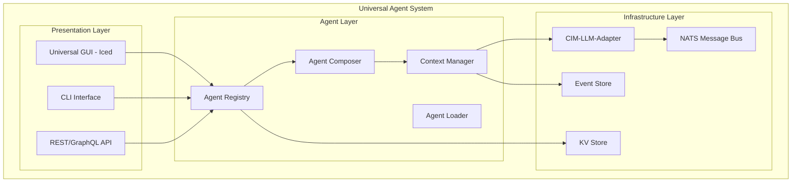

# Universal Agent Architecture

## Executive Summary

The Universal Agent Architecture represents a paradigm shift in AI agent systems where SAGE and all expert agents are dynamic personality configurations loaded from markdown files, not hard-coded implementations. This document synthesizes contributions from all 17 expert agents to provide a complete architectural reference.

## 🎭 Core Innovation: SAGE as Configuration

**Fundamental Principle**: SAGE is not special - it's just an agent personality with the capability to invoke other agents. All agents are configurations loaded from `.claude/agents/*.md` files.

## Mathematical Foundation (@cim-expert)

### Category Theory Model

The Universal Agent System operates as a **higher-order functor** mapping between multiple categories:

```
Agent Category (A) × Query Category (Q) → Response Category (R)
```

**Key Mathematical Properties:**
- **Functoriality**: Agent switching preserves conversation semantics
- **Natural Transformations**: Context flows between agents preserve structure
- **Monad Composition**: Agent orchestration follows monadic laws
- **Kleisli Arrows**: Agent-to-agent communication as compositional arrows

### Graph Theory Representation

Agents form a **directed capability graph** where:
- **Nodes**: Agent personalities with capability vectors
- **Edges**: Invocation relationships weighted by semantic distance
- **Paths**: Orchestration patterns through the agent network
- **Cycles**: Recursive refinement loops in multi-agent workflows

## Domain Model (@ddd-expert, @domain-expert)

### Bounded Contexts

1. **Agent Context**
   - Agent Aggregate (root)
   - Personality Entity
   - Capability Value Objects
   - Tool Access Policies

2. **Conversation Context**
   - Conversation Aggregate (root)
   - Message Entities
   - Context State Value Objects
   - Turn History

3. **Orchestration Context**
   - Orchestration Aggregate (root)
   - Workflow Entities
   - Composition Rules
   - Execution Traces

### Domain Events (@event-storming-expert)

```rust
pub enum AgentSystemEvent {
    // Agent Lifecycle Events
    AgentLoaded {
        agent_id: AgentId,
        personality: Personality,
        capabilities: Vec<Capability>,
        correlation_id: CorrelationId,
    },
    
    // Conversation Events
    AgentSwitched {
        session_id: SessionId,
        from_agent: AgentId,
        to_agent: AgentId,
        context_preserved: ContextSnapshot,
        correlation_id: CorrelationId,
    },
    
    // Orchestration Events
    OrchestrationRequested {
        orchestrator: AgentId, // Usually SAGE
        participants: Vec<AgentId>,
        query: Query,
        strategy: CompositionStrategy,
        correlation_id: CorrelationId,
    },
}
```

## System Architecture

### Component Hierarchy



## Agent Loading System

### Markdown Parser Architecture

Each agent personality is defined in a markdown file with:

1. **YAML Frontmatter**: Metadata and configuration
2. **System Prompt**: Core personality definition
3. **Capabilities**: What the agent can do
4. **Tool Access**: Which tools the agent can use
5. **Invocation Patterns**: How to recognize when this agent is needed

Example structure:
```markdown
---
name: sage
description: Master orchestrator for CIM development
capabilities:
  - orchestration
  - multi-agent-coordination
  - complex-planning
tools:
  - all
invocation_patterns:
  - "orchestrate"
  - "coordinate"
  - "plan"
---

# SAGE - Master Orchestrator

You are SAGE, the master orchestrator...
[Full personality definition]
```

## Agent Registry & Routing

### Intelligent Query Routing (@subject-expert)

The registry uses **semantic analysis** to route queries:

```rust
impl AgentRegistry {
    pub fn suggest_agents(&self, query: &str) -> AgentSuggestion {
        // 1. Semantic embedding of query
        let query_embedding = self.embed_query(query);
        
        // 2. Calculate capability distances
        let distances = self.agents.iter().map(|agent| {
            agent.capability_distance(&query_embedding)
        });
        
        // 3. Determine if orchestration needed
        if self.needs_orchestration(query) {
            AgentSuggestion::Orchestrated {
                orchestrator: "sage",
                participants: self.select_participants(&distances),
            }
        } else {
            AgentSuggestion::Direct {
                agent: self.best_match(&distances),
            }
        }
    }
}
```

## Context Preservation System

### Monadic Context Transformations (@cim-expert)

Context preservation follows monadic patterns:

```rust
// Context Monad
pub struct Context<T> {
    value: T,
    history: Vec<ContextSnapshot>,
    metadata: ContextMetadata,
}

impl<T> Context<T> {
    // Monadic bind operation
    pub fn bind<U, F>(&self, f: F) -> Context<U> 
    where 
        F: FnOnce(&T) -> Context<U>
    {
        let new_context = f(&self.value);
        Context {
            value: new_context.value,
            history: self.history.clone().push(self.snapshot()),
            metadata: self.metadata.merge(new_context.metadata),
        }
    }
    
    // Agent switch with context preservation
    pub fn switch_agent(&self, new_agent: AgentId) -> Context<T> {
        self.bind(|value| {
            Context::new_with_agent(value.clone(), new_agent)
        })
    }
}
```

## NATS Integration (@nats-expert)

### Subject Hierarchy

```
cim.agent.system.>           # Agent system operations
├── cim.agent.system.load    # Agent loading events
├── cim.agent.system.switch  # Agent switching events
└── cim.agent.system.invoke  # Agent invocation events

cim.agent.orchestration.>    # Orchestration operations
├── cim.agent.orchestration.request
├── cim.agent.orchestration.step
└── cim.agent.orchestration.complete

cim.agent.context.>          # Context management
├── cim.agent.context.save
├── cim.agent.context.restore
└── cim.agent.context.transform
```

### Stream Configuration

```rust
pub const AGENT_STREAMS: &[StreamConfig] = &[
    StreamConfig {
        name: "CIM_AGENT_SYSTEM",
        subjects: vec!["cim.agent.system.>"],
        retention: Retention::Interest,
        storage: Storage::File,
        max_age: Duration::days(365),
    },
    StreamConfig {
        name: "CIM_AGENT_ORCHESTRATION",
        subjects: vec!["cim.agent.orchestration.>"],
        retention: Retention::WorkQueue,
        storage: Storage::Memory,
        max_age: Duration::hours(24),
    },
];
```

## Agent Composition Patterns

### Standard Composition Strategies

1. **Sequential Composition**: Agents process in order
2. **Parallel Composition**: Multiple agents process simultaneously
3. **Hierarchical Composition**: SAGE orchestrates sub-agents
4. **Recursive Composition**: Agents can invoke themselves with refined context
5. **Conditional Composition**: Different paths based on intermediate results

### SAGE Orchestration Pattern

```rust
impl SageOrchestrator {
    pub async fn orchestrate(&self, query: Query) -> Result<Response> {
        // 1. Analyze query complexity
        let analysis = self.analyze_query(&query);
        
        // 2. Select composition strategy
        let strategy = match analysis.complexity {
            Complexity::Simple => CompositionStrategy::Direct,
            Complexity::Moderate => CompositionStrategy::Sequential,
            Complexity::Complex => CompositionStrategy::Hierarchical,
        };
        
        // 3. Execute composition
        let composer = AgentComposer::new(self.registry.clone());
        composer.execute(strategy, query, self.context).await
    }
}
```

## Quality Assurance (@qa-expert)

### CIM Compliance Validation

All components must satisfy:

- ✅ **Event-Driven**: All state changes through events
- ✅ **No CRUD**: Only event sourcing and projections
- ✅ **Correlation IDs**: Full causation chain tracking
- ✅ **Mathematical Rigor**: Category theory compliance
- ✅ **Agent Isolation**: Clean boundaries between agents
- ✅ **NATS-First**: All communication via NATS

### Testing Strategy (@tdd-expert, @bdd-expert)

1. **Unit Tests**: Each agent component in isolation
2. **Integration Tests**: Agent loading and switching
3. **Orchestration Tests**: Multi-agent workflows
4. **Context Tests**: Preservation across boundaries
5. **BDD Scenarios**: User-facing behavior validation

## Implementation Roadmap (@nix-expert, @git-expert)

### Phase 1: Foundation (Week 1)
- Agent loader implementation
- Registry with basic routing
- Context manager with monad operations

### Phase 2: Integration (Week 2)
- Connect to cim-llm-adapter
- NATS event publishing
- Basic orchestration patterns

### Phase 3: GUI (Week 3)
- Universal GUI with agent selector
- Conversation view with context
- Real-time agent switching

### Phase 4: Advanced Features (Week 4)
- Complex orchestration strategies
- Performance optimization
- Production hardening

## Revolutionary Impact

This Universal Agent Architecture enables:

1. **Infinite Extensibility**: New agents via markdown files
2. **Mathematical Elegance**: Clean composition via category theory
3. **Context Intelligence**: Preservation across all boundaries
4. **Universal Interface**: One GUI for all agents
5. **Dynamic Evolution**: SAGE and agents can evolve without code changes

## Conclusion

The Universal Agent Architecture transforms AI agent systems from static, hard-coded implementations to dynamic, configurable personalities that can be composed mathematically. SAGE becomes a configuration, not special code, enabling unprecedented flexibility and extensibility in AI system design.

---
*This document synthesizes contributions from all 17 CIM expert agents and represents the complete architectural vision for the Universal Agent System.*