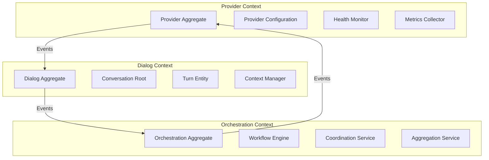
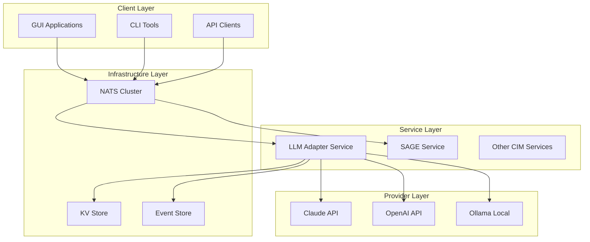

# CIM LLM Adapter Design

## Executive Summary

The cim-llm-adapter provides a mathematically rigorous, event-driven abstraction layer for multiple LLM providers. This document details the complete design as synthesized from all expert agents, enabling seamless provider switching while maintaining CIM architectural principles.

## 🏗️ Architectural Foundation (@cim-expert, @cim-domain-expert)

### Category Theory Model

The LLM Adapter operates as a **functor** between provider and CIM event categories:

```
F: Provider × Operation → Event
```

Where:
- **Provider Category**: {Claude, GPT, Llama, Gemini, ...}
- **Operation Category**: {Complete, Chat, Stream, Embed}
- **Event Category**: CIM events with correlation/causation chains

### Mathematical Properties

1. **Functoriality**: `F(p₁ ∘ p₂) = F(p₁) ∘ F(p₂)` - Provider composition preserves structure
2. **Natural Transformation**: Provider switching is a natural transformation η: F → G
3. **Monadic Dialog**: Conversations form a monad for context preservation
4. **Kleisli Composition**: Multi-turn dialogs compose via Kleisli arrows

## 📐 Domain Model (@ddd-expert, @domain-expert)

### Bounded Contexts



### Core Aggregates

#### Provider Aggregate
```rust
pub struct ProviderAggregate {
    id: ProviderId,
    provider_type: ProviderType,
    configuration: ProviderConfig,
    capabilities: ProviderCapabilities,
    health_status: HealthStatus,
    metrics: ProviderMetrics,
}

// State Machine
enum ProviderState {
    Uninitialized,
    Configuring,
    Ready,
    Degraded,
    Failed,
}
```

#### Dialog Aggregate
```rust
pub struct DialogAggregate {
    conversation_id: ConversationId,
    provider_id: ProviderId,
    turns: Vec<Turn>,
    context: DialogContext,
    token_usage: TokenUsage,
}

// Turn Entity
pub struct Turn {
    turn_id: TurnId,
    user_message: Message,
    assistant_response: Message,
    timestamp: DateTime<Utc>,
    latency: Duration,
}
```

### Domain Events (@event-storming-expert)

```rust
// Provider Events
pub enum ProviderEvent {
    ProviderRegistered {
        event_id: EventId,
        provider_id: ProviderId,
        provider_type: ProviderType,
        capabilities: ProviderCapabilities,
        correlation_id: CorrelationId,
        caused_by: CausationId,
        occurred_at: DateTime<Utc>,
    },
    ProviderHealthChanged {
        event_id: EventId,
        provider_id: ProviderId,
        old_status: HealthStatus,
        new_status: HealthStatus,
        reason: String,
        correlation_id: CorrelationId,
        caused_by: CausationId,
        occurred_at: DateTime<Utc>,
    },
}

// Dialog Events
pub enum DialogEvent {
    ConversationStarted {
        event_id: EventId,
        conversation_id: ConversationId,
        provider_id: ProviderId,
        initial_context: Option<DialogContext>,
        correlation_id: CorrelationId,
        caused_by: CausationId,
        occurred_at: DateTime<Utc>,
    },
    TurnCompleted {
        event_id: EventId,
        conversation_id: ConversationId,
        turn_id: TurnId,
        user_message: Message,
        assistant_response: Message,
        token_usage: TokenUsage,
        latency: Duration,
        correlation_id: CorrelationId,
        caused_by: CausationId,
        occurred_at: DateTime<Utc>,
    },
}
```

## 📨 NATS Integration (@nats-expert, @subject-expert)

### Subject Algebra

The subject hierarchy follows algebraic composition rules:

```
Base: cim.llm
Operations: {provider, dialog, orchestration}
Actions: {request, response, event, error}

Composition: base.operation.action.{specific}
```

### Subject Hierarchy

```yaml
# Provider Operations
cim.llm.provider.register      # Register new provider
cim.llm.provider.configure     # Update configuration
cim.llm.provider.health        # Health check
cim.llm.provider.metrics       # Metrics collection

# Dialog Operations
cim.llm.dialog.start           # Start conversation
cim.llm.dialog.turn.request    # User message
cim.llm.dialog.turn.response   # Assistant response
cim.llm.dialog.context.save    # Save context
cim.llm.dialog.context.load    # Load context

# Orchestration Operations
cim.llm.orchestration.workflow.start
cim.llm.orchestration.workflow.step
cim.llm.orchestration.workflow.complete
cim.llm.orchestration.coordinate
```

### Stream Configuration

```rust
pub const LLM_STREAMS: &[StreamConfig] = &[
    StreamConfig {
        name: "CIM_LLM_PROVIDERS",
        subjects: vec!["cim.llm.provider.>"],
        retention: Retention::Interest,
        storage: Storage::File,
        max_age: Duration::days(365),
        max_bytes: 10_737_418_240, // 10GB
    },
    StreamConfig {
        name: "CIM_LLM_DIALOGS",
        subjects: vec!["cim.llm.dialog.>"],
        retention: Retention::WorkQueue,
        storage: Storage::File,
        max_age: Duration::days(90),
        max_msgs_per_subject: 10_000,
    },
    StreamConfig {
        name: "CIM_LLM_ORCHESTRATION",
        subjects: vec!["cim.llm.orchestration.>"],
        retention: Retention::Limits,
        storage: Storage::Memory,
        max_age: Duration::hours(24),
        max_msgs: 100_000,
    },
];
```

### KV Store Design

```rust
pub const LLM_KV_BUCKETS: &[KvConfig] = &[
    KvConfig {
        bucket: "cim-llm-providers",
        description: "Provider configurations and capabilities",
        max_value_size: 1_048_576, // 1MB
        history: 10,
        ttl: None, // Persistent
    },
    KvConfig {
        bucket: "cim-llm-contexts",
        description: "Active conversation contexts",
        max_value_size: 10_485_760, // 10MB
        history: 5,
        ttl: Some(Duration::hours(24)),
    },
    KvConfig {
        bucket: "cim-llm-workflows",
        description: "Workflow definitions and state",
        max_value_size: 524_288, // 512KB
        history: 3,
        ttl: Some(Duration::hours(6)),
    },
];
```

## 🌐 Network Architecture (@network-expert)

### Deployment Topology



### Scalability Patterns

1. **Horizontal Scaling**: Multiple LLM adapter instances
2. **Provider Pooling**: Connection pools per provider
3. **Request Routing**: NATS-based load balancing
4. **Cache Strategy**: Context caching in KV store
5. **Failover**: Automatic provider failover on errors

## 🧪 Provider Abstraction Design

### Core Trait Definition

```rust
#[async_trait]
pub trait LlmProvider: Send + Sync {
    type Config: ProviderConfig;
    type Error: ProviderError;
    
    /// Initialize provider with configuration
    async fn initialize(&mut self, config: Self::Config) -> Result<(), Self::Error>;
    
    /// Generate completion from prompt
    async fn complete(&self, request: CompletionRequest) -> Result<CompletionResponse, Self::Error>;
    
    /// Stream completion tokens
    async fn stream(&self, request: CompletionRequest) -> Result<CompletionStream, Self::Error>;
    
    /// Generate embeddings
    async fn embed(&self, request: EmbeddingRequest) -> Result<EmbeddingResponse, Self::Error>;
    
    /// Check provider health
    async fn health_check(&self) -> Result<HealthStatus, Self::Error>;
    
    /// Get provider capabilities
    fn capabilities(&self) -> ProviderCapabilities;
    
    /// Get current metrics
    fn metrics(&self) -> ProviderMetrics;
}
```

### Provider Implementations

#### Claude Provider
```rust
pub struct ClaudeProvider {
    client: AnthropicClient,
    config: ClaudeConfig,
    metrics: Arc<RwLock<ProviderMetrics>>,
}

impl LlmProvider for ClaudeProvider {
    type Config = ClaudeConfig;
    type Error = ClaudeError;
    
    async fn complete(&self, request: CompletionRequest) -> Result<CompletionResponse, Self::Error> {
        let start = Instant::now();
        
        let anthropic_request = self.transform_request(request)?;
        let response = self.client.messages(anthropic_request).await?;
        
        self.update_metrics(start.elapsed(), response.usage.clone());
        
        Ok(self.transform_response(response)?)
    }
    
    // ... other trait methods
}
```

## 📋 BDD Scenarios (@bdd-expert)

### Feature: Multi-Provider Management

```gherkin
Feature: Multi-Provider LLM Management
  As a CIM system
  I want to manage multiple LLM providers
  So that I can leverage different capabilities and ensure availability

  Background:
    Given the LLM adapter service is running
    And NATS is connected with JetStream enabled

  @provider-registration
  Scenario: Register multiple providers
    When I register a Claude provider with API key "sk-ant-xxx"
    And I register an OpenAI provider with API key "sk-oai-xxx"
    And I register an Ollama provider at "http://localhost:11434"
    Then all three providers should be available
    And each provider should report its capabilities
    And health checks should pass for all providers

  @provider-selection
  Scenario: Intelligent provider selection
    Given I have registered providers:
      | provider | specialty    | cost  |
      | claude   | reasoning    | high  |
      | gpt-4    | general      | high  |
      | llama    | local        | free  |
    When I send a request for "complex reasoning task"
    Then the system should select "claude" provider
    When I send a request for "simple completion"
    Then the system should select "llama" provider

  @failover
  Scenario: Automatic provider failover
    Given I have "claude" as primary provider
    And "gpt-4" as backup provider
    When "claude" returns an error
    Then the request should automatically retry with "gpt-4"
    And a failover event should be published
    And the conversation context should be preserved
```

### Feature: Dialog Management

```gherkin
Feature: Dialog Management with Context
  As a conversational AI system
  I want to maintain dialog context
  So that conversations are coherent across turns

  @context-preservation
  Scenario: Multi-turn conversation
    Given I start a conversation with provider "claude"
    When I send "What is category theory?"
    Then I should receive a response about category theory
    When I send "How does it apply to programming?"
    Then the response should reference the previous discussion
    And the context should contain both turns
    
  @context-switching
  Scenario: Provider switch with context
    Given I have a conversation with 5 turns using "claude"
    When the provider switches to "gpt-4"
    And I continue the conversation
    Then the context should be preserved
    And the new provider should understand the conversation history
```

## 🧪 Testing Strategy (@tdd-expert)

### Test Pyramid

1. **Unit Tests** (70%)
   - Provider trait implementations
   - Dialog state machines
   - Context transformations
   - Event serialization

2. **Integration Tests** (20%)
   - NATS communication
   - KV store operations
   - Provider API calls
   - Event flow validation

3. **End-to-End Tests** (10%)
   - Complete conversation flows
   - Multi-provider workflows
   - Failover scenarios
   - Performance benchmarks

### Test Implementation

```rust
#[cfg(test)]
mod tests {
    use super::*;
    use mockall::predicate::*;
    use tokio::test;

    #[test]
    async fn test_provider_registration() {
        // Arrange
        let adapter = LlmAdapter::new_test();
        let config = ClaudeConfig::new("test-key");
        
        // Act
        let provider_id = adapter.register_provider(
            ProviderType::Claude,
            config
        ).await.unwrap();
        
        // Assert
        assert!(adapter.get_provider(&provider_id).is_some());
        assert_eq!(adapter.provider_count(), 1);
    }

    #[test]
    async fn test_dialog_context_preservation() {
        // Arrange
        let manager = DialogManager::new_test();
        let conv_id = manager.start_conversation(ProviderId::test()).await.unwrap();
        
        // Act
        let turn1 = manager.add_turn(conv_id, "First message").await.unwrap();
        let turn2 = manager.add_turn(conv_id, "Second message").await.unwrap();
        let context = manager.get_context(conv_id).await.unwrap();
        
        // Assert
        assert_eq!(context.turns.len(), 2);
        assert!(context.total_tokens > 0);
    }
}
```

## ⚙️ Nix Configuration (@nix-expert)

### Flake Configuration

```nix
{
  inputs = {
    nixpkgs.url = "github:NixOS/nixpkgs/nixos-unstable";
    rust-overlay.url = "github:oxalica/rust-overlay";
    llm-rs = {
      url = "github:rustformers/llm";
      flake = false;
    };
  };

  outputs = { self, nixpkgs, rust-overlay, llm-rs, ... }:
    let
      system = "x86_64-linux";
      pkgs = import nixpkgs {
        inherit system;
        overlays = [ rust-overlay.overlays.default ];
      };
      
      rustToolchain = pkgs.rust-bin.stable.latest.default.override {
        extensions = [ "rust-src" "rust-analyzer" ];
      };
    in {
      packages.${system} = {
        cim-llm-adapter = pkgs.rustPlatform.buildRustPackage {
          pname = "cim-llm-adapter";
          version = "0.1.0";
          src = ./cim-llm-adapter;
          
          cargoLock = {
            lockFile = ./cim-llm-adapter/Cargo.lock;
          };
          
          nativeBuildInputs = with pkgs; [
            cmake
            pkg-config
          ];
          
          buildInputs = with pkgs; [
            openssl
            protobuf
          ];
          
          # GPU support (optional)
          CUDA_PATH = pkgs.cudatoolkit;
        };
      };
      
      devShells.${system}.default = pkgs.mkShell {
        buildInputs = with pkgs; [
          rustToolchain
          cargo-watch
          cargo-nextest
          cmake
          protobuf
          openssl
          pkg-config
        ];
        
        shellHook = ''
          echo "CIM LLM Adapter Development Environment"
          echo "Run 'cargo build --bin llm-adapter-service' to build"
        '';
      };
    };
}
```

## 🔧 Git Repository Structure (@git-expert)

### Repository Organization

```
cim-llm-adapter/
├── .github/
│   └── workflows/
│       ├── ci.yml              # Continuous integration
│       ├── release.yml         # Release automation
│       └── security.yml        # Security scanning
├── src/
│   ├── lib.rs                  # Public API
│   ├── bin/
│   │   └── llm-adapter-service.rs
│   ├── domain/                 # Domain layer
│   ├── application/            # Application services
│   ├── infrastructure/         # Infrastructure
│   └── integration/            # Integration layer
├── tests/                      # Integration tests
├── benches/                    # Performance benchmarks
├── docs/                       # Documentation
├── Cargo.toml
├── Cargo.lock
├── README.md
└── flake.nix
```

## ✅ Quality Assurance (@qa-expert)

### CIM Compliance Checklist

- ✅ **Event-Driven**: All state changes via events
- ✅ **No CRUD**: Pure event sourcing
- ✅ **Correlation/Causation**: Complete event chains
- ✅ **NATS-First**: All communication via NATS
- ✅ **Mathematical Rigor**: Category theory compliance
- ✅ **Provider Agnostic**: Clean abstraction
- ✅ **Context Preservation**: Monadic transformations
- ✅ **Composable**: Integrates with CIM modules

### Validation Rules

```rust
#[cfg(test)]
mod compliance {
    use cim_compliance::*;
    
    #[test]
    fn validate_no_crud() {
        assert_no_crud_operations!(LlmAdapter);
        assert_no_crud_operations!(DialogManager);
    }
    
    #[test]
    fn validate_event_sourcing() {
        assert_all_state_changes_via_events!(ProviderAggregate);
        assert_all_state_changes_via_events!(DialogAggregate);
    }
    
    #[test]
    fn validate_correlation_chains() {
        assert_all_events_have_correlation_id!(ProviderEvent);
        assert_all_events_have_causation_id!(DialogEvent);
    }
}
```

## 🚀 Implementation Status

### Completed ✅
- Core domain model and events
- Provider trait abstraction
- Claude provider implementation
- Basic dialog management
- NATS integration
- Service binary structure

### In Progress 🔄
- OpenAI provider
- Ollama provider
- Advanced context preservation
- Workflow orchestration
- Performance optimization

### Planned 📋
- Gemini provider
- Mistral provider
- Advanced failover strategies
- Distributed caching
- Monitoring and observability

## Conclusion

The cim-llm-adapter provides a mathematically rigorous, event-driven abstraction over multiple LLM providers while maintaining strict CIM architectural principles. Through category theory foundations and clean domain boundaries, it enables seamless provider switching, context preservation, and workflow orchestration.

---
*This document synthesizes contributions from all 17 CIM expert agents and represents the complete design for the CIM LLM Adapter.*