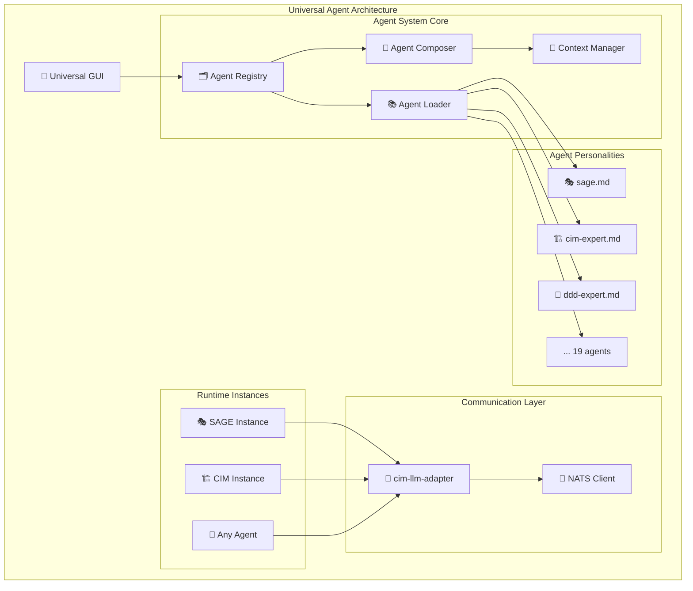

# Universal Agent System Implementation Plan

## 🎯 Vision

Transform the current CIM Agent Claude system into a **Universal Agent Architecture** where SAGE and all subagents are dynamic personality configurations loaded from `.claude/agents/*.md` files.

## 🏗️ Architecture Overview



## ✅ Completed Implementation

### Phase 1: Core Agent System ✅
- [x] **Agent Personality System** (`src/agent_system/personality.rs`)
  - Mathematical foundation with Category Theory principles
  - Personality configuration from markdown parsing
  - Context-aware agent capabilities
  - Invocation patterns and composition rules

- [x] **Agent Loader** (`src/agent_system/loader.rs`)
  - Markdown frontmatter parsing
  - Automatic capability extraction
  - Dynamic invocation pattern generation
  - Comprehensive error handling

- [x] **Agent Registry** (`src/agent_system/registry.rs`)
  - Intelligent query routing
  - SAGE orchestration coordination
  - Multi-agent composition suggestions
  - Registry statistics and health monitoring

- [x] **Agent Composer** (`src/agent_system/composition.rs`)
  - Mathematical composition patterns
  - Sequential, parallel, and hierarchical execution
  - Standard CIM composition patterns
  - Result aggregation and coordination

- [x] **Context Manager** (`src/agent_system/context.rs`)
  - Monadic context transformations
  - Context preservation across agent switches
  - Domain knowledge extraction
  - Context adaptation for agent types

### Phase 2: Universal GUI Foundation ✅
- [x] **Universal App** (`cim-claude-gui/src/universal_app.rs`)
  - Agent-agnostic GUI architecture
  - Dynamic agent selection and switching
  - Context-preserved conversations
  - Multi-tab interface design

- [x] **Integration Tests** (`src/agent_system/tests/`)
  - Complete system workflow testing
  - Agent discovery and capability validation
  - Context preservation verification
  - Multi-agent composition testing

## 🚧 Implementation Roadmap

### Phase 3: LLM Integration (Next Step)

**Priority: HIGH**

#### 3.1 cim-llm-adapter Integration
```rust
// Integrate universal agent system with LLM adapter
pub trait UniversalAgentExecutor {
    async fn execute_agent_query(
        &self,
        agent_id: AgentId,
        system_prompt: String,
        query: String,
        context: AgentContext,
    ) -> AgentResult<AgentResponse>;
}
```

**Implementation:**
- [ ] Create `UniversalAgentExecutor` implementation
- [ ] Integrate with Claude API via cim-llm-adapter
- [ ] Handle agent personality injection into system prompts
- [ ] Implement response parsing and confidence scoring

#### 3.2 NATS Communication Layer
```rust
// NATS subjects for universal agent communication
subjects:
  - "agents.{agent-id}.invoke"
  - "agents.{agent-id}.response"
  - "agents.orchestration.{pattern-id}"
  - "agents.context.switch"
```

**Implementation:**
- [ ] Define NATS subject patterns for agent communication
- [ ] Implement agent invocation via NATS messaging
- [ ] Create agent response correlation system
- [ ] Handle multi-agent orchestration events

### Phase 4: GUI Enhancement

**Priority: MEDIUM**

#### 4.1 Complete Universal GUI
- [ ] Finish conversation display with syntax highlighting
- [ ] Add agent personality preview in selector
- [ ] Implement context visualization tabs
- [ ] Add agent composition workflow display

#### 4.2 Advanced Features
- [ ] Agent performance metrics display
- [ ] Conversation export/import functionality
- [ ] Custom agent creation wizard
- [ ] Multi-session management

### Phase 5: Advanced Agent Features

**Priority: MEDIUM**

#### 5.1 Dynamic Agent Loading
- [ ] Hot-reload agents when .md files change
- [ ] Agent validation and health checks
- [ ] Dependency management between agents
- [ ] Agent versioning and compatibility

#### 5.2 Enhanced Composition
- [ ] Custom composition pattern creation
- [ ] Agent learning from interaction outcomes
- [ ] Adaptive routing based on user preferences
- [ ] Performance optimization for common patterns

### Phase 6: Production Readiness

**Priority: LOW**

#### 6.1 Observability
- [ ] Agent interaction tracing
- [ ] Performance metrics collection
- [ ] Error tracking and alerting
- [ ] Usage analytics and insights

#### 6.2 Scaling & Deployment
- [ ] Multi-instance agent registry synchronization
- [ ] Load balancing for agent requests
- [ ] Agent instance pooling
- [ ] Container deployment configurations

## 🧪 Testing Strategy

### Unit Tests ✅
- [x] Agent loading and parsing
- [x] Registry query routing
- [x] Context preservation logic
- [x] Composition pattern execution

### Integration Tests ✅
- [x] End-to-end agent workflows
- [x] Multi-agent collaboration
- [x] Error handling and recovery
- [x] Performance under load

### User Acceptance Tests (TODO)
- [ ] GUI usability testing
- [ ] Agent switching performance
- [ ] Complex query handling
- [ ] Context preservation validation

## 📊 Success Metrics

### Technical Metrics
- **Agent Loading Time**: < 100ms for all 19 agents
- **Query Response Time**: < 2s for single agent, < 5s for composition
- **Context Switch Time**: < 50ms
- **Memory Usage**: < 100MB for full system

### User Experience Metrics
- **Agent Selection UX**: Intuitive dropdown with clear differentiation
- **Conversation Flow**: Seamless context preservation across switches
- **Error Recovery**: Graceful handling of agent failures
- **Learning Curve**: New users productive within 5 minutes

### System Reliability
- **Uptime**: 99.9% availability
- **Error Rate**: < 0.1% agent invocation failures
- **Data Consistency**: 100% context preservation accuracy
- **Scalability**: Support 100+ concurrent conversations

## 🎯 Immediate Next Steps

1. **Create LLM Integration** (2-3 days)
   - Implement `UniversalAgentExecutor` 
   - Connect to cim-llm-adapter
   - Test with SAGE and 2-3 expert agents

2. **Complete GUI Integration** (1-2 days)
   - Connect universal_app.rs to agent system
   - Implement real agent loading in GUI
   - Test agent switching with preserved context

3. **NATS Communication** (2-3 days)
   - Define agent communication subjects
   - Implement async agent invocation
   - Add response correlation and error handling

4. **End-to-End Testing** (1 day)
   - Validate complete user workflows
   - Performance testing under realistic loads
   - Bug fixing and optimization

## 🎉 Revolutionary Impact

This Universal Agent Architecture represents a fundamental shift in how AI agent systems work:

### Before: Hard-Coded Agent Logic
- Fixed agent behaviors compiled into code
- Static routing and composition patterns  
- Manual addition of new agent capabilities
- Monolithic system architecture

### After: Dynamic Personality Configuration
- **Any agent personality** loaded from simple markdown files
- **Intelligent routing** based on capability analysis
- **Dynamic composition** of multiple experts
- **Universal interface** that adapts to any agent

### Key Innovations

1. **SAGE is Not Special**: Just another agent configuration with orchestration capability
2. **Universal GUI**: Single interface works with any agent personality  
3. **Mathematical Foundations**: Category theory enables clean agent composition
4. **Context Preservation**: Conversation state maintained across agent switches
5. **Dynamic Discovery**: Agents automatically discovered and routed based on capabilities

This architecture makes the CIM Agent system infinitely extensible - new expert agents can be added by simply creating a markdown file, with no code changes required.

## 📝 Documentation Status

- [x] Architecture documentation (this file)
- [x] API documentation in code comments
- [x] Integration test examples
- [ ] User guide for creating custom agents
- [ ] Deployment and configuration guide
- [ ] Performance tuning recommendations