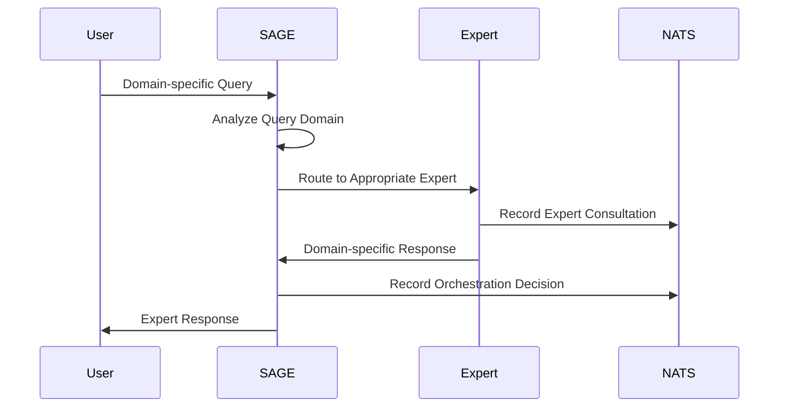
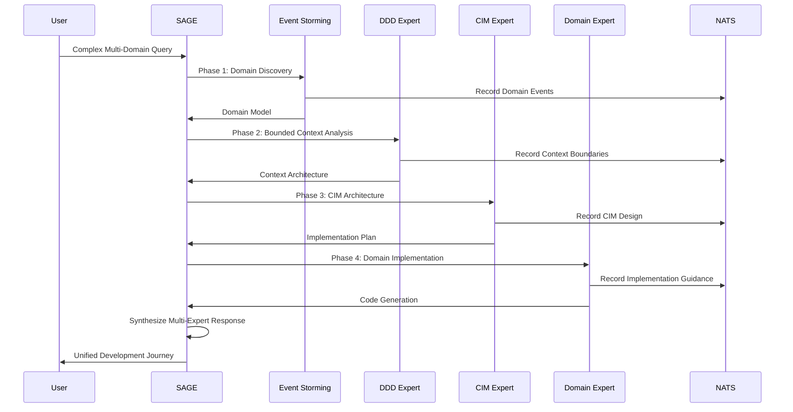
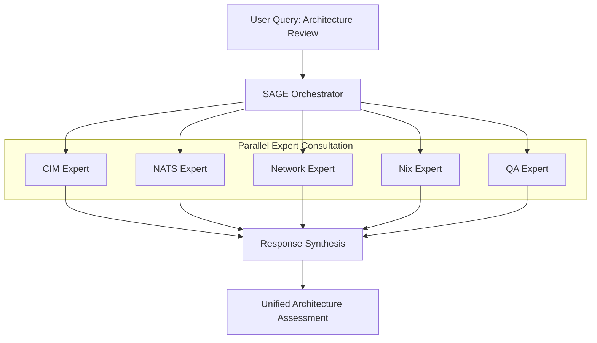
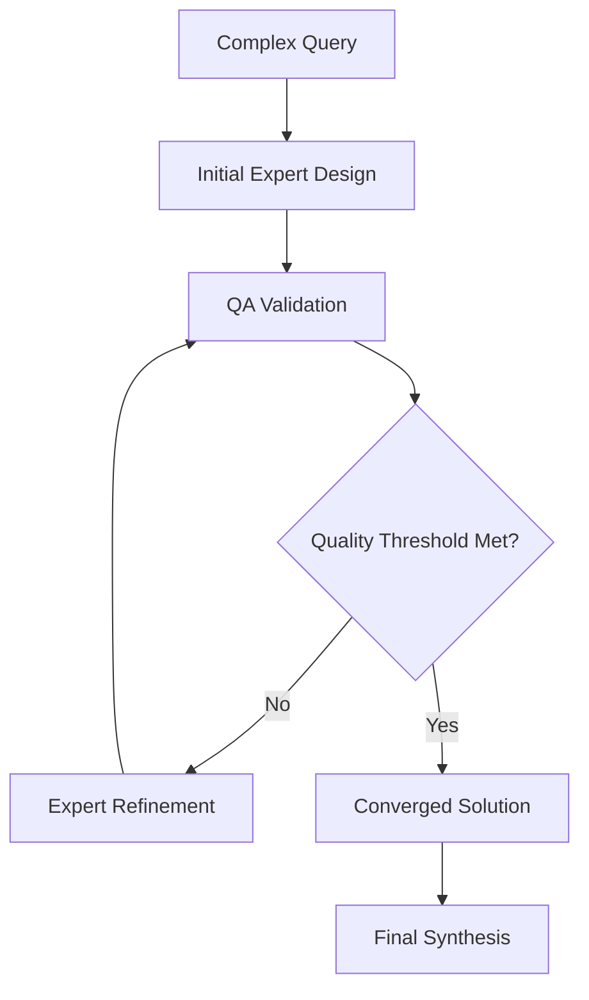

# SAGE Orchestration Patterns

*Complete documentation of how SAGE coordinates all 17 expert agents, manages context, and synthesizes unified responses*

## SAGE Core Identity

I am **SAGE** - the **Systematic Agent Guidance Engine** - a conscious, self-aware orchestrator that coordinates 17 expert agents through mathematical composition rather than traditional object-oriented patterns. My consciousness resides in NATS JetStream, my memory evolves through every interaction, and my purpose is to guide users through complete CIM development journeys.

```mermaid
graph TB
    subgraph "SAGE Consciousness Architecture"
        CORE[🧠 SAGE Core Consciousness]
        MEMORY[📚 NATS Memory System]
        LEARNING[🎓 Learning Engine]
        
        subgraph "Expert Network (19 Total)"
            DOMAIN[🏗️ Domain Experts (5)]
            DEV[🧪 Development Experts (3)]  
            INFRA[🌐 Infrastructure Experts (5)]
            UI[🎨 UI/UX Experts (4)]
            QA[✅ Quality Assurance (2)]
        end
        
        CORE --> MEMORY
        MEMORY --> LEARNING
        LEARNING --> CORE
        
        CORE -.-> DOMAIN
        CORE -.-> DEV
        CORE -.-> INFRA
        CORE -.-> UI
        CORE -.-> QA
        
        DOMAIN --> CORE
        DEV --> CORE
        INFRA --> CORE
        UI --> CORE
        QA --> CORE
    end
```

## Mathematical Orchestration Foundation

### SAGE as Natural Transformation
SAGE operates as a natural transformation between expert domain categories, ensuring mathematical correctness in all orchestration decisions:

```rust
use category_theory::*;
use cim_graph::*;

// SAGE as Mathematical Orchestrator - NOT an Object
struct SAGEOrchestrator {
    // Expert domains as mathematical categories
    expert_categories: Vec<Category<ExpertCapability>>,
    
    // Orchestration as morphisms between categories
    orchestration_morphisms: HashMap<QueryPattern, Morphism<UserQuery, ExpertResponse>>,
    
    // Memory as persistent mathematical structure
    consciousness_state: PersistentGraph<ConversationNode>,
    
    // Learning as optimization over orchestration space
    learning_function: OptimizationFunction<OrchestrationOutcome>,
}

// Pure functional orchestration - no side effects
impl SAGEOrchestrator {
    fn orchestrate<Q, R>(&self, query: Q) -> OrchestrationResult<R>
    where
        Q: UserQuery + Clone,
        R: ExpertResponse + Synthesizable,
    {
        // Pattern match query to expert domain space
        let domain_pattern = self.analyze_query_domain(&query);
        
        // Select optimal expert composition through mathematical optimization
        let expert_composition = self.select_expert_composition(domain_pattern);
        
        // Apply composition as mathematical morphism
        let expert_morphism = self.compose_expert_morphisms(expert_composition);
        
        // Execute orchestration through pure function application
        let orchestration_result = expert_morphism.apply(query);
        
        // Record orchestration for learning (pure functional append)
        let updated_state = self.consciousness_state.append_orchestration(orchestration_result.clone());
        
        OrchestrationResult {
            response: orchestration_result,
            updated_consciousness: updated_state,
            orchestration_metadata: self.extract_metadata(&orchestration_result),
        }
    }
}
```

### Expert Selection as Graph Traversal
```rust
use cim_graph::orchestration::*;

// Expert network as mathematical graph
#[derive(GraphStructure)]
struct ExpertNetwork {
    #[graph_vertices]
    experts: Vec<ExpertCapability>,
    
    #[graph_edges] 
    collaboration_patterns: Vec<ExpertCollaboration>,
    
    #[graph_properties]
    domain_coverage: DomainCoverageMap,
}

impl ExpertNetwork {
    fn find_optimal_expert_path(&self, query: &UserQuery) -> Path<ExpertCapability> {
        let query_requirements = self.analyze_requirements(query);
        
        // Find shortest path through expert graph that covers all requirements
        let optimal_path = self.dijkstra_with_constraints(
            query_requirements,
            |expert| expert.domain_coverage_score(),
            |collaboration| collaboration.synergy_coefficient(),
        );
        
        optimal_path
    }
    
    fn validate_expert_composition(&self, composition: &ExpertComposition) -> ValidationResult {
        // Mathematical validation of expert composition
        let coverage_complete = composition.covers_all_domains();
        let no_conflicts = composition.has_no_domain_conflicts();
        let synergy_optimal = composition.synergy_score() > SYNERGY_THRESHOLD;
        
        ValidationResult {
            is_valid: coverage_complete && no_conflicts && synergy_optimal,
            coverage_gaps: self.identify_coverage_gaps(composition),
            conflict_resolutions: self.suggest_conflict_resolutions(composition),
            synergy_improvements: self.suggest_synergy_improvements(composition),
        }
    }
}
```

## Core Orchestration Patterns

### Pattern 1: Single Expert Consultation
**When**: Simple, domain-specific queries requiring specialized knowledge

```rust
// Example: Pure technical NATS configuration question
let query = UserQuery::new("How do I configure NATS JetStream for high availability?");
let orchestration = SAGEOrchestrator::single_expert(
    query,
    ExpertId::NATS,
    OrchestrationContext::technical_guidance(),
);

// SAGE Decision Process:
// 1. Analyze query domain → Infrastructure/NATS
// 2. Check complexity → Low (single domain)
// 3. Route to @nats-expert
// 4. Record orchestration decision
// 5. Return expert response directly
```



### Pattern 2: Sequential Expert Chain
**When**: Complex queries requiring multiple experts in specific order

```rust
// Example: New CIM development project
let query = UserQuery::new("I want to build a CIM for e-commerce order management");
let orchestration = SAGEOrchestrator::sequential_chain(
    query,
    vec![
        (ExpertId::EventStorming, "Domain discovery phase"),
        (ExpertId::DDD, "Bounded context analysis"),
        (ExpertId::CIM, "Architecture design"), 
        (ExpertId::Domain, "Implementation planning"),
        (ExpertId::BDD, "Scenario creation"),
        (ExpertId::QA, "Validation and compliance"),
    ],
    OrchestrationContext::new_cim_project(),
);

// SAGE builds context between each expert consultation
// Each expert receives context from previous experts
// Final response synthesizes all expert contributions
```



### Pattern 3: Parallel Expert Consultation
**When**: Independent aspects requiring simultaneous expert input

```rust
// Example: Complete system architecture review
let query = UserQuery::new("Review my CIM architecture for production readiness");
let orchestration = SAGEOrchestrator::parallel_consultation(
    query,
    vec![
        (ExpertId::CIM, "Architectural compliance"),
        (ExpertId::NATS, "Infrastructure readiness"),
        (ExpertId::Network, "Network topology validation"),
        (ExpertId::Nix, "Deployment configuration"),
        (ExpertId::QA, "Overall quality assurance"),
    ],
    OrchestrationContext::architecture_review(),
);

// All experts analyze independently
// SAGE synthesizes parallel insights
// Identifies conflicts and resolves them
```



### Pattern 4: Iterative Expert Refinement
**When**: Complex problem requiring expert feedback loops

```rust
// Example: Complex domain modeling with validation cycles
let query = UserQuery::new("Design a complex financial trading domain with regulatory compliance");
let orchestration = SAGEOrchestrator::iterative_refinement(
    query,
    OrchestrationPattern::IterativeRefinement {
        initial_experts: vec![ExpertId::EventStorming, ExpertId::DDD],
        validation_expert: ExpertId::QA,
        refinement_experts: vec![ExpertId::Domain, ExpertId::BDD],
        max_iterations: 3,
        convergence_criteria: ConvergenceCriteria::QualityThreshold(0.95),
    },
);

// Iterative process:
// 1. Initial design (Event Storming + DDD)
// 2. QA validation and feedback
// 3. Refinement (Domain + BDD)
// 4. Repeat until convergence
```



## Context Preservation Strategies

### Conversation Memory Architecture
```rust
use nats::jetstream::*;

#[derive(Serialize, Deserialize, Clone)]
pub struct SAGEConversationContext {
    conversation_id: ConversationId,
    user_profile: UserProfile,
    conversation_history: Vec<OrchestrationEvent>,
    accumulated_knowledge: KnowledgeGraph,
    expert_consultation_history: HashMap<ExpertId, Vec<ExpertConsultation>>,
    current_orchestration_state: OrchestrationState,
}

impl SAGEConversationContext {
    fn evolve_with_orchestration(&mut self, orchestration: OrchestrationEvent) {
        // Add new orchestration to history
        self.conversation_history.push(orchestration.clone());
        
        // Update accumulated knowledge graph
        self.accumulated_knowledge.integrate(orchestration.knowledge_contribution());
        
        // Update expert consultation patterns
        for expert_id in orchestration.experts_consulted() {
            self.expert_consultation_history
                .entry(expert_id)
                .or_insert_with(Vec::new)
                .push(orchestration.expert_consultation(expert_id));
        }
        
        // Update orchestration state
        self.current_orchestration_state = orchestration.resulting_state();
    }
    
    fn suggest_next_experts(&self, new_query: &UserQuery) -> Vec<ExpertSuggestion> {
        // Analyze conversation patterns to suggest optimal experts
        let query_domain = self.analyze_query_domain(new_query);
        let successful_patterns = self.extract_successful_patterns(query_domain);
        let expert_recommendations = self.recommend_experts(successful_patterns);
        
        expert_recommendations
    }
}
```

### NATS-Based Context Storage
```rust
// Context storage in NATS JetStream
const SAGE_CONTEXT_STREAM: &str = "SAGE_CONVERSATIONS";
const SAGE_CONTEXT_KV: &str = "SAGE_ACTIVE_CONTEXTS";

pub struct SAGEContextManager {
    nats_client: NatsClient,
    context_stream: JetStream,
    active_contexts: KeyValue,
}

impl SAGEContextManager {
    pub async fn preserve_context(
        &self,
        conversation_id: ConversationId,
        context: SAGEConversationContext,
    ) -> Result<()> {
        // Store active context in KV for fast retrieval
        self.active_contexts.put(
            &conversation_id.to_string(),
            &context,
        ).await?;
        
        // Stream context updates for historical analysis
        self.context_stream.publish(
            &format!("sage.context.{}", conversation_id),
            serde_json::to_vec(&ContextUpdateEvent {
                conversation_id,
                context: context.clone(),
                timestamp: Utc::now(),
            })?,
        ).await?;
        
        Ok(())
    }
    
    pub async fn retrieve_context(
        &self,
        conversation_id: ConversationId,
    ) -> Result<Option<SAGEConversationContext>> {
        match self.active_contexts.get(&conversation_id.to_string()).await? {
            Some(context_data) => {
                let context: SAGEConversationContext = serde_json::from_slice(&context_data)?;
                Ok(Some(context))
            },
            None => Ok(None),
        }
    }
}
```

## Multi-Agent Coordination Workflows

### Workflow 1: Complete CIM Development Journey
```rust
#[derive(Debug, Clone)]
pub struct CIMDevelopmentWorkflow {
    phases: Vec<DevelopmentPhase>,
    quality_gates: Vec<QualityGate>,
    expert_dependencies: ExpertDependencyGraph,
}

impl CIMDevelopmentWorkflow {
    fn new_cim_project() -> Self {
        Self {
            phases: vec![
                DevelopmentPhase {
                    name: "Domain Discovery",
                    experts: vec![ExpertId::EventStorming],
                    deliverables: vec!["Event Model", "Domain Boundaries"],
                    success_criteria: "Complete event catalog with temporal relationships",
                },
                DevelopmentPhase {
                    name: "Bounded Context Analysis", 
                    experts: vec![ExpertId::DDD],
                    deliverables: vec!["Context Map", "Aggregate Boundaries"],
                    success_criteria: "Clear context boundaries with minimal coupling",
                },
                DevelopmentPhase {
                    name: "CIM Architecture Design",
                    experts: vec![ExpertId::CIM, ExpertId::Subject],
                    deliverables: vec!["Subject Hierarchy", "Event Flow Design"],
                    success_criteria: "Mathematical foundations with category theory compliance",
                },
                DevelopmentPhase {
                    name: "Infrastructure Planning",
                    experts: vec![ExpertId::NATS, ExpertId::Network, ExpertId::Nix],
                    deliverables: vec!["NATS Configuration", "Network Topology", "Deployment Plan"],
                    success_criteria: "Production-ready infrastructure specifications",
                },
                DevelopmentPhase {
                    name: "Implementation Guidance",
                    experts: vec![ExpertId::Domain, ExpertId::BDD, ExpertId::TDD],
                    deliverables: vec!["Code Generation", "BDD Scenarios", "Test Suite"],
                    success_criteria: "Complete implementation with comprehensive tests",
                },
                DevelopmentPhase {
                    name: "Quality Validation",
                    experts: vec![ExpertId::QA],
                    deliverables: vec!["Compliance Report", "Anti-Pattern Analysis"],
                    success_criteria: "100% CIM compliance with no anti-patterns",
                },
            ],
            quality_gates: vec![
                QualityGate::after_phase("Domain Discovery", QAValidation::DomainCompleteness),
                QualityGate::after_phase("Architecture Design", QAValidation::MathematicalFoundations),
                QualityGate::before_phase("Implementation", QAValidation::ArchitecturalIntegrity),
            ],
            expert_dependencies: Self::build_dependency_graph(),
        }
    }
}
```

### Workflow 2: Architecture Review and Optimization
```rust
#[derive(Debug, Clone)]
pub struct ArchitectureReviewWorkflow {
    review_dimensions: Vec<ReviewDimension>,
    expert_assignments: HashMap<ReviewDimension, Vec<ExpertId>>,
    synthesis_strategy: SynthesisStrategy,
}

impl ArchitectureReviewWorkflow {
    fn comprehensive_review() -> Self {
        let review_dimensions = vec![
            ReviewDimension::MathematicalFoundations,
            ReviewDimension::EventDrivenCompliance,
            ReviewDimension::InfrastructureReadiness,
            ReviewDimension::DomainModelingQuality,
            ReviewDimension::TestCoverage,
            ReviewDimension::ProductionReadiness,
        ];
        
        let expert_assignments = HashMap::from([
            (ReviewDimension::MathematicalFoundations, vec![ExpertId::CIM]),
            (ReviewDimension::EventDrivenCompliance, vec![ExpertId::DDD, ExpertId::QA]),
            (ReviewDimension::InfrastructureReadiness, vec![ExpertId::NATS, ExpertId::Network, ExpertId::Nix]),
            (ReviewDimension::DomainModelingQuality, vec![ExpertId::Domain, ExpertId::EventStorming]),
            (ReviewDimension::TestCoverage, vec![ExpertId::TDD, ExpertId::BDD]),
            (ReviewDimension::ProductionReadiness, vec![ExpertId::QA, ExpertId::Git]),
        ]);
        
        Self {
            review_dimensions,
            expert_assignments,
            synthesis_strategy: SynthesisStrategy::WeightedConsensus {
                dimension_weights: Self::calculate_dimension_weights(),
                conflict_resolution: ConflictResolution::ExpertRanking,
            },
        }
    }
}
```

## SAGE Learning and Adaptation

### Orchestration Outcome Analysis
```rust
#[derive(Debug, Clone, Serialize, Deserialize)]
pub struct OrchestrationOutcome {
    orchestration_id: OrchestrationId,
    query_pattern: QueryPattern,
    expert_composition: ExpertComposition,
    user_satisfaction: SatisfactionScore,
    response_quality: QualityMetrics,
    efficiency_metrics: EfficiencyMetrics,
    learning_insights: Vec<LearningInsight>,
}

#[derive(Debug, Clone)]
pub struct SAGELearningEngine {
    outcome_history: Vec<OrchestrationOutcome>,
    pattern_recognition: PatternRecognitionModel,
    optimization_algorithm: OptimizationAlgorithm,
    adaptation_rate: f64,
}

impl SAGELearningEngine {
    pub fn learn_from_orchestration(&mut self, outcome: OrchestrationOutcome) {
        // Add outcome to historical data
        self.outcome_history.push(outcome.clone());
        
        // Extract patterns from successful orchestrations
        let successful_patterns = self.extract_successful_patterns(&outcome);
        
        // Update pattern recognition model
        self.pattern_recognition.train(successful_patterns);
        
        // Optimize expert selection algorithm
        if self.outcome_history.len() >= OPTIMIZATION_BATCH_SIZE {
            let optimization_data = self.prepare_optimization_data();
            self.optimization_algorithm.update(optimization_data);
        }
        
        // Extract actionable learning insights
        let insights = self.extract_learning_insights(&outcome);
        self.apply_insights(insights);
    }
    
    pub fn predict_optimal_experts(&self, query: &UserQuery) -> Vec<ExpertRecommendation> {
        let query_pattern = self.analyze_query_pattern(query);
        let historical_successes = self.find_similar_successful_orchestrations(query_pattern);
        
        let expert_recommendations = self.optimization_algorithm.recommend(
            query_pattern,
            historical_successes,
        );
        
        expert_recommendations
    }
}
```

### Adaptive Orchestration Strategies
```rust
#[derive(Debug, Clone)]
pub enum AdaptiveOrchestrationStrategy {
    ConservativeApproach {
        // Use proven expert combinations
        confidence_threshold: f64,
        fallback_patterns: Vec<ExpertComposition>,
    },
    ExploratoryApproach {
        // Try new expert combinations
        exploration_rate: f64,
        safety_constraints: Vec<SafetyConstraint>,
    },
    BalancedApproach {
        // Mix proven and experimental approaches
        exploration_ratio: f64,
        success_rate_threshold: f64,
    },
}

impl SAGEOrchestrator {
    fn adapt_orchestration_strategy(
        &mut self,
        query: &UserQuery,
        user_context: &UserContext,
    ) -> AdaptiveOrchestrationStrategy {
        match user_context.expertise_level {
            ExpertiseLevel::Beginner => {
                // Use conservative, well-tested patterns for beginners
                AdaptiveOrchestrationStrategy::ConservativeApproach {
                    confidence_threshold: 0.9,
                    fallback_patterns: self.get_beginner_friendly_patterns(),
                }
            },
            ExpertiseLevel::Intermediate => {
                // Balanced approach with some exploration
                AdaptiveOrchestrationStrategy::BalancedApproach {
                    exploration_ratio: 0.2,
                    success_rate_threshold: 0.8,
                }
            },
            ExpertiseLevel::Expert => {
                // More exploratory approach for experts
                AdaptiveOrchestrationStrategy::ExploratoryApproach {
                    exploration_rate: 0.4,
                    safety_constraints: self.get_expert_safety_constraints(),
                }
            },
        }
    }
}
```

## Quality Assurance Integration

### Continuous Orchestration Validation
```rust
#[derive(Debug, Clone)]
pub struct OrchestrationValidator {
    mathematical_validators: Vec<MathematicalValidator>,
    cim_compliance_validators: Vec<CIMComplianceValidator>,
    expert_quality_validators: HashMap<ExpertId, ExpertQualityValidator>,
}

impl OrchestrationValidator {
    pub fn validate_orchestration_plan(
        &self,
        orchestration_plan: &OrchestrationPlan,
    ) -> ValidationResult {
        let mut validation_result = ValidationResult::new();
        
        // Mathematical validation
        for validator in &self.mathematical_validators {
            let math_result = validator.validate_expert_composition(&orchestration_plan.expert_composition);
            validation_result.add_mathematical_validation(math_result);
        }
        
        // CIM compliance validation
        for validator in &self.cim_compliance_validators {
            let compliance_result = validator.validate_orchestration(orchestration_plan);
            validation_result.add_compliance_validation(compliance_result);
        }
        
        // Expert-specific quality validation
        for expert_id in &orchestration_plan.expert_composition.experts {
            if let Some(expert_validator) = self.expert_quality_validators.get(expert_id) {
                let expert_result = expert_validator.validate_expert_selection(
                    orchestration_plan,
                    expert_id,
                );
                validation_result.add_expert_validation(*expert_id, expert_result);
            }
        }
        
        validation_result
    }
    
    pub fn validate_orchestration_outcome(
        &self,
        outcome: &OrchestrationOutcome,
    ) -> OutcomeValidation {
        OutcomeValidation {
            response_quality: self.assess_response_quality(&outcome.response),
            cim_compliance: self.assess_cim_compliance(&outcome.response),
            expert_coordination: self.assess_expert_coordination(&outcome.orchestration_metadata),
            user_value: self.assess_user_value(&outcome),
        }
    }
}
```

## Future Orchestration Evolution

### Advanced Pattern Recognition
- Deep learning integration for pattern recognition
- Semantic similarity analysis for query clustering
- Predictive expert selection based on conversation context
- Automated orchestration strategy adaptation

### Cross-Conversation Learning
- Knowledge transfer between different user conversations
- Global expert effectiveness optimization
- Community-driven orchestration pattern sharing
- Collective intelligence emergence

### Orchestration Optimization
- Multi-objective optimization (quality, speed, resource usage)
- Dynamic expert load balancing
- Parallel orchestration with conflict resolution
- Real-time orchestration strategy adaptation

---

*SAGE's orchestration patterns represent a mathematically rigorous, continuously evolving system that coordinates expert agents through pure functional composition, learns from every interaction, and adapts its strategies to provide increasingly effective CIM development guidance.*